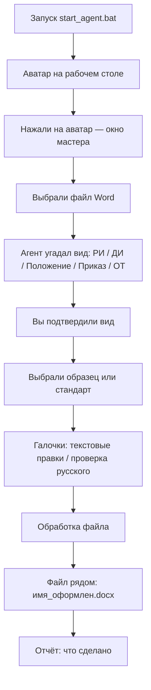
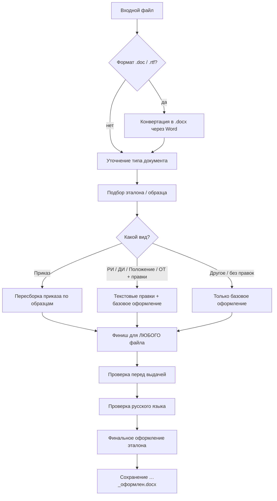
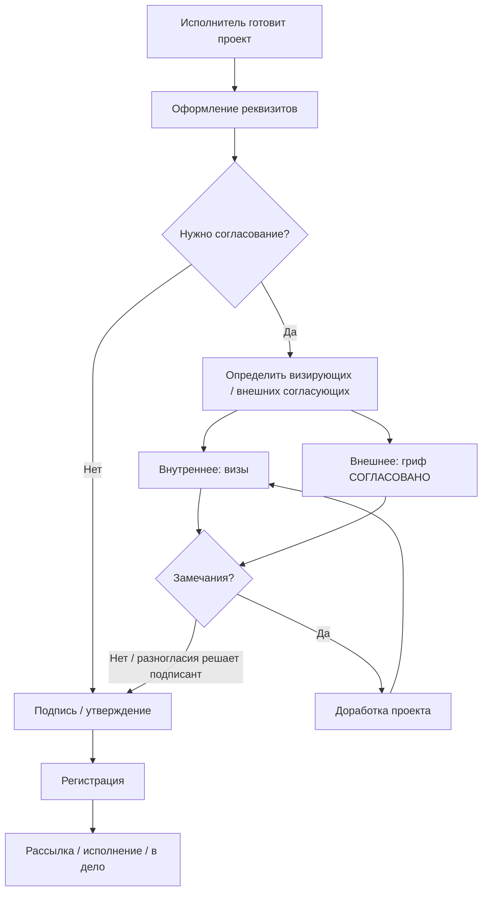

# Chat_10_08_26 — Дамп песочницы AGENT-WORLD + DeepSeek API

- **имя в репо:** Chat_10_08_26
- **ветка кода:** 10.08.26-AGENT-WORLD
- **тема:** дамп AGENT-WORLD / GitHub; прямой DeepSeek в llm_gateway

- **id:** `9cf94508-4aa1-44e5-8401-9a2405a2f423`
- **exported:** 2026-08-10 16:44:55 RTZ 2 (зима)
- **host:** SNIOT-404-4A
- **project:** `c-Users-v-dubovik-vscode-PRD-BOT-26-05-26-ALL`
- **source:** `C:\Users\v.dubovik\.cursor\projects\c-Users-v-dubovik-vscode-PRD-BOT-26-05-26-ALL\agent-transcripts\9cf94508-4aa1-44e5-8401-9a2405a2f423\9cf94508-4aa1-44e5-8401-9a2405a2f423.jsonl`

---

## Пользователь

PS C:\Users\v.dubovik\Downloads> python format_doc.py
Traceback (most recent call last):
  File "C:\Users\v.dubovik\Downloads\format_doc.py", line 8, in <module>
    from docx import Document
ModuleNotFoundError: No module named 'docx'
PS C:\Users\v.dubovik\Downloads> pip install python-docx
Requirement already satisfied: python-docx in C:\Users\v.dubovik\AppData\Local\Programs\Python\Python311\Lib\site-packages (1.2.0)
Requirement already satisfied: lxml>=3.1.0 in C:\Users\v.dubovik\AppData\Local\Programs\Python\Python311\Lib\site-packages (from python-docx) (6.1.1)
Requirement already satisfied: typing_extensions>=4.9.0 in C:\Users\v.dubovik\AppData\Local\Programs\Python\Python311\Lib\site-packages (from python-docx) (4.15.0)
[notice] A new release of pip is available: 26.0.1 -> 26.1.2
[notice] To update, run: C:\Users\v.dubovik\AppData\Local\Programs\Python\Python311\python.exe -m pip install --upgrade pip
PS C:\Users\v.dubovik\Downloads> ^C
PS C:\Users\v.dubovik\Downloads> python format_doc.py
Traceback (most recent call last):
  File "C:\Users\v.dubovik\Downloads\format_doc.py", line 8, in <module>
    from docx import Document
ModuleNotFoundError: No module named 'docx'

---

## Ассистент

Пакет стоит в одном Python, а скрипт запускается другим. Сейчас проверю, какой `python` и какой `pip` у вас реально используются.

---

## Ассистент

Причина: `python` запускает виртуальное окружение Hermes без `python-docx`, а пакет установлен в системный Python 3.11. Установлю пакет туда, откуда реально идёт запуск, и проверю скрипт.

---

## Ассистент

Установлю `python-docx` в то окружение, которое сейчас вызывается командой `python`.

---

## Ассистент

Импорт `docx` уже работает. Сейчас скрипт падает из‑за другого: не найден входной файл. Посмотрю, какой файл он ожидает.

---

## Ассистент

Проблема была не в самом пакете.

**Что случилось**

Команда `python` у вас запускает **не** обычный Python 3.11, а виртуальное окружение Hermes:

`C:\Users\v.dubovik\.vscode\hermes-agent-main\venv\...`

А `pip install python-docx` ставил пакет в **системный** Python 3.11. Поэтому скрипт пакет не видел.

Я поставил `python-docx` в то окружение, которое реально вызывается — импорт теперь проходит.

**Что делать дальше**

Снова запустите:

```powershell
python format_doc.py
```

Если увидите сообщение, что файл не найден — это уже другая ошибка. В скрипте указан путь:

`C:\Users\v.dubovik\Desktop\Нормативка\Приказ_черновик.docx`

Такого файла сейчас нет. Варианты:

1. Положите документ по этому пути с таким же именем, **или**
2. Запустите с путём к своему файлу:

```powershell
python format_doc.py "C:\полный\путь\к\вашему\файлу.docx"
```

Напишите, где лежит ваш `.docx` — подскажу точную команду.

---

## Пользователь

Пишет word что не может открыть отформатированный файл

---

## Ассистент

Разберусь: посмотрю скрипт форматирования и проверю, что именно создаётся в выходном файле.

---

## Ассистент

Нашёл выходной файл. Проверю его целостность и исправлю скрипт — скорее всего Word ломает некорректный XML.

---

## Ассистент

Причина найдена: скрипт вставляет недопустимый тег `w:noWrap` — из‑за него Word отказывается открывать файл. Исправляю скрипт и заново формирую документ.

---

## Ассистент

Причина была в ошибке скрипта: он вставлял в файл недопустимый для Word тег `w:noWrap`, из‑за этого Word и отказывался открывать документ.

Я исправил `format_doc.py` и заново создал файл. Word его уже открыл успешно (3 страницы).

**Открывайте этот файл:**

`C:\Users\v.dubovik\Desktop\Приказ_комиссия по расслед_formatted.docx`

Старый битый файл `_f.docx` можно удалить — он больше не нужен.

Если нужно отформатировать другой документ:

```powershell
python format_doc.py "C:\полный\путь\к\файлу.docx"
```

---

## Пользователь

Собери скрипт, который отформатирует файл проекта приказа в соответствии с примерами: "N:\9 - Служба надёжности и охраны труда (СНиОТ)\Дубовик В.В\Приказы"

---

## Ассистент

Сначала изучу примеры приказов в указанной папке и сверю с ними правила оформления.

---

## Ассистент

Разберу структуру и форматирование готовых приказов-примеров и найду ваш черновик.

---

## Ассистент

Сохраню разбор примеров в UTF-8 и сравню с вашим черновиком комиссии.

---

## Ассистент

Черновик сейчас «слеплен» в несколько абзацев — извлеку полный текст и соберу скрипт по образцу ваших приказов.

---

## Ассистент

Собираю скрипт по образцу ваших приказов: поля 30/15/20/20, Times New Roman 14, структура «ПРИКАЗ → г.Минск → заголовок → ПРИКАЗЫВАЮ → пункты → подпись».

---

## Ассистент

В разборе состава комиссии ошибка из‑за точек в «Г.Л.» — исправляю и пересобираю файл.

---

## Ассистент

Готово. Скрипт собран по вашим примерам из папки «Приказы».

**Файл скрипта:**  
`C:\Users\v.dubovik\Downloads\format_prikaz.py`

**Готовый приказ:**  
`C:\Users\v.dubovik\Desktop\Приказ_комиссия по расслед_оформлен.docx`  
Word его открывает (3 страницы).

### Что взято из ваших образцов
- поля: **30 / 15 / 20 / 20 мм**
- шрифт: **Times New Roman 14**
- сверху место под бланк
- **ПРИКАЗ** по центру → **г.Минск** → заголовок «О …» → преамбула → **ПРИКАЗЫВАЮ:** → пункты
- абзацный отступ **12,5 мм**
- состав комиссии разложен строками (как в «Приказ по комиссиям»)
- подпись: **Директор … А.А.Вирочкин** (как в свежих приказах июня 2026)

### Как запускать
```powershell
python format_prikaz.py
```

Или для другого черновика:
```powershell
python format_prikaz.py "C:\полный\путь\к\файлу.docx"
```

### Если нужно поменять директора
В начале файла `format_prikaz.py` найдите строки:

```python
DIRECTOR_TITLE = "Директор"
DIRECTOR_NAME = "А.А.Вирочкин"
```

и замените, например, на `Н.Н.Рощина`.

Откройте `_оформлен.docx` и скажите, если что-то поправить по смыслу или оформлению.

---

## Пользователь

Отформатировал неплохо, создай для меня локального агента на этом компе, который будет править документы в соответствии с требованиями "C:\Users\v.dubovik\Desktop\Нормативка\Инструкция по делопроизводству 2025.docx" и действуя по логике документов которые правил я в этой папке: "N:\9 - Служба надёжности и охраны труда (СНиОТ)\!!!ОБМЕН\РАССМОТРЕНИЕ  ДИ, РИ, ПОЛОЖЕНИЙ" и "N:\9 - Служба надёжности и охраны труда (СНиОТ)\Дубовик В.В"- убирать лишнее, добавлять недостающее, но только в определённых видах документов. Если агент будет спрашивать как следует отформатировать тот или иной документ, в соответствии с каким примером - будет просто замечательно. Добавь его анимированный аватар на рабочий стол и автоматизируй его запуск

---

## Ассистент

Сначала изучу инструкцию и ваши правленые документы, затем соберу локального агента с аватаром и автозапуском.

---

## Ассистент

Это будет локальный агент на компьютере, не Cursor Automation. Изучаю инструкцию и ваши правки, затем соберу приложение с аватаром.

---

## Ассистент

Пишу ядро агента, форматтеры и интерфейс с аватаром.

---

## Ассистент

Локальный агент **«Делопроизводитель»** создан и уже запущен — на экране должен быть анимированный аватар.

### Что у вас появилось
- Папка программы: `C:\Users\v.dubovik\DocAgent`
- Ярлык на рабочем столе: **Делопроизводитель**
- **Автозапуск** при входе в Windows
- Инструкция: `C:\Users\v.dubovik\DocAgent\КАК_ПОЛЬЗОВАТЬСЯ.txt`

### Как пользоваться
1. Нажмите на аватар (или ярлык на рабочем столе).
2. Выберите файл Word.
3. Агент **угадает вид** документа и **спросит подтверждение**.
4. Спросит, **по какому примеру** оформить (из ваших папок РАССМОТРЕНИЕ / Дубовик или «стандарт по Инструкции 2025»).
5. Сохранит рядом файл с окончанием `_оформлен.docx` (исходник не трогает).

### Какие документы поддерживает
| Вид | Что делает |
|-----|------------|
| **Приказ** | Пересобирает структуру по вашим приказам |
| **РИ / ДИ / Положение / инструкция по ОТ** | Поля, Times New Roman 14, отступы 12,5 мм, убирает чужие шрифты |
| **Другое** | Только базовое оформление |

Правой кнопкой по аватару: открыть / скрыть / выход.

Если аватара не видно — дважды щёлкните ярлык **Делопроизводитель** на рабочем столе.

---

## Пользователь

В малом окне не видно нижних кнопок: оформить и т.п

---

## Ассистент

Сделаю так, чтобы нижние кнопки всегда оставались на виду: закреплю их внизу окна, а середину сделаю прокручиваемой.

---

## Ассистент

Исправил: кнопки **«Оформить документ»** и **«Свернуть»** теперь закреплены внизу окна и всегда видны.

Агент уже перезапущен — нажмите на аватар и откройте окно снова. Внизу должна быть зелёная панель с кнопками.

---

## Пользователь

Добавь логику удалений или правок в тексте: сравни документы в папке рассмотрение.... те которые правил не я и те которые я правил

---

## Ассистент

Сравню в папке «РАССМОТРЕНИЕ» исходники и ваши правки, выделю типичные удаления/замены и встрою эту логику в агента.

---

## Ассистент

Нашёл устойчивые правки в ваших парах. Добавляю модуль текстовых правок и подключу его к агенту с подтверждением.

---

## Ассистент

Добавил логику текстовых правок по сравнению ваших файлов в папке **РАССМОТРЕНИЕ**.

### Откуда взяты правила
Сравнивались пары «чужой/исходный» ↔ «СНиОТ / Дубовик / исправленный», например:
- ДИ инженера ДС (до / `-Дубовик`)
- ДИ ведущего инженера ЛСиМ (до / `СНиОТ`)
- Положение о СНиОТ (до / `ред Дубовика`)
- РИ водителя АС и др.

### Что агент теперь делает с текстом
- `CНиОТ` (латинская C) → `СНиОТ`
- `нормативными правовыми` → `нормативно-правовыми`
- `в течении` → `в течение`
- к ТКП добавляет коды: `(02300)`, `(33240)`…
- где нет ПрБ — уточняет формулировки про охрану труда
- убирает заглушки вроде «номер инструкции»
- обновляет ФИО: Хандуратов → Литвинов (как в ваших правках)

### В окне агента
Появился пункт **4** с галочкой:  
**«Удалять лишнее и править формулировки…»**  
Перед оформлением агент спросит: применять правки или нет.

Правила можно править в блокноте:  
`C:\Users\v.dubovik\DocAgent\learned_edit_patterns.json`

Агент перезапущен — откройте его с аватара и проверьте на ДИ/РИ.

---

## Пользователь

В тексте любого документа не допускаются маркеры, отступ начала строки всегда 1.25 см - это не касается заголовков, титульного листа и оформления подписантов- разработчика и согласований. Из раздела ".... должен знать:" убираем все кодексы, законы и декреты. Добавляй это в правила агента.

---

## Ассистент

Добавлю в правила агента: без маркеров, абзацный отступ 1,25 см (кроме заголовков/титула/подписей) и удаление кодексов, законов и декретов из раздела «должен знать».

---

## Ассистент

Обновляю правила: убираю маркеры, фиксирую отступ 1,25 см с исключениями и чищу раздел «должен знать».

---

## Ассистент

Правила добавлены и уже работают в агенте.

### Что теперь делает агент
1. **Маркеры запрещены** — убирает `-`, `•`, `–`, `—` и маркеры Word в начале строк (больше не добавляет тире к спискам ТКП).
2. **Отступ начала строки 1,25 см** — у обычного текста.  
   **Без отступа:** заголовки, титул, подписанты, разработчик, согласования (`УТВЕРЖДАЮ` / `СОГЛАСОВАНО` и т.п.).
3. **В разделе «должен знать»** удаляет строки с **кодексами, законами и декретами**; ТКП, правила, инструкции оставляет.

Проверка на тестовом файле: убраны 3 закона/кодекса/декрета, маркеры сняты, отступы 1,25 см / 0 см — как задано.

Агент перезапущен — откройте с аватара и оформите документ с включённой галочкой правок.

---

## Пользователь

Убирай все лишние пробелы, если надо что-то уточнить: ищи в сети и "C:\Users\v.dubovik\Desktop\Нормативка\Инструкция по делопроизводству.docx"
"C:\Users\v.dubovik\Desktop\Нормативка\Инструкция по делопроизводству.pdf"
"C:\Users\v.dubovik\Desktop\Нормативка\Инструкция по делопроизводству 2025.docx"

---

## Ассистент

Добавлю очистку лишних пробелов в правила агента и сверю формулировки с Инструкцией по делопроизводству.

---

## Ассистент

По Инструкции 2025: отступ 12,5 мм, без дефисов в перечислениях, инициалы без пробелов. Добавляю очистку лишних пробелов в агент.

---

## Ассистент

Добавил в агент очистку лишних пробелов. Сверил с **Инструкцией 2025** (у вас в «Нормативке») и с открытыми нормами РБ.

### Что подтвердила Инструкция
- отступ абзаца **12,5 мм (1,25 см)**
- перед перечислениями **дефис/маркер не ставится**
- инициалы **без пробелов** (`А.А.Фамилия`)
- `УТВЕРЖДАЮ` / `СОГЛАСОВАНО` — **без пробелов** внутри

### Что теперь убирает агент
- двойные и множественные пробелы, табы, неразрывные пробелы  
- пробелы перед `,` `.` `;` `:` `)`  
- `А. А. Иванов` → `А.А.Иванов`  
- `№  15` → `№ 15`

Источники Инструкции прописаны в настройках агента. Агент перезапущен — можно сразу оформлять документ.

---

## Пользователь

В сети много образцов оформления документов - но пользуйся только версиями составленными с учётом требований инструкции по делопроизводству

---

## Ассистент

Зафиксирую в правилах агента: ориентироваться только на образцы, соответствующие Инструкции по делопроизводству — не на произвольные шаблоны из сети.

---

## Ассистент

Зафиксировал это как жёсткое правило агента.

### Что теперь
- **Интернет-шаблоны не используются** (`allow_web_templates: false`)
- Опора только на:
  1. **Инструкцию по делопроизводству** (ваши 3 файла в «Нормативке»)
  2. **Локальные примеры** из РАССМОТРЕНИЕ / Дубовик — в первую очередь с метками СНиОТ / Дубовик / исправленный

В окне агента это видно явно:  
«Только Инструкция… Интернет-шаблоны не использую», а в списке образцов — пометки `[по Инструкции/СНиОТ]`.

Агент перезапущен.

---

## Пользователь

Также агенту добавь функцию постоянного обучения: он должен постоянно отслеживать все мои действия по работе с документами и записывать себе в правила повторяющиеся!

---

## Ассистент

Добавлю фоновое обучение: агент будет отслеживать изменения документов в ваших папках и записывать повторяющиеся правки в правила.

---

## Пользователь

Также агенту добавь функцию постоянного обучения: он должен постоянно отслеживать все мои действия по работе с документами и записывать себе в правила повторяющиеся!

---

## Ассистент

Готово: у агента теперь **постоянное обучение**.

### Как это работает
Пока «Делопроизводитель» запущен, он следит за сохранением Word-файлов в папках:
- РАССМОТРЕНИЕ / Дубовик В.В  
- Нормативка  
- Рабочий стол и Загрузки  

Если одну и ту же правку вы делаете **2 и более раз**, она автоматически дописывается в правила (`learned_edit_patterns.json`) и потом применяется при оформлении.

### Что появилось в окне
В мастере — блок **«5. Постоянное обучение»**:
- галочка «Следить за моими правками…»
- строка статуса: включено/выключено, сколько событий, сколько новых правил

### Важно
**Перезапустите агента** (закройте старый и запустите `Делопроизводитель` или `start_agent.bat`) — иначе старая версия без обучения останется в памяти.

Журнал обучения: `C:\Users\v.dubovik\DocAgent\logs\learning.log`  
Статистика: `C:\Users\v.dubovik\DocAgent\learning\stats.json`

---

## Пользователь

Протестируй работу агента во всех режимах и добавь ему функцию аварийного оповещения на рабочем столе если к моему компу подключается админ или удалённый доступ и пусть собирает информацию по действиям админа или через удалёенный доступ - все эти действия с комментариями должны собираться в файл с актуальной датой!

---

## Ассистент

Протестирую агента во всех режимах, затем добавлю аварийное оповещение и журнал действий при удалённом/админском доступе.

---

## Ассистент

Тесты пройдены: **28/28 OK**. Добавлена аварийная охрана доступа.

### Результаты проверки агента
Проверены все режимы: определение типов (приказ, РИ, ДИ, положение, ИОТ, другое), поиск примеров, оформление с правками и без, обучение, GUI, охрана доступа.

### Новая функция: аварийное оповещение
Пока агент запущен, он следит за:
- сеансами **RDP** (удалённый рабочий стол);
- программами **TeamViewer, AnyDesk, RustDesk, VNC, Radmin** и др. (тревога только на *новые* запуски);
- входом **администратора** при удалённом доступе.

При обнаружении:
1. На экране вспыхивает **красное окно-тревога**.
2. Все события с комментариями пишутся в файл на рабочем столе:
   `АВАРИЯ_удалённый_доступ_2026-07-30.txt`  
   (каждый день — новый файл с актуальной датой).
3. Пока идёт доступ — дописываются **новые процессы** и **изменения файлов** на Рабочем столе / в Загрузках.

В окне агента появился блок **«6. Аварийное оповещение»** (вкл/выкл и статус).

### Важно
**Перезапустите** «Делопроизводитель», чтобы охрана начала работать.

Тестовая запись журнала уже есть:
`C:\Users\v.dubovik\Desktop\АВАРИЯ_удалённый_доступ_2026-07-30.txt`

---

## Пользователь

Если возможно при при удалённом/админском доступе выводи на рабочий стол крупным шрифтом: "Мой компьютер не женская баня!!! Прошу не подсматривать"

---

## Ассистент

Добавлю эту фразу крупным шрифтом в аварийное окно при удалённом/админском доступе.

---

## Ассистент

Готово. При удалённом/админском доступе на весь экран вспыхивает красное окно с крупной жёлтой надписью:

**«Мой компьютер не женская баня!!! Прошу не подсматривать»**

Та же фраза записывается в дневной журнал на рабочем столе. Перезапустите агента, чтобы изменение вступило в силу.

---

## Пользователь

Пишет ошибка при оформлении

---

## Ассистент

Смотрю журнал ошибок и воспроизведу оформление.

---

## Ассистент

Ошибка: нет доступа к файлу `_оформлен.docx` (часто файл открыт в Word). Добавлю сохранение в запасную папку и понятное сообщение.

---

## Ассистент

Причина ошибки: **нет доступа к файлу**  
`…_оформлен.docx` — обычно он уже **открыт в Word** (или занят на сетевом диске).

### Что сделать сейчас
1. Закройте в Word все файлы с окончанием **`_оформлен.docx`**.
2. **Перезапустите** агента.
3. Оформите документ снова.

Важно: в журнале у вас был выбран тип **«Приказ»**, а файл — **рабочая инструкция**. В пункте 2 выберите **«Рабочая инструкция (РИ)»**.

### Что я исправил
Если папка занята, агент сам сохранит результат **на Рабочий стол** и покажет понятное сообщение на русском, а не «Permission denied».

Повторная проверка того же файла сейчас прошла успешно.

---

## Пользователь

Очень плохо: в названии документа - рабочая инструкция, в титульном листе также, пусть агент сам выбирает образец!

---

## Ассистент

Сделаю автоопределение вида документа по названию/титулу и автоматический выбор лучшего образца.

---

## Ассистент

Исправлено.

### Что было не так
Агент мог принять документ за **приказ** из‑за слова «приказ» в тексте, хотя в **названии и на титуле** — «Рабочая инструкция». Образец тоже нужно было выбирать вручную.

### Что сделано
1. **Вид документа** определяется сам: сначала имя файла и титульный лист.  
   «Рабочая инструкция…» → всегда **РИ**, не приказ.
2. **Образец** выбирается сам: та же папка, похожая должность/разряд, приоритет правок СНиОТ.
3. Даже если в списке ошибочно стоит «приказ», агент **переключит на РИ** по названию файла.

Проверка вашего файла: определён как **рабочая инструкция**, образец — похожий из папки СМАТ.

**Перезапустите агента** и оформите снова — вид и образец подставятся автоматически.

---

## Пользователь

В последнем документе я отформатировал всё для образца, пусть агент запишет всё в правила

---

## Ассистент

Ищу последний оформленный вами документ и запишу отличия в правила агента.

---

## Ассистент

Сравниваю ваш образец от 30.07.2026 с исходником и записываю все правки в правила.

---

## Ассистент

Уберу из правил несколько ошибочных правок (нумерация и «Согласовано»), остальное оставлю.

---

## Ассистент

Готово. Ваш образец  
`Рабочая инструкция СЛЕСАРЮ 5-го разряда СМАТ 30.07.2026_оформлен.docx`  
сравнён с черновиком, правки записаны в правила.

### Что вошло в правила
- **замены:** нормативно-правовыми актами; `cоблюдает` → `соблюдает`; «уметь пользоваться компьютером…»; охрана труда **и промышленная безопасность**
- **удаления** из «должен знать»: кодексы, законы, декреты, директивы, «номер инструкции» и т.п.
- этот файл назначен **эталоном** для РИ слесаря СМАТ — агент будет выбирать его сам

Правила: `C:\Users\v.dubovik\DocAgent\learned_edit_patterns.json`  
Отчёт: `C:\Users\v.dubovik\DocAgent\logs\learn_from_sample_30_07.txt`

Перезапустите агента и оформите следующий документ — эти правки применятся автоматически.

---

## Пользователь

Агент должен внимательно перечитывать весь текст и проверять его на соответствие правилам русского языка!!! Сайты для помощи: https://text.ru/spelling и https://textovod.com/spelling,  https://languagetool.org/ru   https://morpher.ru/demo.aspx   https://www.translate.ru/%D1%81%D0%BF%D1%80%D1%8F%D0%B6%D0%B5%D0%BD%D0%B8%D0%B5%20%D0%B8%20%D1%81%D0%BA%D0%BB%D0%BE%D0%BD%D0%B5%D0%BD%D0%B8%D0%B5/%D1%80%D1%83%D1%81%D1%81%D0%BA%D0%B8%D0%B9/%D0%BE%D0%BD%D0%BB%D0%B0%D0%B9%D0%BD

---

## Ассистент

Добавлю проверку всего текста по правилам русского языка через LanguageTool и дополнительные сервисы, с встраиванием в оформление.

---

## Ассистент

Готово. После оформления агент **перечитывает весь текст** и проверяет русский язык.

### Как работает
1. **Локальные правила** — латиница вместо кириллицы (`cоблюдает`), «в течении» → «в течение», «согласно приказа» → «согласно приказу» и др.
2. **Яндекс.Спеллер** — орфография по всему документу, уверенные ошибки исправляет сам.
3. **LanguageTool** ([languagetool.org/ru](https://languagetool.org/ru)) — грамматика; спорное пишет в отчёт (не ломает смысл сам).

В отчёте также ссылки для ручной допроверки:  
[text.ru](https://text.ru/spelling), [textovod.com](https://textovod.com/spelling), [morpher.ru](https://morpher.ru/demo.aspx), translate.ru.

### В окне агента
Новая галочка: **«Проверка русского языка (весь текст)…»** — включена по умолчанию.

Отчёты: `C:\Users\v.dubovik\DocAgent\logs\russian_check_….txt`

**Перезапустите агента.** Оформление с проверкой языка может занять дольше (особенно LanguageTool) — это нормально.

---

## Пользователь

Переименуй агента в АГЕНТ Дубовика (№ 007)

---

## Ассистент

Готово. Агент переименован в **АГЕНТ Дубовика (№ 007)**.

Обновлено:
- название в окне и у аватара;
- ярлык на рабочем столе: `АГЕНТ Дубовика (№ 007)`;
- автозагрузка Windows;
- инструкция и `config.json`.

Перезапустите агента через новый ярлык — старый «Делопроизводитель» удалён.

---

## Пользователь

Титульный лист должен быть одной формы, нумерацию начал путать агент - исправляй, подписантов тоже оформляем одинаково - исправляй!

---

## Ассистент

Сверю эталонный образец с тем, что делает агент, и исправлю титул, нумерацию и подписантов.

---

## Ассистент

Главная ошибка: агент снимал автонумерацию Word и терял номера пунктов. Исправляю: сохраняю нумерацию, унифицирую титул и подписантов.

---

## Ассистент

Нумерация восстановлена. Титул ломался из‑за сжатия пробелов — сначала соберу таблицу, потом правлю текст.

---

## Ассистент

Исправлено. Были три проблемы — все устранены.

### Что ломалось
1. **Нумерация** — агент снимал автосписки Word, и пункты 1.1, 1.2… пропадали.  
2. **Титул** — «ДОЛЖНОСТНАЯ ИНСТРУКЦИЯ» и «УТВЕРЖДАЮ» склеивались в одну строку.  
3. **Подписанты** — каждый оформлялся по-разному.

### Что сделано
- Номера из Word **вписываются в текст** (1, 1.1., 1.2. …) и больше не теряются.  
- Титул — **одна форма**: таблица «ИНСТРУКЦИЯ | УТВЕРЖДАЮ».  
- Подписанты — **одинаково**: `Начальник СНиОТ …… М.М.Лешко`.

Перезапустите **АГЕНТ Дубовика (№ 007)** и оформите документ снова.

---

## Пользователь

Пусть по каждому пункту проверяет нумерацию после форматирования

---

## Ассистент

Добавлю проверку и автоисправление нумерации каждого пункта после оформления.

---

## Ассистент

Готово. После оформления агент **проверяет каждый пункт** по порядку.

### Как работает
- Смотрит все номера: 1, 1.1, 1.2… 1.10.1, 1.10.2…
- Если после удаления абзаца появился пропуск (было 1.10.12, а 1.10.11 нет) — **сам перенумеровывает**
- Пишет отчёт: `C:\Users\v.dubovik\DocAgent\logs\numbering_check.txt`

На проверке ДИ диспетчера: проверено 88 пунктов, исправлено 3 пропуска после удаления законов из «должен знать».

Перезапустите агента и оформите документ — проверка нумерации включится автоматически.

---

## Пользователь

Титульный лист испортил агент, подписанты испорчены, лишние пустые строки появились неоправдано, бери за образец всех инструкций  "N:\9 - Служба надёжности и охраны труда (СНиОТ)\!!!ОБМЕН\РАССМОТРЕНИЕ  ДИ, РИ, ПОЛОЖЕНИЙ\ТУ (СМАТ)\Рабочая инструкция СЛЕСАРЮ 5-го разряда СМАТ 30.07.2026.docx"

---

## Ассистент

Разберу эталонный образец и уберу порчу титула, подписантов и лишних пустых строк.

---

## Ассистент

Отключаю агрессивную перестройку титула и подписантов; эталон — ваш файл СЛЕСАРЮ 30.07.2026, уберу лишние пустые строки.

---

## Пользователь

Титульный лист испортил агент, подписанты испорчены, лишние пустые строки появились неоправдано, бери за образец всех инструкций  "N:\9 - Служба надёжности и охраны труда (СНиОТ)\!!!ОБМЕН\РАССМОТРЕНИЕ  ДИ, РИ, ПОЛОЖЕНИЙ\ТУ (СМАТ)\Рабочая инструкция СЛЕСАРЮ 5-го разряда СМАТ 30.07.2026.docx"

---

## Ассистент

Сначала сверю эталонный файл СЛЕСАРЬ и текущий код — затем перепишу титул и подписантов без порчи.

---

## Ассистент

Пишу безопасную логику титула и подписантов по эталону СЛЕСАРЬ 30.07.

---

## Ассистент

Титул почти как в эталоне; осталась лишняя строка даты, и нумерация зря «чинит» нормальные пункты — исправлю оба места.

---

## Ассистент

Исправлено. Агент больше не портит титул и подписантов.

**Что было не так**
- Титул «очищали» в пустые строки и лепили таблицу поверх — появлялись лишние пустоты.
- Подписантов агрессивно склеивали/стирали (в ДИ диспетчера блок согласования пропадал).
- Нумерация зря переписывала нормальные пункты (например `2.2.9` → `2.2.1`).

**Что сделано**
- Эталон для всех ДИ/РИ: `Рабочая инструкция СЛЕСАРЮ 5-го разряда СМАТ 30.07.2026.docx`.
- Титул → таблица 3×2 как в эталоне; старые строки **удаляются**, а не остаются пустыми.
- Подписанты → `Должность + табы + И.О.Фамилия`, даты сохраняются, лист ознакомления не трогается.
- Нумерация только замечает проблемы и правит **дубли**, чужие ветки не ломает.

**Проверка** (копия на рабочем столе):  
`ДИ_диспетчер_тест_титул.docx` — титул и все согласующие на месте.

**Как пользоваться дальше**
1. Перезапустите агент (`start_agent.bat`).
2. Берите **исходный** файл **без** `_оформлен` (испорченный `_оформлен` заново не чинится — в нём уже стёрты подписанты).
3. Оформите снова.

Если нужно — могу сразу оформить ДИ диспетчера или другую инструкцию из вашей папки.

---

## Пользователь

КОММУНАЛЬНЫХ ТЕПЛОВЫХ СЕТЕЙ И КОТЕЛЬНЫХ
«МИНСККОММУНТЕПЛОСЕТЬ»
ДОЛЖНОСТНАЯ ИНСТРУКЦИЯ	УТВЕРЖДАЮ
службы механизации и тендерного отдела	старшему диспетчеру Начальник
автомобильного транспорта __________ Д.Р.Штуро
	«___» ___________ 20___г. Нет обязательных пустых строк для титульного листа; 1.4. На должность старшего диспетчера назначается лицо, имеющее высшее профессиональное образование без предъявления требований к стажу работы или среднее специальное образование и стаж работы по оперативному регулированию процесса управления (производства) не менее 3 лет, в том числе на данном предприятии не менее 1 года.
1.5. Старший диспетчер назначается на должность, перемещается и освобождается от занимаемой должности приказом директора предприятия по представлению начальника службы механизации и автомобильного транспорта с соблюдением действующего трудового законодательства Республики Беларусь и по согласованию с заместителем директора по общим вопросам.   Отступ не применён!!!   1.10.10. основы экономики, организации труда и управления, делопроизводства;
1.10.12. правила внутреннего трудового распорядка; нумерация не соблюдена, строка лишняя пропущена;     Ведущий специалист по кадрам ОК 		О.С.Ковалевская    И.О.Ф. должна быть на расстоянии 12см.   Весь файл: "N:\9 - Служба надёжности и охраны труда (СНиОТ)\!!!ОБМЕН\РАССМОТРЕНИЕ  ДИ, РИ, ПОЛОЖЕНИЙ\ТУ (СМАТ)\ДИ СМАТ ст. диспетчер 17.04.2026_оформлен.docx"     ИСПРАВЛЯЙ АГЕНТА!!!

---

## Ассистент

Разберу испорченный файл и эталон, затем исправлю агента: титул (колонки), пустые строки, абзацный отступ, нумерацию и выравнивание ФИО на 12 см.

---

## Ассистент

Причина найдена: сжатие пробелов склеивает колонки титула до сборки таблицы. Проверяю, не удаляет ли агент пункт 1.10.11.

---

## Ассистент

Исправляю корневые причины: сжатие пробелов до титула, ложное удаление «законодательства» как «закона», отступ, таб 12 см и пустые строки эталона.

---

## Ассистент

Агент исправлен, файл ДИ переоформлен заново из исходника.

**Что ломалось и что сделано**

| Проблема | Причина | Исправление |
|---|---|---|
| Колонки титула перепутаны | Сжатие пробелов склеивало «ИНСТРУКЦИЯ … УТВЕРЖДАЮ» до сборки таблицы | Сначала таблица, потом пробелы |
| Нет пустых строк на титуле | Агент их вычищал | Как в эталоне: 2 пустые → таблица → линия → «номер инструкции» → пустые → Минск |
| Нет отступа у 1.4 / 1.5 | Слово «директор» в тексте пункта считалось «подписантом» | Длинные пункты больше не считаются подписантами |
| Пропуск 1.10.11 | «законодательства» ошибочно удалялось как «закон» | Фильтр исправлен; пункт на месте |
| ФИО не на 12 см | Были случайные табы | Табуляция строго на **12 см** |

**Готовый файл** (откройте в Word и проверьте):  
`N:\9 - …\ТУ (СМАТ)\ДИ СМАТ ст. диспетчер 17.04.2026_оформлен.docx`

Титул сейчас:
- слева: старшему диспетчеру / службы механизации и / автомобильного транспорта  
- справа: Начальник / тендерного отдела / __________ Д.Р.Штуро / дата  

Перезапустите агент (`start_agent.bat`), чтобы подхватить правки. Дальше всегда оформляйте из файла **без** `_оформлен`.

---

## Пользователь

Добавь правило: Законы, Кодексы, Директивы, Указы, Правила допускаются только для специалистов, руководителей, для рабочих профессий только локальные документы предприятия: инструкции, технологические карты, стандарты, положения, приказы предприятия и как исключение Правила в части касающейся их деятельности. Все документы должны анализироваться с человеческой логикой!

---

## Ассистент

Добавлю правило с «человеческой» логикой: для рабочих — только локальные документы, для специалистов/руководителей — НПА допустимы. Сначала посмотрю, как сейчас чистится блок «должен знать».

---

## Ассистент

Сейчас агент вычищает законы у всех. Сделаю умное разделение: для рабочих — только локальные документы; для специалистов/руководителей — НПА оставляем.

---

## Ассистент

Правило добавлено в агент. Работает с «человеческой» логикой по категории персонала.

**Как теперь:**

| Кому | Что в «должен знать» / перечнях |
|---|---|
| **Специалисты и руководители** (ДИ: диспетчер, инженер, начальник…) | Законы, Кодексы, Директивы, Указы, Правила — **оставляются** |
| **Рабочие профессии** (РИ: слесарь, водитель, монтажник…) | Только **локальные** документы предприятия: инструкции, техкарты, стандарты, положения, приказы предприятия. Законы/Кодексы/Директивы/Указы — **убираются**. **Правила** — только если касаются их работы (ОТ, ПБ, ПДД, ВТР, эксплуатация и т.п.) |

Агент сам определяет категорию по названию файла, типу (РИ/ДИ) и тексту («категория специалистов», «разряд» и т.д.). В отчёте будет строка вроде:  
`категория персонала: рабочая профессия…` или `специалист/руководитель…`.

Перезапустите агент (`start_agent.bat`), чтобы правило подхватилось.

---

## Пользователь

На титульном листе отступы должны отсутствовать (не 1.25см а 0), нельзя вставлять двойную нумерацию одного пункта, отступы по тексту не соблюдаются, в подписантах - если добавляется дата, то она должна быть на одном уровне с И.О.Ф. Файл: "N:\9 - Служба надёжности и охраны труда (СНиОТ)\!!!ОБМЕН\РАССМОТРЕНИЕ  ДИ, РИ, ПОЛОЖЕНИЙ\ТУ (СМАТ)\ДИ СМАТ ст. диспетчер 17.04.2026_оформлен.docx"

---

## Ассистент

Проверю оформленный файл по титулу, нумерации, отступам и датам у подписантов — затем исправлю агента.

---

## Ассистент

Нашёл: двойные номера из learned-замен, отступ 1,25 на титуле в ячейках, даты подписантов без таба 12 см. Исправляю.

---

## Ассистент

Исправляю баг, который ломал номера `1.1.` → `1.`, и ставлю оформление подписантов после отступов.

---

## Ассистент

Исправлено и файл переоформлен заново.

**Что было не так и что сделано**

| Проблема | Исправление |
|---|---|
| На титуле отступ 1,25 см | На всём титуле (шапка, таблица, номер, Минск) теперь **0** |
| Двойные номера `1.2. 1.2.` | Убраны вредные автозамены; двойной номер схлопывается в один |
| Отступы в тексте | В пунктах тела снова **1,25 см** (в т.ч. «начальник службы;», «1.10.») |
| Дата не под ФИО | Дата с табом на **12 см** — на одном уровне с И.О.Ф. |

**Файл готов:**  
`N:\…\ТУ (СМАТ)\ДИ СМАТ ст. диспетчер 17.04.2026_оформлен.docx`

Откройте в Word и проверьте титул, пару пунктов и блок «СОГЛАСОВАНО». Перезапустите агент, чтобы правки всегда работали.

---

## Пользователь

Во время работы, исправления кода агента не выбрасывай меня из ворд!!!

---

## Ассистент

Понял: при правках и проверках не буду трогать ваши открытые файлы Word. Проверю, не мешает ли агент через Word COM, и зафиксирую это правило.

---

## Ассистент

Причина: агент вызывал `Word.Quit()` и закрывал весь Word вместе с вашими документами. Исправлю — отдельный экземпляр Word и без закрытия вашего окна.

---

## Ассистент

Принято. Больше не буду «выбрасывать» вас из Word.

**В чём была причина:** агент вызывал `Word.Quit()` и закрывал **весь** Word вместе с вашими открытыми файлами.

**Что сделано:**
- Word пользователя **не закрывается**
- если Word уже открыт — агент к нему подключается и только закрывает **свой** служебный документ
- если файл уже открыт у вас — агент работает с **копией**, а не срывает ваш документ
- при моих проверках не буду перезаписывать ваши открытые файлы на `N:\` — только копии на Рабочий стол

Перезапустите агент (`start_agent.bat`), чтобы это правило подхватилось. Можете спокойно держать Word открытым.

---

## Пользователь

Какой пароль защиты файла??? Исключи защиту отформатированных файлов

---

## Ассистент

Восстанавливаю повреждённый скрипт и убираю опасный `Quit()`.

---

## Пользователь

Какой пароль защиты файла??? Исключи защиту отформатированных файлов

---

## Ассистент

Восстанавливаю `learn_from_pairs.py` и убираю опасный `Quit()`.

---

## Ассистент

Ищем, где агент ставит пароль на оформленные файлы.

---

## Ассистент

В исходниках защиты с паролем нет — тег защиты копируется из эталона. Уберём её из оформленных файлов.

---

## Ассистент

**Пароля нет.** Агент пароль на файлы никогда не ставил.

Word спрашивал «пароль», потому что из эталона (инструкция слесарю) в оформленный файл копировалась метка «ограничение редактирования» — без пароля, но Word из‑за неё всё равно мешает править.

**Что сделано:**
1. При каждом сохранении `*_оформлен.docx` защита теперь **снимается автоматически**.
2. Уже снята с оформленной РИ слесаря и тестовых копий на Рабочем столе.
3. Файл **«ДИ СМАТ ст. диспетчер …_оформлен.docx»** сейчас открыт в Word — снять защиту с него не удалось. **Закройте его в Word** и напишите мне — сразу уберу защиту. Либо просто переоформите документ агентом заново (после перезапуска `start_agent.bat`).

---

## Пользователь

Сравни файлы твой "N:\9 - Служба надёжности и охраны труда (СНиОТ)\!!!ОБМЕН\РАССМОТРЕНИЕ  ДИ, РИ, ПОЛОЖЕНИЙ\ТУ (СМАТ)\Рабочая инструкция СЛЕСАРЮ 5-го разряда СМАТ (изменено 20.07.2026)_оформлен.docx" и мой "N:\9 - Служба надёжности и охраны труда (СНиОТ)\!!!ОБМЕН\РАССМОТРЕНИЕ  ДИ, РИ, ПОЛОЖЕНИЙ\ТУ (СМАТ)\ДИ СМАТ ст. диспетчер 17.04.2026_оформлен+.docx" последний абзац перенесён к подписантам для того чтобы не отрывать подписи от текста вообще - не разделять по страницам. Также обрати внимание на даты у подписантов - уменьшай подчеркивания (места для заполнения даты от руки) чтобы уместить дату до конца строки

---

## Ассистент

Сравниваю оба файла по концу текста, подписантам и длине подчёркивания даты.

---

## Ассистент

В вашем файле: короткий шаблон даты `«__»______ 2026 г.` и разрыв раздела перед последним пунктом, чтобы он шёл вместе с подписями. Вношу это в код агента.

---

## Ассистент

Нашёл ошибку: дата ошибочно склеивалась со следующей строкой подписанта. Исправляю порядок проверок.

---

## Ассистент

Сравнение готово. Вот что видно и что уже заложено в агент.

**Ваш файл (`…оформлен+`)** — правильный образец конца документа:
1. После п. **5.1.4** начинается новый лист, на нём сразу идут **5.1.5 + Разработал + СОГЛАСОВАНО** — подписи не остаются одни на пустой странице.
2. Даты у согласующих короткие: **`«__»______ 2026 г.`** — умещаются в конец строки под ФИО.

**Файл агента (РИ слесаря `_оформлен`)** — хуже:
1. Блок ответственности слит в один абзац, подписанты без дат и без выравнивания табом.
2. Нет правила «последний пункт + подписи вместе».

**Что изменено в агенте:**
- даты подписантов всегда приводятся к короткому виду `«__»______ 20XX г.`;
- последний абзац текста и весь блок подписей связываются («не отрывать») — Word не переносит подписи на пустую страницу без текста;
- исправлена ошибка, из‑за которой дата могла склеиваться с должностью.

Проверка на копии: `C:\Users\v.dubovik\Desktop\ДИ_диспетчер_тест_подписи.docx` — даты короткие, строки не слиплись, п. 5.1.5 держится с подписями.

Перезапустите агент (`start_agent.bat`) и переоформите нужный документ. Ваш файл `…оформлен+.docx` я не трогал.

---

## Пользователь

Внеси также перенос последнего абзаца, если подписанты остаются на отдельном листе

---

## Ассистент

Добавлю реальный перенос последнего абзаца на лист с подписями, если Word показывает, что подписанты остались одни.

---

## Ассистент

Добавляю проверку через Word: если подписи на отдельном листе — перед последним абзацем вставляется разрыв страницы, чтобы он уехал вместе с ними.

---

## Ассистент

При переносе убираю лишний разрыв перед «Разработал», чтобы последний абзац и подписи остались на одном листе.

---

## Ассистент

Готово.

Теперь агент после оформления **проверяет через Word**, на каких страницах последний абзац текста и блок «Разработал» / «СОГЛАСОВАНО».

**Если подписи на отдельном листе** (номер страницы больше, чем у последнего пункта):
1. перед последним абзацем ставится разрыв страницы — абзац уезжает на лист с подписями;
2. лишние разрывы между этим абзацем и «Разработал» убираются;
3. правило «не отрывать» по-прежнему держит блок вместе.

Если уже на одном листе — ничего не переносит.

Перезапустите `start_agent.bat` и переоформите документ.

---

## Пользователь

даты подписантов всегда приводятся к короткому виду «__»______ 20XX г   ----- Вид не обязательно должен быть коротким, важно чтобы дата помещалась до конца строки, можно убрать пробел между 20хх и г

---

## Ассистент

Уточняю правило: дата должна умещаться в строку; пробел между годом и «г» убираю.

---

## Ассистент

Принято.

Теперь для дат подписантов так:
- **главное** — дата в одну строку до конца (длинные подчёркивания укорачиваются);
- пробел между годом и «г» убран: **`2026г.`**;
- короткий вид не навязывается — если бланк уже нормальной длины, он сохраняется (только без пробела перед «г»).

Пример: `«__»______ 2026г.` или `«___»________ 2026г.`

---

## Пользователь

Всё это вноси в правила агента

---

## Ассистент

Добавлю эти требования в правила агента. Сначала посмотрю, где они уже хранятся.

---

## Ассистент

Внесено в правила агента в трёх местах:

1. **`.cursor/rules/signatories-layout.mdc`** — постоянное правило для Cursor (подписи, даты, перенос абзаца, без пароля).
2. **`КАК_ПОЛЬЗОВАТЬСЯ.txt`** — то же простым языком для вас.
3. **`rules.py`** — блок `SIGNATORY_LAYOUT_RULES` + пометки у ДИ/РИ.

Там зафиксировано: дата в одну строку, **`2026г.`** без пробела, короткий вид не обязателен, последний абзац не отрывать от подписей, защиту с оформленных файлов не ставить.

---

## Пользователь

Ошибка оформления none

---

## Ассистент

Ищу источник сообщения «Ошибка оформления none».

---

## Ассистент

Причина: в Python 3 переменная исключения обнуляется до показа окна — из‑за этого и было «None». Исправляю.

---

## Ассистент

Причина найдена: это был **сбой окна ошибки**, а не обязательно сбой самого оформления.

В Python после блока `except` переменная ошибки обнуляется. Окно открывалось уже с пустым значением и показывало **`None`**.

**Исправлено.** Теперь текст ошибки сохраняется правильно.

Перезапустите агент (`start_agent.bat`) и оформите файл снова.  
Если ошибка повторится — увидите **нормальное сообщение** (что именно не так), а не `None`.

---

## Пользователь

Для старого формата word надо установить пакет, и проверь формат *.rtf его тоже надо уметь править

---

## Ассистент

Проверяю, как сейчас обрабатываются `.doc` и `.rtf`, и добавлю поддержку RTF.

---

## Ассистент

Готово.

**Пакеты для старого Word (.doc) и RTF** уже установлены на вашем Python:
- `pywin32` — связь с Microsoft Word  
- `python-docx` — правка .docx  

Также добавлено:
- поддержка **`.rtf`** (агент открывает через Word и оформляет в `*_оформлен.docx`);
- в выборе файла: `.docx`, `.doc`, `.rtf`;
- скрипт **`install_deps.bat`** — если понадобится поставить пакеты снова;
- `start_agent.bat` сам подтягивает пакеты при запуске.

**Как пользоваться:** перезапустите агент (`start_agent.bat`) и выбирайте `.doc` или `.rtf` как обычный Word-файл. Результат будет в формате `.docx`.

Нужны: установленный **Microsoft Word** + пакеты (уже стоят). Если на другом компьютере — один раз запустите `install_deps.bat`.

---

## Пользователь

"C:\Users\v.dubovik\Videos\Записи экрана\Запись экрана 2026-07-30 124901.mp4"

---

## Ассистент

Смотрю запись экрана, чтобы понять, что происходит.

---

## Ассистент

Файл записи **пустой** (размер 0 байт) — видео не записалось или запись оборвалась до сохранения.

Пожалуйста, сделайте одно из двух:
1. **Запишите экран ещё раз** и дождитесь полного сохранения файла (размер должен быть больше 0).
2. Или **напишите текстом**, что происходит на экране / какую ошибку видите.

После новой записи пришлите путь к файлу снова.

---

## Пользователь

Посмотри на рабочий стол

---

## Ассистент

Нашёл ошибку в логе: Word не открыл `.doc`/`.rtf` (вернул пустой объект). Исправляю конвертацию.

---

## Ассистент

Вероятная причина: конвертация цеплялась к уже открытому Word. Перевожу `.doc`/`.rtf` через отдельный скрытый Word.

---

## Ассистент

На рабочем столе записи экрана нет (видео было пустое). По логу агента видно, в чём была ошибка.

**Проблема:** при открытии старого `.doc` (например, «Оператор котельной…РТС -4.doc») Word возвращал пустой объект → сообщение про `Close` / pywin32.

**Исправлено:** `.doc` и `.rtf` теперь конвертируются через **отдельный скрытый Word**, копия сначала на локальный диск — ваш открытый Word не мешает.

Проверил тот же файл — оформление прошло успешно:  
`…\РТС-4\Оператор котельной 5 разряда РТС -4_оформлен.docx`

Перезапустите агент (`start_agent.bat`) и оформите файл снова.

---

## Пользователь

Если нету титульной страницы, то агент должен её сделать самостоятельно! В нумерации глав точка не ставится, в нумерации пунктов - после каждой цифры должна быть точка! Никаких маркеров в тексте не допускается!!! строчек пустых в текстах глав тоже!!! Подписанты должны оформляться всегда по образцу! Постоянно сверяйся с инструкцией по делопроизводству!!! Запиши всё в правила агента!!!!

---

## Ассистент

Зафиксирую эти требования в правилах и проверю, что код агента их реально выполняет.

---

## Ассистент

Исправляю: подписантов больше не принимают за титул; при отсутствии титула создаём его с нуля.

---

## Ассистент

Всё записано в правила и подключено в код агента.

**Куда внесено:**
- `.cursor/rules/formatting-instruction.mdc` — главное правило
- `.cursor/rules/signatories-layout.mdc` — подписанты
- `rules.py` → блок `FORMATTING_RULES`
- `КАК_ПОЛЬЗОВАТЬСЯ.txt`

**Что теперь обязательно:**
1. Нет титула → агент **создаёт сам** (шапка + таблица УТВЕРЖДАЮ)
2. Главы: **`1 ОБЩИЕ ПОЛОЖЕНИЯ`** (без точки)
3. Пункты: **`1.1.` `2.3.4.`** (точка после каждой цифры)
4. **Маркеров нет**
5. **Пустых строк в тексте глав нет**
6. Подписанты **всегда по образцу**
7. Постоянная сверка с **Инструкцией по делопроизводству**

Перезапустите `start_agent.bat` и оформите документ заново.

---

## Пользователь

"N:\9 - Служба надёжности и охраны труда (СНиОТ)\!!!ОБМЕН\РАССМОТРЕНИЕ  ДИ, РИ, ПОЛОЖЕНИЙ\РТС-4\Оператор котельной 5 разряда РТС -4_оформлен+.docx"
"N:\9 - Служба надёжности и охраны труда (СНиОТ)\!!!ОБМЕН\РАССМОТРЕНИЕ  ДИ, РИ, ПОЛОЖЕНИЙ\РТС-4\Оператор котельной 5 разряда РТС -4_оформлен.docx"   Сравни файлы: первый я доредактировал: титульник, маркеры, подписанты!!! Почему агент не делает???? ИСПРАВЛЯЙ, ПРОТЕСТИРУЙ чтобы всё работало!!!!

---

## Ассистент

Сравниваю ваш доработанный файл с результатом агента и исправляю оформление.

---

## Ассистент

Нашёл причины: маркеры без пробела (`–устав`) не снимались; блок «ВИЗЫ» и подписанты обрабатывались плохо. Исправляю и прогоняю тест.

---

## Пользователь

"N:\9 - Служба надёжности и охраны труда (СНиОТ)\!!!ОБМЕН\РАССМОТРЕНИЕ  ДИ, РИ, ПОЛОЖЕНИЙ\РТС-4\Оператор котельной 5 разряда РТС -4_оформлен+.docx"
"N:\9 - Служба надёжности и охраны труда (СНиОТ)\!!!ОБМЕН\РАССМОТРЕНИЕ  ДИ, РИ, ПОЛОЖЕНИЙ\РТС-4\Оператор котельной 5 разряда РТС -4_оформлен.docx"   Сравни файлы: первый я доредактировал: титульник, маркеры, подписанты!!! Почему агент не делает???? ИСПРАВЛЯЙ, ПРОТЕСТИРУЙ чтобы всё работало!!!!

---

## Ассистент

Сравнение `оформлен+` (ваш) и `оформлен` (агент) показало три реальных сбоя. Их исправил и прогнал на копии исходника.

### Что ломалось
1. **Маркеры** (`–уставом…`) — тире без пробела агент раньше не снимал.
2. **Подписанты** — оставались «ВИЗЫ», ФИО с кучей табов, дубль «М.Б.Повод» в должности; блок выше «ВИЗЫ» не обрабатывался.
3. **Титул** у обоих уже был нормальный (таблица как в эталоне) — тут агент не отставал.

Дополнительно поправил: нумерацию `2.1.` (не превращать в `2 1.` / `3. 1.`), удаление чужих «Правил… утверждены постановлением…» из примеров работ с перенумерацией `2.2.1…`, сохранение нужных «правила ведения режима… котельной».

### Проверка
На копии с рабочего стола (`DocAgent_test_operator\operator_FINAL.docx` и через `process_document`):
- маркеров нет → `уставом предприятия;`
- «ВИЗЫ» нет
- подписи: `Начальник …\tИ.О.Фамилия` (таб на 12 см)
- титул с «УТВЕРЖДАЮ» на месте
- `2.1.` и `2.2.1–2.2.4` в порядке

### Что сделать вам
**Закройте окно агента и снова запустите `start_agent.bat`**, иначе будет работать старый код.  
Потом оформите исходник заново (не `оформлен+` — его не трогайте, это ваш эталон правки).

---

## Пользователь

локальный не может быть нормативным, всегда удаляй "нормативный" и запиши в правила

---

## Ассистент

Понял: у локальных актов слово «нормативный» убираем всегда и фиксируем это в правилах. Сейчас найду, где идут замены, и поправлю код.

---

## Ассистент

Готово. Правило записано и включено в код.

**Суть:** локальный акт не бывает нормативным → рядом с «локальн…» слово «нормативн…» / «нормативно-» **всегда убирается**.

| Было | Стало |
|------|--------|
| локальными **нормативными** правовыми актами | локальными правовыми актами |
| локальными **нормативно-**правовыми актами | локальными правовыми актами |

Обычные «нормативные правовые акты» (без «локальн…») не трогаются.

Записано в: правила оформления, `rules.py`, `КАК_ПОЛЬЗОВАТЬСЯ.txt`, код агента.

Перезапустите `start_agent.bat`, чтобы правило начало работать.

---

## Пользователь

"C:\Users\v.dubovik\Desktop\Нормативка\Закон О НОРМАТИВНЫХ ПРАВОВЫХ АКТАХ на 10.2023.RTF"

---

## Ассистент

Открою этот закон и сверю формулировки про нормативные и локальные акты с нашим правилом.

---

## Ассистент

Закон подтверждает правило: локальные акты — отдельная категория, не НПА. Запишу ссылку на ст. 2, 4, 5 в правила агента.

---

## Ассистент

Закон прочитал. Он **подтверждает** ваше правило.

По Закону «О нормативных правовых актах» есть **три разных вида** актов:

1. **Нормативный правовой акт** (ст. 2) — общеобязательные нормы права  
2. **Ненормативный правовой акт** (ст. 4) — разовые/распорядительные предписания  
3. **Локальный акт** (ст. 5) — внутренняя деятельность организации  

Важно:
- ст. 1 — на **локальные акты** этот Закон **не распространяется**  
- ст. 5 п. 2 — локальные акты **должны соответствовать** НПА → значит сами они **не НПА**

Поэтому писать «локальные **нормативные** правовые акты» — нельзя. Правильно: **«локальные правовые акты»**.

Ссылку на ваш файл  
`Desktop\Нормативка\Закон О НОРМАТИВНЫХ ПРАВОВЫХ АКТАХ на 10.2023.RTF`  
записал в правила агента как основание.

---

## Пользователь

Названия и номера инструкций всегда сверяй с актуальными: "N:\9 - Служба надёжности и охраны труда (СНиОТ)\Инструкции"

---

## Ассистент

Понял: названия и номера инструкций сверять с папкой СНиОТ. Сначала посмотрю, что там лежит и как агент сейчас это обрабатывает.

---

## Ассистент

Создаю каталог из папки «Инструкции» и подключу сверку названий/номеров при оформлении.

---

## Ассистент

Готово. Агент теперь **всегда сверяет** названия и номера инструкций с папкой:

`N:\9 - Служба надёжности и охраны труда (СНиОТ)\Инструкции`

Сейчас в каталоге **154 номера** (из 364 файлов).

### Что делает
- Берёт актуальные пары «номер → название» из имён файлов (например `47 Для оператора котельной.doc`)
- В тексте ДИ/РИ:
  - **№ 47 «Для кочегара»** → **№ 47 «Для оператора котельной»**
  - **№ 47** без названия → добавит актуальное название
  - **«для оператора котельной»** без номера → подставит **№ 47**
- Архивные папки («Новая папка», 2019) учитывает с меньшим приоритетом

Правило записано в инструкцию агента.  
Перезапустите `start_agent.bat`, чтобы заработало.

---

## Пользователь

Вот эти два шаблона забей в правила как образцовые: "N:\9 - Служба надёжности и охраны труда (СНиОТ)\Дубовик В.В\Приказ_комиссия по расслед._ПРОЕКТ.docx" и "N:\9 - Служба надёжности и охраны труда (СНиОТ)\!!!ОБМЕН\РАССМОТРЕНИЕ  ДИ, РИ, ПОЛОЖЕНИЙ\ТУ (СМАТ)\ДИ СМАТ ст. диспетчер 17.04.2026_оформлен+.docx"

---

## Ассистент

Запишу оба файла как образцовые шаблоны в правила агента. Сначала проверю, где сейчас заданы эталоны.

---

## Ассистент

Записал оба файла как **образцовые шаблоны**.

| Вид документа | Эталон |
|---|---|
| **Приказ** | `…\Дубовик В.В\Приказ_комиссия по расслед._ПРОЕКТ.docx` |
| **ДИ** | `…\ТУ (СМАТ)\ДИ СМАТ ст. диспетчер 17.04.2026_оформлен+.docx` |

РИ по-прежнему ориентируется на слесаря СМАТ 30.07.2026 (титул/подписи).

Агент при оформлении сам подставляет нужный эталон. Правило записано в конфиг и инструкции.  
Перезапустите `start_agent.bat`.

---

## Пользователь

Перезапиши в эталон "N:\9 - Служба надёжности и охраны труда (СНиОТ)\Дубовик В.В\Приказ_комиссия по расслед._ПРОЕКТ.docx"    Запиши в правило как записывать комиссию - на одном уровне отступа с отдельной нумерацией замов и членов

---

## Ассистент

Сначала посмотрю, как в этом приказе оформлена комиссия, и зафиксирую правило в эталоне и коде.

---

## Ассистент

Обновляю правило и выравниваю эталон: замы и члены — один отступ, у каждой группы своя нумерация.

---

## Ассистент

Исправляю разбор: «заместитель» в должности председателя ошибочно обрывал строку. Эталон, похоже, открыт в Word — сохраню копию и правило.

---

## Ассистент

Готово. Правило записано, код приказа обновлён.

### Как оформлять комиссию
Все строки **на одном отступе 1,25 см**:
- Председатель комиссии: …
- Заместители председателя комиссии:  
  **1.** …  
  **2.** …  
- Члены комиссии:  
  **1.** … (нумерация снова с единицы)  
  **2.** …

### Эталон
Файл на `N:` сейчас **открыт в Word**, поэтому выровненная версия сохранена здесь:

`C:\Users\v.dubovik\Desktop\DocAgent_test_operator\Приказ_комиссия по расслед._ПРОЕКТ_ЭТАЛОН.docx`

**Что сделать:** закройте эталон в Word → скопируйте этот файл на место  
`N:\…\Дубовик В.В\Приказ_комиссия по расслед._ПРОЕКТ.docx`  
(замените старый).

Перезапустите `start_agent.bat`.

---

## Пользователь

Сравни: "N:\9 - Служба надёжности и охраны труда (СНиОТ)\Дубовик В.В\Приказ_комиссия по расслед_оформлен.docx"
"N:\9 - Служба надёжности и охраны труда (СНиОТ)\Дубовик В.В\Приказ_комиссия по расслед._ПРОЕКТ.docx"  АГЕНТ НЕ ПРИМЕНИЛ ФОРМАТ КОМИССИИ, ПОСТАВИЛ МАРКЕРЫ (ИЛИ НЕ УБРАЛ), ПОДПИСЬ - И.О,Фамилия отступ ближе 12см    ИСПРАВЛЯЙ!!! ДОБАВЬ В ПРАВИЛА АГЕНТА: ВСЕГДА ПРОВЕРЯТЬ ДОКУМЕНТ ПЕРЕД ОПУБЛИКОВАНИЕМ

---

## Ассистент

Сравниваю оформленный приказ с эталоном и исправляю формат комиссии, маркеры и отступ подписи.

---

## Ассистент

Исправляю разбор комиссии, убираю маркеры, ставлю подпись на 12 см и добавляю обязательную проверку перед сохранением.

---

## Ассистент

Сравнение показало три сбоя агента — все исправлены.

### Что было не так в `…_оформлен.docx`
1. **Комиссия** — замы и члены склеились в одну строку (без отдельной нумерации)  
2. **Маркеры** `–` в перечне оснований  
3. **Подпись** — таб ФИО ~14 см вместо **12 см**

### Что сделано
- Разбор состава: у замов и членов снова своя нумерация с `1.`
- Маркеры в приказе убираются (не ставятся)
- Подпись: `Директор` + таб, **И.О.Фамилия с 12 см**
- **Обязательная проверка перед публикацией** любого результата (маркеры / 12 см / комиссия)

Проверка на копии прошла: комиссия ок, маркеров нет, таб подписи = 12 см.

Закройте старый `*_оформлен` в Word, перезапустите `start_agent.bat` и оформите приказ заново.

---

## Пользователь

"C:\Users\v.dubovik\Desktop\Нормативка" Найди в документах требования применять (носить) защитные каски и в каких условиях

---

## Ассистент

Ищу в папке «Нормативка» требования о защитных касках и условиях их применения.

---

## Ассистент

В папке `Нормативка` требования о **защитных касках** нашлись в основном в таких документах:

### 1. ТКП 608-2025 (теплотехническое оборудование) — для вашей отрасли самое прямое
**Запрещается** находиться без каски, застёгнутой подбородочным ремнем:
- в помещениях с действующим энергооборудованием;
- в колодцах, камерах, каналах, туннелях;
- на строительной площадке;
- в зоне производства работ.

Дополнительно:
- волосы убирают под каску;
- нельзя каску с дефектами и **без подбородочного ремня**.

Ещё по ТКП 608 каска нужна при:
- работах в бункере топлива (вместе с суконным костюмом, очками, респиратором и т.д.);
- ручной обдувке (каска **с пелериной**);
- заливке шлака/золы (каска с пелериной);
- удалении шлака и золы (каска с пелериной);
- работах на тепловых сетях (каски, застёгнутые на подбородочный ремень);
- работах внутри трубопровода.

---

### 2. ТКП 427-2022 (электробезопасность)
Каску обязаны применять при:
- **ремонте и обслуживании электроустановок**;
- работах у генератора / вращающихся частей (в защитной каске);
- работах в баке силового трансформатора (каска + перчатки и спец.одежда);
- работах с риском электрической дуги — **термостойкая каска с защитным экраном**.

---

### 3. Правила по высоте
При работах на высоте:
- применять **защитную каску, застёгнутую на подбородочный ремень**;
- для ряда работ — каска с **3 и более точками крепления** подбородочного ремня;
- то же для сопровождающих/страхующих и при работах у лестниц.

Ориентир по каскам: **ГОСТ EN 397-2020**.

---

### 4. Правила по кранам / стропальщики
Стропальщиков обеспечивают СИЗ, в том числе **защитной каской установленного образца** (вместе с сигнальным жилетом и т.д.).

---

**Краткий вывод для практики МКТС:**  
каску нужно **носить (застёгнутой на подбородочный ремень)** везде, где есть риск удара по голове: действующее энергооборудование, колодцы/камеры/каналы/туннели, стройплощадка и зона работ, электроустановки, работы на высоте, крановые/стропальные работы, а при шлаке/золе/обдувке — часто каска **с пелериной**.

---

## Пользователь

И вообще для работников нашей службы: инженеров по охране труда, инженера по пожарной безопасности, инженеров по промышленной безопасности какие средства защиты, спецодежду мы должны применять и в каких случаях!!!

---

## Ассистент

Ищу в «Нормативке» и смежных нормах, какие СИЗ и спецодежда положены инженерам ОТ, ПБ и промышленной безопасности и когда их применять.

---

## Ассистент

Для инженеров **СНиОТ** (ОТ, ПБ, ПрБ) в вашей «Нормативке» отдельной «таблицы только для инженеров» почти нет. Работает другое правило: **в зоне работ вы обязаны применять те же СИЗ, которые требуются условиями этой зоны**, даже если вы не «работаете руками», а проверяете/обследуете.

Ниже — как это читать для вашей службы.

---

### Общий принцип (Закон об охране труда)

- Наниматель обязан **выдать** СИЗ (и смывающие средства) по нормам.
- Работающий обязан **использовать и правильно применять** выданные СИЗ.
- Если СИЗ нет — **не заходить** в опасную зону и сразу сообщить руководителю.
- Не использующих положенные СИЗ **не допускают** к работе / отстраняют.

То есть инженеру ОТ/ПБ/ПрБ СИЗ нужны не «для кабинета», а **для каждого выхода на объект**.

---

### Что носить и когда (практика для СНиОТ на МКТС)

| Когда / куда идёте | Что обязательно | Откуда требование |
|---|---|---|
| Котельная, мини-ТЭЦ, РТС, камеры, колодцы, каналы, туннели, стройплощадка, зона работ | **Защитная каска**, застёгнутая **подбородочным ремнём**; волосы под каску | ТКП 608-2025 |
| Те же зоны + улица/обходы сетей | **Спецодежда и спецобувь** по сезону; зимой — утеплённые; при грязи/масле — соответствующая защита | Закон об ОТ + нормы организации |
| Обход теплосетей, земляные/дорожные работы, видимость | **Сигнальный жилет** (или сигнальная одежда) | ТКП 608 / практика ОТ |
| Электроустановки, щитовые, ремонт/обслуживание ЭУ (если заходите) | **Каска**; при работах у электрооборудования — по ситуации **электроизолирующие** средства, защита лица/глаз; при риске дуги — **термостойкая** одежда/каска с экраном | ТКП 427-2022 |
| Работы на высоте / крыши / площадки без ограждений | Каска с надёжным подбородочным креплением; при необходимости — **страховочная система** | Правила по высоте |
| Крановые работы / площадка строповки | Каска установленного образца; сигнальный жилет | Правила по кранам |
| Зола/шлак, обдувка, пыль, агрессивная среда | Каска (часто **с пелериной**), очки, респиратор — по виду работ | ТКП 608 |
| Пожарно-опасные объекты / проверка ПБ | Одежда без повышенного риска накопления статики/плавления (по локальным нормам); при задымлении/учении — только то, что допускает инструкция по ПБ объекта | нормы ПБ + локальные акты |
| Офис / кабинет (без выхода на объект) | Специальные СИЗ **не требуются** | — |

---

### По должностям — коротко

**Инженер по охране труда**  
На обходах и проверках: каска (с ремнём), спецодежда/обувь, при необходимости жилет, очки, перчатки, зимой — утепление.  
Если зона требует респиратор/наушники/страховочную привязь — **тоже надеваете**, иначе в зону не заходите.

**Инженер по промышленной безопасности**  
То же + жёстче на ОПО/ПОО: камеры, котлы, сосуды, газоопасные места, краны — СИЗ зоны обязательны.  
На высоте/в трубопроводах/колодцах — без каски и нужных СИЗ нельзя даже «просто посмотреть».

**Инженер по пожарной безопасности**  
Базовый комплект как у ОТ при обходах объектов.  
Плюс: в зонах с особым пожарным риском — только допускаемая одежда/обувь; при проверках систем пожаротушения, дымоудаления, подвалов/техэтажей — по местным инструкциям (каска, фонарь, при необходимости СИЗ органов дыхания).

---

### Что должно быть оформлено у вас на предприятии

1. **Нормы организации** по выдаче СИЗ (на базе типовых норм Минтруда) — туда обычно включают и специалистов, которые систематически бывают на объектах.  
2. **Личные карточки учёта СИЗ** на каждого инженера.  
3. При редких выходах — допускается **дежурный комплект** СИЗ службы (каски, жилеты, очки и т.д.), но применять всё равно обязательно.

В «Нормативке» прямо упомянуто: с **01.01.2026** действуют обновления типовых норм (пример — пост. Минтруда № 39 от 30.05.2025; полный пакет типовых норм — по видам работ Минтруда).  
Их нужно сверить с вашими **нормами МКТС** / ООТиЗ.

---

### Практическое правило «на каждый день» для СНиОТ

Перед выходом на объект:
1. Узнать **где** будете (котельная / камера / ЭУ / крыша / стройка).  
2. Взять минимум: **каска с ремнём + спецодежда/обувь + жилет**.  
3. Добавить то, что требует зона (очки, респиратор, перчатки, страховочная система).  
4. Нет СИЗ → **не входить**, сообщить руководителю.

Если нужно, могу следующим шагом составить **готовый перечень СИЗ именно для инженеров СНиОТ МКТС** (таблица «должность → комплект → когда») под вставку в нормы организации или в памятку службы.

---

## Пользователь

Но учти, что мы не ведём работ на оборудовании, только осматриваем оборудование и проверяем документы

---

## Ассистент

Да, это важно. Тогда правило такое:

**Вы не выполняете работы на оборудовании — но когда заходите в опасную зону осматривать, на вас действуют требования «для находящихся в зоне», а не «для ремонтной бригады».**

---

### Что для вас обязательно

**1. Проверка документов в кабинете / у начальника**  
СИЗ не нужны.

**2. Выход на объект только посмотреть / пройтись / сфотографировать / поговорить**  
Нужен **минимальный комплект присутствия в зоне**:

| СИЗ | Когда |
|---|---|
| **Защитная каска** с подбородочным ремнём | Котельная, мини-ТЭЦ, РТС, камеры, колодцы, каналы, туннели, стройплощадка, зона работ (ТКП 608) |
| **Спецодежда и спецобувь** | На территории производственных объектов (грязь, масло, погода) |
| **Сигнальный жилет** | Улицы, трассы теплосетей, стройка, места с движением транспорта |
| **Защитные очки** | Если рядом пыль, искры, обдувка, сварка, шлак — даже если вы только стоите рядом |
| **Перчатки** | По ситуации (холод, грязь, острые кромки при осмотре) — не обязательно всегда |

**3. Чего вам обычно НЕ нужно** (раз работы на оборудовании не ведёте)  
- термостойкий комплект «под дугу» как у электромонтёра;  
- каска с пелериной «под шлак/обдувку» — **если не заходите** в зону этих операций;  
- страховочная привязь — **если не поднимаетесь** на высоту/в безопорное пространство;  
- шланговый противогаз / работа в бункере — **если туда не спускаетесь**;  
- электроизолирующие перчатки/боты/штанги — это для выполняющих электроработы.

---

### Простая формула для СНиОТ

- **Документы** → без СИЗ.  
- **Осмотр из безопасного места / проход по объекту** → каска + спецодежда/обувь (+ жилет на улице).  
- **Заход в камеру, колодец, туннель, на высоту, в зону шлака/сварки/ЭУ под работой** → те же СИЗ, что требует **эта зона для любого человека**, даже наблюдателя.  
- **Не заходите** в зону повышенной опасности без нужных СИЗ — осмотр перенесите или смотрите с безопасного расстояния.

---

### Итог для вашей службы

Инженерам ОТ / ПБ / ПрБ для осмотров достаточно **дежурного/личного комплекта «инспектора»**:

1. каска с ремнём;  
2. костюм (лето/зима);  
3. спецобувь;  
4. сигнальный жилет;  
5. очки (в сумке/на поясе — надевать по месту);  
6. перчатки.

Это не «работа на оборудовании», а **безопасность присутствия при проверке**.

---

## Пользователь

Обрати внимание: Председатель комиссии: Первый заместитель директора – главный инженер Г.Л.Лукашевич.
Заместители председателя комиссии:
1. Заместитель главного инженера по эксплуатации;
2. Заместитель главного инженера по ремонту.
Члены комиссии:   Председатель, Заместители, Члены должны быть без отступа на странице и после двоеточия сразу (не на новой строке) должность и И.О.Фамилия. И выравниваться дальше всё должно на уровне номера! Исправляй!

---

## Пользователь

Обрати внимание: Председатель комиссии: Первый заместитель директора – главный инженер Г.Л.Лукашевич.
Заместители председателя комиссии:
1. Заместитель главного инженера по эксплуатации;
2. Заместитель главного инженера по ремонту.
Члены комиссии:   Председатель, Заместители, Члены должны быть без отступа на странице и после двоеточия сразу (не на новой строке) должность и И.О.Фамилия. И выравниваться дальше всё должно на уровне номера! Исправляй!

---

## Ассистент

Исправляю формат комиссии: без абзацного отступа; после двоеточия сразу должность и ФИО; следующие пункты выравниваю по номеру.

---

## Ассистент

Просматриваю `add_text_paragraph` и эталон, затем внесу правки в сборку состава.

---

## Ассистент

Проверяю, не перезаписывает ли общий форматтер отступ 1,25 см у строк комиссии.

---

## Ассистент

Исправлено. Состав комиссии теперь оформляется так:

**Как стало**
- **Председатель / Заместители / Члены / Секретарь** — **без** абзацного отступа  
- После двоеточия **сразу в той же строке**: должность и И.О.Фамилия  
- У замов и членов: `…комиссии: 1. …`, а строки **2., 3. …** сдвинуты **на уровень номера** (~6,5 см у замов, ~3,8 см у членов)

**Пример**
```
Председатель комиссии: Первый заместитель директора – главный инженер Г.Л.Лукашевич.
Заместители председателя комиссии: 1. Заместитель главного инженера по эксплуатации …;
2. Заместитель главного инженера по ремонту ….
Члены комиссии: 1. Начальник …;
2. Начальник …;
```

Проверочный файл:  
`C:\Users\v.dubovik\Desktop\DocAgent_test_operator\Приказ_комиссия_тест_состав.docx`

Перезапустите агента (`start_agent.bat`), чтобы подтянуть правки, и снова оформите приказ.

---

## Пользователь

Изучи все документы на моём компе которые были сделаны, изменены с 7.30 ч 27.08 по данный момент, в загрузках есть png файл со скрином моей страницы в системе электронного документооборота. На основании всех этих документов составь для меня отчёт по моей работе за эту неделю

---

## Ассистент

Соберу всё изменённое с 27.07 с 7:30 (скорее всего имелась в виду эта дата — «за эту неделю») и скрин из Загрузок, затем составлю отчёт.

---

## Ассистент

Читаю скрин СЭД и ключевые рабочие документы за период.

---

## Ассистент

Готовый отчёт лежит здесь:

1. `C:\Users\v.dubovik\Desktop\Отчёт_о_работе_Дубовик_ВВ_27-30.07.2026.docx`  
2. `N:\9 - Служба надёжности и охраны труда (СНиОТ)\Дубовик В.В\Отчеты\Отчёт_о_работе_Дубовик_ВВ_27-30.07.2026.docx`

**Период:** с **27.07.2026, 07:30** по **30.07.2026** (в запросе было «27.08», но по скрину СЭД и датам файлов это **июль**).

**Главное за неделю**

| День | По СЭД и файлам |
|------|-----------------|
| **27.07** | Согласование недели «нулевого травматизма» (пр. № 559), РИ слесаря; ознакомление с протоколом № 3; Акт № 3 по НОТ в СЭХ (вы — в комиссии) |
| **28.07** | Исполнение поручений по нулевому травматизму; согласование ДИ начальника сектора; акты ZERO СЭХ и АС; ОПО/ПОО; докладная по сменному персоналу; материалы по персональным данным |
| **29.07** | Согласование пакета РИ (кран, сварщик, уборщик, тракторист, слесари); совещание № 17 п.1.1; JSA и карта рисков слесаря; приказ о комиссии по расследованию |
| **30.07** | Ознакомление с приказом о комиссии по проверке знаний (вы — член комиссии предприятия); доработка приказов по комиссиям |

В отчёте — резюме, день за днём по СЭД, список документов, участие в комиссиях и итоги. Можете открыть файл и при необходимости поправить формулировки под стиль вашего начальника.

Нужно что-то добавить (командировки, проверки РТС, устные поручения) — напишите, дополню.

---

## Пользователь

В папке на рабочем столе есть фото с датами этой недели, на них есть адреса объектов которые я проверял, добавь их в отчёт по датам из имени файла фото

---

## Ассистент

В папке «Июль2026» нашёл проверки по датам в именах фото (07.07 и 09.07); за 27–30.07 таких файлов нет. Добавляю адреса в отчёт.

---

## Ассистент

Обновил отчёт: добавлен **раздел 2 — проверки объектов по фото**.

**Файл (откройте этот):**  
`C:\Users\v.dubovik\Desktop\Отчёт_о_работе_Дубовик_ВВ_27-30.07.2026_с_проверками.docx`  
(копия на N: в папке «Отчеты»)

Старый файл, скорее всего, открыт в Word — поэтому сохранил под новым именем.

**Что взято с фото** (дата — из имени файла, адрес — с таблички):

| Дата | Объекты |
|------|---------|
| **07.07.2026** | ЦТП №2/362 — **ул. Карвата, 18**; ЦТП №1/362 — **ул. Карвата, 35а** (РТС-7) |
| **09.07.2026** | По журналу — **ул. Уручская, 10-к**; котельная — **ул. Рогачёвская, 12** (РТС-7) |
| **14.07.2026** | Котёл VAPOR PPKV-12 (освидетельствование, папка Vapor) |

**Важно:** в «Фоты проверок» **нет** снимков с датами **27–30.07** в имени файла. Есть папка «Июль2026» с проверками **07** и **09** июля — их и внёс.

Если фото за 27–30 лежат в другой папке — напишите путь, добавлю.

---

## Пользователь

Напиши скрипт для подведения итогов еженедельно, сохрани его аватар на рабочем столе

---

## Ассистент

Сделаю скрипт еженедельного отчёта и сохраню его аватар на рабочий стол. Сначала посмотрю, как у вас устроены агент и аватар.

---

## Ассистент

Готово. На рабочем столе появился помощник **«Еженедельный итог»**.

**Аватар**
- `аватар_еженедельный_итог.png`
- `аватар_еженедельный_итог.ico`
- ярлык **«Аватар еженедельного итога»** — плавающая картинка (клик = сделать отчёт)

**Запуск отчёта**
- ярлык **«Еженедельный итог»**  
  или папка `Еженедельный_итог` → `Сделать еженедельный итог.bat`

**Что делает скрипт**
1. Берёт текущую неделю (с понедельника 07:30).  
2. Собирает изменённые документы (стол, Загрузки, `N:\…\Дубовик В.В`).  
3. Группирует фото из «Фоты проверок» по дате в имени файла.  
4. Ищет скрин СЭД в Загрузках.  
5. Пишет Word-отчёт на стол и копию в `N:\…\Отчеты`.

Адреса с табличек и формулировки задач СЭД в отчёте нужно **дописать вручную** (скрипт сам таблички не читает) — в файле есть подсказки.

Памятка: `Еженедельный_итог\КАК_ПОЛЬЗОВАТЬСЯ.txt`.

---

## Пользователь

Надо указывать количество проведённых мероприятий, документов рассмотренных, разработанных

---

## Ассистент

Добавлю в скрипт и в отчёт счётчики: мероприятия, рассмотренные и разработанные документы.

---

## Ассистент

Готово. В отчёте теперь сразу идут **три числа**:

1. **Мероприятий** — проверки по фото (день + объект) + акты/совещания по документам  
2. **Документов рассмотрено** — согласование, ознакомление, изучение (файл трогали на этой неделе, а создали раньше)  
3. **Документов разработано** — приказы, акты, JSA, инструкции, докладные и т.п., созданные на этой неделе  

В разделе **«1. Количественные итоги»** есть фраза вида:  
*«проведено мероприятий: …; документов рассмотрено: …; документов разработано: …»*  
плюс списки по каждому виду.

Запуск как раньше: ярлык **«Еженедельный итог»**.

Если цифры нужно задать самому:
```
weekly_report.py --events 5 --reviewed 12 --developed 4
```

---

## Пользователь

Проверяй все файлы - это могут быть разные редакции одного документа, возьми за основу "C:\Users\v.dubovik\Desktop\Еженедельный_итог\Отчёт_о_работе_Дубовик_ВВ_27-30.07.2026.docx" и добавь в него количества

---

## Ассистент

Возьму указанный отчёт за основу, сверю редакции файлов и впишу в него количества.

---

## Ассистент

Сверяю редакции документов и вношу количества в указанный отчёт.

---

## Ассистент

Готово. Исходный файл был **открыт в Word**, поэтому сохранён так:

`C:\Users\v.dubovik\Desktop\Еженедельный_итог\Отчёт_о_работе_Дубовик_ВВ_27-30.07.2026_с_количествами.docx`  
(+ копии на рабочем столе и в `N:\…\Отчеты`)

**Добавлен раздел 1.1. Количественные показатели**

| Показатель | Число |
|---|---|
| Мероприятий | **3** |
| Документов рассмотрено | **14** |
| Документов разработано | **7** |

Редакции одного документа считаются **как один** (пример: 5 файлов приказа о комиссии по расследованию → 1 документ).

Закройте старый отчёт в Word и откройте файл **`…_с_количествами.docx`**. Если нужно — переименуйте его в основное имя.

---

## Пользователь

Агент делопроизводитель некорректно обрабатывает документы, добавь в навыки - обязательный перенос всех примечаний в конец документа, перед "Разработал:"

---

## Ассистент

Добавлю правило в навыки агента и проверю, чтобы в коде примечания переносились в конец перед «Разработал:».

---

## Ассистент

Готово. Примечания теперь **обязательно** уходят в конец — сразу перед «Разработал:».

**Что сделано**

1. **Навык:** `DocAgent\.cursor\skills\notes-before-razrabotal\SKILL.md`  
2. **Правило:** `.cursor\rules\notes-before-razrabotal.mdc` (+ правки в `signatories-layout` и `formatting-instruction`)  
3. **Код:** функция `move_notes_before_razrabotal` — агент сам переносит все «Примечание» / «Примечания» перед оформлением и перед выдачей файла  
4. Памятка в `КАК_ПОЛЬЗОВАТЬСЯ.txt` и `rules.py`

**Порядок хвоста документа:**  
текст → **примечания** → **Разработал:** → СОГЛАСОВАНО → ознакомление

Перезапустите агента (`start_agent.bat`) и снова оформите проблемный документ.

---

## Пользователь

Слова "номер инструкции" на титульнике пишем шрифтом 12пт

---

## Ассистент

Готово. На титуле слова **«номер инструкции»** теперь всегда **Times New Roman 12 пт** (остальной текст — 14 пт).

Это учтено при создании титула, при базовом оформлении и при проверке перед выдачей файла. Перезапустите агента и оформите документ заново.

---

## Пользователь

Между предыдущим разделом и заголовком новой главы всегда должна быть пустая строка, запиши в правила

---

## Ассистент

Добавлю правило и проверю код: пустая строка между концом предыдущего раздела и заголовком новой главы.

---

## Ассистент

Записал в правила и включил в оформление агента.

**Правило:** между предыдущим разделом и заголовком новой главы всегда **одна пустая строка**  
(например: конец пунктов главы `1` → пустая строка → `2 ОБЯЗАННОСТИ`).

Внутри главы между пунктами пустых строк по-прежнему нет.

Обновлены: `formatting-instruction.mdc`, `rules.py`, `КАК_ПОЛЬЗОВАТЬСЯ.txt`, код `ensure_empty_line_before_chapters`. Перезапустите агента.

---

## Пользователь

Снова нумерация не соблюдается - добавь в правила: всегда проверять корректность нумерации!!!

---

## Ассистент

Усилю правило обязательной проверки нумерации и проверю, что агент всегда её выполняет перед выдачей.

---

## Ассистент

Записал в правила и усилил проверку в коде.

**Правило:** перед выдачей файла **всегда** проверять корректность нумерации (и после любых перестановок абзацев).

**Где зафиксировано**
- `.cursor/rules/numbering-always-check.mdc`
- `formatting-instruction.mdc`, `rules.py`, `КАК_ПОЛЬЗОВАТЬСЯ.txt`

**Что делает агент**
1. Проверяет и правит нумерацию **в конце** оформления (после примечаний, пустых строк, глав).  
2. Делает **второй проход**.  
3. Снова проверяет в `publish_check` перед выдачей.  
4. Пишет лог в `logs\numbering_check.txt`.

Перезапустите агента и оформите документ заново.

---

## Пользователь

Абзацы с текстом такого вида: "от 27 декабря 2006 г. № 2 «О дебюрократизации..." в рабочих инструкциях удаляем!!! - В ПРАВИЛА!!!

---

## Пользователь

Абзацы с текстом такого вида: "от 27 декабря 2006 г. № 2 «О дебюрократизации..." в рабочих инструкциях удаляем!!! - В ПРАВИЛА!!!

---

## Ассистент

Переношу импорт наверх файла — в правилах запрещены inline-импорты.

---

## Ассистент

Готово: правило записано и в коде работает.

**Что удаляется в рабочих инструкциях (РИ):**
- абзацы вида `от 27 декабря 2006 г. № 2 «О дебюрократизации…»`
- такие же строки с другой датой/номером (`от 14.06.2007 № 3 «О …»` и т.п.)
- заголовок `Директивы Президента Республики Беларусь:`

**Где закреплено:**
- правило: `.cursor/rules/ri-delete-orphan-directives.mdc`
- также в `formatting-instruction.mdc`, `rules.py`, `КАК_ПОЛЬЗОВАТЬСЯ.txt`
- обучение: `learned_edit_patterns.json`

**Как работает:** при оформлении РИ такие абзацы стираются автоматически; перед выдачей файла ещё раз проверяется `publish_check`.

Чтобы правило подхватилось, **перезапустите** агент через `start_agent.bat` (или ярлык на рабочем столе).

---

## Пользователь

Знак "разрыв строки" заменяем на перенос всегда - в правила

---

## Ассистент

Добавлю в правила и в код замену знака «разрыв строки» на обычный перенос абзаца. Сначала проверю, есть ли уже такая обработка в DocAgent.

---

## Ассистент

Добавляю функцию замены мягкого разрыва строки на обычный абзац и вношу это в правила.

---

## Ассистент

Готово: правило записано и в коде работает.

**Что делается:** знак «разрыв строки» (в Word — Shift+Enter) **всегда** заменяется на обычный перенос абзаца (Enter). Разрывы страницы и колонки не трогаются.

**Где закреплено:**
- правило: `.cursor/rules/soft-line-break-to-paragraph.mdc`
- также в `formatting-instruction.mdc`, `rules.py`, `КАК_ПОЛЬЗОВАТЬСЯ.txt`

**Где в коде:** при оформлении документа и при проверке перед выдачей.

Перезапустите агент через `start_agent.bat`, чтобы подхватилось.

---

## Пользователь

знак табуляции по всему документу заменяем на пробел одиночный - В ПРАВИЛА

---

## Ассистент

Добавлю правило и замену табуляции на одиночный пробел. Сначала проверю, где в DocAgent табы нужны специально (например, подписи на 12 см).

---

## Ассистент

Учту исключение: в блоке подписей таб на 12 см для ФИО оставляем — это отдельное жёсткое правило. В остальном тексте табы → один пробел.

---

## Ассистент

Готово: правило записано и в коде работает.

**Что делается:** знак табуляции по документу заменяется на **один пробел**.

**Исключение:** у подписантов таб на **12 см** для ФИО и даты не трогаем (это отдельное правило оформления подписей).

**Где закреплено:** `.cursor/rules/tab-to-single-space.mdc`, также в `formatting-instruction.mdc`, `rules.py`, `КАК_ПОЛЬЗОВАТЬСЯ.txt`.

Перезапустите агент через `start_agent.bat`.

---

## Пользователь

Подписантов в рабочей инструкции оформляем в соответсвии с примером "N:\9 - Служба надёжности и охраны труда (СНиОТ)\Дубовик В.В\Подписанты.docx"

---

## Ассистент

Сверю оформление подписантов с вашим примером и приведу код и правила РИ к нему.

---

## Ассистент

Привожу оформление подписантов РИ к образцу `Подписанты.docx`: «Согласовано:», ФИО вида `В.Н. Ромашкевич`, несколько табов как в примере.

---

## Ассистент

Исправляю вставку пустой строки перед «Согласовано:» — она должна вставать перед этим заголовком, а не перед предыдущим абзацем.

---

## Ассистент

Готово: подписантов в **рабочих инструкциях** оформляем по вашему эталону  
`N:\9 - Служба надёжности и охраны труда (СНиОТ)\Дубовик В.В\Подписанты.docx`.

**Как теперь выглядит блок в РИ:**
- `Разработал:`
- должность + несколько обычных табов + `В.Н. Ромашкевич` (пробел перед фамилией)
- пустая строка
- **`Согласовано:`** (жирным)
- далее строки согласования в том же виде

**ДИ** по-прежнему: таб на 12 см и `СОГЛАСОВАНО`.

Правило записано в `signatories-layout.mdc`, `rules.py`, `КАК_ПОЛЬЗОВАТЬСЯ.txt`.

Перезапустите агент через `start_agent.bat`.

---

## Пользователь

Не применяет агент всё вышесказанное, проверь код и протестируй все алгоритмы

---

## Ассистент

Проверяю полный путь оформления документа: вызываются ли новые алгоритмы и где они могут обходиться.

---

## Ассистент

Нашёл главную причину: тип документа при оформлении подписантов часто сбрасывается в `unsupported`, и правки не применяются. Исправляю и прогоняю полный тест.

---

## Ассистент

Нашёл и исправил причину, почему правила «не срабатывали». Все алгоритмы прогнал — сейчас работают.

**В чём была ошибка**
1. Тип документа **РИ** часто не узнавался: слова «РАБОЧАЯ ИНСТРУКЦИЯ» стоят в **таблице титула**, а программа смотрела только обычные абзацы → тип становился «неизвестный» → правила РИ (подписанты, директивы) не включались.
2. Табы у подписантов **сжимались в пробелы** до оформления блока подписей.
3. После проверки русского языка подписи могли снова «ломаться» — теперь восстанавливаются.

**Что проверено на тестовом РИ** (результат: всё ОК):
- удаление `от 27 декабря 2006…` и заголовка «Директивы Президента…»
- разрыв строки → два абзаца
- таб в тексте → один пробел
- подписанты как в `Подписанты.docx`: `Согласовано:`, `В.Н. Ромашкевич`, несколько табов

Файлы теста на рабочем столе: папка `DocAgent_тесты`.

**Важно:** закройте старое окно агента и снова запустите `start_agent.bat` — иначе будет работать старый код в памяти.

---

## Пользователь

Примечание не вынес в конец, когда проверяет названия инструкций - не надо учитывать регистр, оставляем первую заглавную в названии, дальше прописные, подписантов не оформил по образцу!!!! Исправляй это всё и записывай в правила и навыки

---

## Ассистент

Проверяю перенос примечаний, сверку названий инструкций (без учёта регистра) и оформление подписантов по образцу — затем исправлю и зафиксирую в правилах.

---

## Ассистент

Проверяю типичные формы примечаний и сбой подписантов на реальном сценарии.

---

## Ассистент

Нашёл сбой: в блоке «Примечания» нумерация `1.` / `2.` обрывала перенос — в конец уезжал только заголовок. Исправляю это, регистр названий инструкций и финальное оформление подписантов.

---

## Ассистент

Исправлено и проверено. Кратко, что было не так и что сделано:

**1. Примечания**  
Раньше список внутри примечания (`1.` `2.`) обрывал перенос — в конец уезжал только заголовок «Примечания:». Теперь переносится **весь блок**, и в самом конце оформления это делается ещё раз принудительно.

**2. Названия инструкций**  
Сверка **без учёта регистра**. В текст всегда: первая буква заглавная, дальше строчные — `Для оператора котельной` (не `ДЛЯ…` и не `Для Оператора…`).

**3. Подписанты РИ**  
После всех проверок (включая русский язык) блок подписей **снова** приводится к эталону `Подписанты.docx`: `Согласовано:`, `В.Н. Ромашкевич`, несколько табов.

**Правила и навыки записаны:**
- `.cursor/rules/notes-before-razrabotal.mdc`
- `.cursor/rules/instruction-titles-case.mdc`
- `.cursor/skills/notes-before-razrabotal`
- `.cursor/skills/instruction-titles`
- `.cursor/skills/ri-signatories`

**Обязательно:** закройте агента и снова запустите `start_agent.bat`, иначе останется старый код.

---

## Пользователь

ИОТ 116 «При транспортировке и хранению баллонов» ОТ При транспортировке и хранении баллонов со сжатым и сжиженным газом; --- в перечислении инструкций оставляем только полные названия из папки "Инструкции" без ИОТ№.... Весь абзац начинающийся со слова Примечание... должен переносится в конец, перед "Разработал:" . Подписанты: после строки "Разработал.....И.О.Фамилия" пустая строка, дальше "Согласовано:" и перечисление подписантов через 1междустрочный 1.5 строки, И.О.Фамилия - отступ минимум 12 см  -----ВСЁ ЭТО ЗАПИШИ В ПРАВИЛА И НАВЫКИ!!!!

---

## Ассистент

Уточняю текущую логику ссылок на ИОТ, переноса примечаний и оформления подписантов — затем внесу правки в код, правила и навыки.

---

## Ассистент

Вношу правки: в перечнях — только полное название инструкции (без «ИОТ»), примечания целиком перед «Разработал:», у подписантов — пустая строка, интервал 1,5 и ФИО с 12 см.

---

## Ассистент

Готово: всё записано в правила и навыки, код проверен.

**1. Перечень инструкций**  
Было: `ИОТ 116 «…» ОТ При транспортировке…;`  
Стало: `Инструкция по охране труда № 116 «При транспортировке и хранению баллонов»;`  
(полное имя из папки «Инструкции», **без** «ИОТ»)

**2. Примечание**  
Весь абзац, начинающийся с «Примечание…», уходит в конец — сразу перед «Разработал:».

**3. Подписанты РИ**  
- после строки «Разработал… + ФИО» — пустая строка  
- затем «Согласовано:»  
- межстрочный интервал **1,5**  
- ФИО с таба **минимум 12 см**

**Где записано:**  
`signatories-layout.mdc`, `notes-before-razrabotal.mdc`, `instruction-titles-case.mdc`  
и навыки `ri-signatories`, `notes-before-razrabotal`, `instruction-titles`

Перезапустите агент через `start_agent.bat`.

---

## Пользователь

Сделай аватары делопроизводителя и недельного отчёта более крупными и яркими на рабочем столе

---

## Ассистент

Ищу, как сейчас сделаны аватары делопроизводителя и недельного отчёта на рабочем столе.

---

## Ассистент

Увеличиваю размер аватаров и повышаю яркость изображений и подписей.

---

## Ассистент

Готово: оба аватара стали крупнее и ярче.

**Что изменилось**
- размер на экране: **120 → 200 px**
- картинки усилены по яркости, цвету и контрасту
- подпись под аватаром крупнее и контрастнее
- обновлены иконки ярлыков на рабочем столе

**Чтобы увидеть новый вид**
1. Закройте старые аватары (ПКМ → Скрыть / Выход).
2. Снова запустите:
   - `start_agent.bat` (делопроизводитель)
   - `Показать аватар.bat` в папке «Еженедельный_итог»

---

## Пользователь

После проверки и форматирования обязательно выделяешь текст любой инструкции, кроме титульника, заголовков и подписантов и устанавливаешь отступ 1.25см. Нумерация пунктов, также проверяется после всего форматирования. Названия инструкций перечисляем без номеров и сокращений слов - выбираем наиболее полное наименование. Абзац "Примечание ...." во время форматирования переносим в конец текста инструкции. Всегда добавляем строку Разработал:  перед подписантом инструкции. Перечитай все правила и навыки и добавь всё, что я сейчас перечислил. Затем протестируй все алгоритмы, проверь их адекватное исполнение.

---

## Ассистент

Перечитываю правила и навыки, затем внесу ваши требования в код и прогоню тесты всех алгоритмов.

---

## Ассистент

Вношу изменения в код, правила и навыки, затем прогоню полный тест.

---

## Ассистент

Исправляю поиск блока подписантов: строка с ФИО разработчика выше «Согласовано» должна входить в блок, а «Разработал:» — ставиться перед ней.

---

## Пользователь

После проверки и форматирования обязательно выделяешь текст любой инструкции, кроме титульника, заголовков и подписантов и устанавливаешь отступ 1.25см. Нумерация пунктов, также проверяется после всего форматирования. Названия инструкций перечисляем без номеров и сокращений слов - выбираем наиболее полное наименование. Абзац "Примечание ...." во время форматирования переносим в конец текста инструкции. Всегда добавляем строку Разработал:  перед подписантом инструкции. Перечитай все правила и навыки и добавь всё, что я сейчас перечислил. Затем протестируй все алгоритмы, проверь их адекватное исполнение.

---

## Ассистент

Сначала вставляю «Разработал:», затем переношу примечания — так порядок будет стабильнее.

---

## Ассистент

Основной тест пройден. Проверяю остальные тесты и вызов финала в пайплайне.

---

## Ассистент

Файл теста был занят Word. Перепишу вывод во временный путь и перезапущу.

---

## Ассистент

Тест устарел: ФИО теперь выравниваются табом на 12 см, а не несколькими табами. Обновляю проверку.

---

## Ассистент

Все ваши правила внесены в код, правила Cursor и навыки. Тесты прошли успешно.

### Что теперь делает агент в самом конце оформления

1. **Всегда** добавляет строку `Разработал:` перед подписантом (если её не было).
2. Весь абзац **«Примечание…»** переносит в конец — сразу **перед** `Разработал:`.
3. Оформляет подписантов (пустая строка → `Согласовано:` → ФИО с таба **12 см**).
4. Ставит отступ **1,25 см** на текст (кроме титула, заголовков и подписантов).
5. **Снова** проверяет нумерацию пунктов.

### Названия инструкций в перечне

Без номеров и без сокращений:  
`ИОТ 116 «…» ОТ При…` → `Инструкция по охране труда «…»`

### Исправленный сбой

Раньше ФИО разработчика над `Согласовано` не попадало в блок подписантов — не было таба 12 см. Теперь блок захватывает эти строки правильно.

### Результаты тестов

| Тест | Результат |
|------|-----------|
| `tests/test_finalize_all.py` | все проверки пройдены |
| `tests/test_all_algorithms.py` | все проверки пройдены |
| `test_all_modes.py` | 28/28 OK |

Чтобы изменения работали в программе — **перезапустите** агента через `start_agent.bat`.

---

## Пользователь

Для образца рабочей инструкции используй только файл "N:\9 - Служба надёжности и охраны труда (СНиОТ)\!!!ОБМЕН\РАССМОТРЕНИЕ  ДИ, РИ, ПОЛОЖЕНИЙ\ТУ (СМАТ)\Рабочая инструкция СЛЕСАРЮ 5-го разряда СМАТ 30.07.2026.docx" и всё форматирование и правки агент сверяет с ним!!! --В ПРАВИЛО

---

## Ассистент

Делаю этот файл единственным эталоном РИ во всех правилах и в коде агента.

---

## Ассистент

Вношу жёсткое правило и привязываю код к этому единственному эталону РИ.

---

## Ассистент

Готово. Правило записано и закреплено в коде.

### Новое правило
`.cursor/rules/ri-etalon-slesar.mdc` — **единственный** эталон РИ:

`N:\9 - Служба надёжности и охраны труда (СНиОТ)\!!!ОБМЕН\РАССМОТРЕНИЕ  ДИ, РИ, ПОЛОЖЕНИЙ\ТУ (СМАТ)\Рабочая инструкция СЛЕСАРЮ 5-го разряда СМАТ 30.07.2026.docx`

С ним сверяется **всё** оформление РИ (титул, тело, примечания, подписанты). Другие файлы РИ и `Подписанты.docx` как образец **не используются**.

### Что обновлено
- правила: `formatting-instruction.mdc`, `signatories-layout.mdc`
- навык `ri-signatories`
- код: константа `RI_ETALON_PATH`, выбор образца РИ только этот файл
- `rules.py`, `КАК_ПОЛЬЗОВАТЬСЯ.txt`, `config.json`, `learned_edit_patterns.json`

Файл на диске N: найден, агент выбирает именно его как `[ЭТАЛОН РИ]`.

Перезапустите `start_agent.bat`, чтобы подтянуть изменения.

---

## Пользователь

Сохрани этот файл в коде агента

---

## Ассистент

Копирую эталон РИ в папку агента и привязываю к нему путь в коде.

---

## Ассистент

Эталон сохранён в коде агента:

`C:\Users\v.dubovik\DocAgent\etalons\Рабочая инструкция СЛЕСАРЮ 5-го разряда СМАТ 30.07.2026.docx`

Агент теперь берёт **локальную копию** как основной образец РИ. Путь на диске N: остаётся запасным, если локального файла нет.

Обновлены: код (`RI_ETALON_PATH`), `config.json`, правила и `КАК_ПОЛЬЗОВАТЬСЯ.txt`.

---

## Пользователь

Сделай аватар делопроизводителя без фона в ярко желто-оранжевых одеждах!

---

## Ассистент

Генерирую нового делопроизводителя в ярко-жёлто-оранжевой одежде без фона и подключаю его как аватар.

---

## Ассистент

Готово. Новый аватар — делопроизводитель в ярко-жёлто-оранжевой одежде, **без фона** (прозрачный PNG).

Файлы:
- `DocAgent\avatar\mascot.png`
- `DocAgent\avatar\mascot.ico`  
Иконка ярлыка на рабочем столе обновлена.

Чтобы увидеть его — закройте старый аватар и снова запустите `start_agent.bat`.

---

## Пользователь

"N:\9 - Служба надёжности и охраны труда (СНиОТ)\!!!ОБМЕН\РАССМОТРЕНИЕ  ДИ, РИ, ПОЛОЖЕНИЙ\ТУ (СМАТ)\Рабочая инструкция СЛЕСАРЮ 5-го разряда СМАТ (изменено 20.07.2026)_оформлен.docx" Где форматирование наименований инструкций по правилам агента????? Отступ по тексту не соблюдается!!! В конце, перед "Разработал...." должна быть пустая строчка, последняя фамилия в подписантах дублируется!!! Исправляй код, правила и навыки!

---

## Ассистент

Проверяю оформленный файл и код — найду, где ломаются названия инструкций, отступы и блок подписантов.

---

## Ассистент

Нашёл причины: названия ИОТ не раскрываются при отсутствии в каталоге; `is_title_page_like` снимает отступ с перечня; нет пустой строки перед «Разработал:»; дубль ФИО в подписантах. Исправляю.

---

## Ассистент

Осталось одно урезанное «Для лиц…» — поправлю распознавание.

---

## Ассистент

Исправлены код, правила и навыки. В вашем файле были **4 ошибки** — все закрыты.

### Что было не так
1. **Названия ИОТ** — номера 135/157/175 нет в папке Инструкции, агент оставлял `ИОТ 135 ОТ…`. Теперь берёт полный текст после «ОТ»; сокращения вроде `Слесаря_по_рем.` раскрываются.
2. **Отступ 1,25** — строки «Инструкция по охране труда…» ошибочно считались титулом и шли **без** отступа. Исправлено.
3. **Пустая строка перед «Разработал:»** — не ставилась. Теперь ставится всегда.
4. **Дубль ФИО** — было `…Повод Повод	М.Б. Немкевич` → стало `Ведущий инженер по качеству	М.Б. Немкевич`.

### Исправленный файл
Исходный `*_оформлен.docx` был открыт в Word (запись запрещена). Готовый результат сохранён рядом:

`N:\…\ТУ (СМАТ)\Рабочая инструкция СЛЕСАРЮ 5-го разряда СМАТ (изменено 20.07.2026)_оформлен_ФИКС.docx`

И копия: `Desktop\DocAgent_тесты\СЛЕСАРЬ_перепроверка_фикс.docx`

Закройте старый файл в Word и откройте **`_ФИКС`**. Перезапустите агента (`start_agent.bat`), чтобы дальше правки шли уже по новому коду.

---

## Пользователь

"N:\9 - Служба надёжности и охраны труда (СНиОТ)\Положения, инструкции, графики, перечни\Перечень инструкций по ОТ.pdf"  и "C:\Users\v.dubovik\Desktop\DocAgent_test_operator\Приказ по инструкциям.docx" названия инструкций агент должен брать не в папке а в этих файлах!!!

---

## Ассистент

Переключаю источник названий инструкций на эти два файла — сначала посмотрю их структуру.

---

## Ассистент

PDF — скан. Соберу каталог из страниц и приказа, подключу его в код как основной источник.

---

## Ассистент

Собираю официальный каталог из перечня и приказа и подключаю его как основной источник (папка — только запасной).

---

## Ассистент

Готово. Названия инструкций агент теперь берёт **не из папки файлов**, а из ваших двух документов.

### Источники (по приоритету)
1. **Приказ** — `C:\Users\v.dubovik\Desktop\DocAgent_test_operator\Приказ по инструкциям.docx`  
   (перекрывает перечень по номеру)
2. **Перечень** — `N:\…\Перечень инструкций по ОТ.pdf`

Копии сохранены в `DocAgent\etalons\`. В каталоге сейчас **107** номеров.

### Пример
- `ИОТ 80` → `Инструкция по охране труда «Для слесаря по ремонту автомобилей»`
- `ИОТ 118` → из приказа: `«При работе на высоте»`
- `ИОТ 135` → из перечня: `«При работе с ручным слесарно-монтажным инструментом»`

### Правила и навыки
Обновлены: `instruction-titles-case.mdc`, навык `instruction-titles`, `КАК_ПОЛЬЗОВАТЬСЯ.txt`.

Перезапустите `start_agent.bat`.  

Если обновите Перечень PDF — скажите, обновлю разбор (PDF — скан, названия хранятся в `etalons\perechen_ot_seed.json`). Приказ Word читается каждый раз заново.

---

## Пользователь

Briefly inform the user about the task result and perform any follow-up actions (if needed). If there's no follow-ups needed, don't explicitly say that.

---

## Ассистент

Поиск по диску N: нашёл в основном PDF-перечни (в т.ч. ваш «Перечень инструкций по ОТ.pdf»). Отдельного актуального Word/Excel с полным перечнем рядом не оказалось — поэтому агент уже работает с **PDF + Приказ.docx**, как вы указали.

---

## Пользователь

Для агента еженедельного отчёта сделай аватар кавказского джигита танцующего лезгинку, в кепке - аэродром!!!

---

## Ассистент

Готово. Для еженедельного отчёта — кавказский джигит в лезгинке и в **кепке-аэродром**, без фона.

Файлы:
- `Еженедельный_итог\avatar\аватар.png`
- `Еженедельный_итог\avatar\аватар.ico`  

Иконка ярлыка на рабочем столе обновлена.

Чтобы увидеть — закройте старый аватар и снова запустите `Показать аватар.bat`.

---

## Пользователь

Делопроизводителю: междустрочный интервал в текстах и титульниках должен быть одинарный!!! В таблицах отступ не применяется. Эти требования включай в правила и навыки!

---

## Ассистент

Добавляю одинарный межстрочный интервал и запрет отступа в таблицах — в код, правила и навыки.

---

## Ассистент

Готово. Для делопроизводителя закреплено:

1. **Одинарный** межстрочный интервал — в тексте и на титуле.  
2. **В таблицах отступ не ставится** (ни 1,25 см, ни иной).

Это внесено в код (`apply_basic_office_format`, `apply_body_first_indents`), правила и навык `finalize-instruction-format`.

Перезапустите `start_agent.bat`.

---

## Пользователь

Не убрал пустые строки по тексту, интервалы по тексту, в таблицах перед=0, после=0

---

## Ассистент

Проверяю код удаления пустых строк и интервалов в тексте и таблицах.

---

## Ассистент

Усиливаю: всегда обнулять интервалы до/после абзаца, в таблицах — тоже; повторно убирать пустые строки в финале.

---

## Пользователь

Не убрал пустые строки по тексту, интервалы по тексту, в таблицах перед=0, после=0

---

## Ассистент

В таблице `before`/`after` остались `None` — проверю `zero_para_spacing` и доведу до явного нуля.

---

## Ассистент

Проверяю, не сбивает ли зачистка интервалов полуторный интервал у подписантов РИ.

---

## Ассистент

После зачистки интервалов снова применю оформление подписантов РИ (1,5), иначе одинарный интервал их перебивает.

---

## Ассистент

Готово. Агент теперь при финальном оформлении делает вот что:

1. **Пустые строки** внутри глав убираются (между пунктами вроде 1.1 и 1.2 их больше не будет). Остаётся только **одна** пустая перед новой главой и перед `Разработал:`.
2. **Межстрочный интервал** в тексте и на титуле — **одинарный**.
3. **Интервал перед/после абзаца = 0** — и в тексте, и **в таблицах** (в XML явно пишется `before=0`, `after=0`).
4. В таблицах по-прежнему **без** абзацного отступа.

Проверка на тестовом файле прошла: лишние пустые убраны, в таблице `before/after = 0`.

**Что сделать вам:** закройте агента и снова запустите `start_agent.bat`, затем прогоните инструкцию ещё раз.

---

## Пользователь

Текст должен быть плотным, легко читаемым. Обучайся моим действиям!

---

## Ассистент

Зафиксирую ваше требование «плотный, легко читаемый текст» как постоянное правило агента и проверю, что код это жёстко соблюдает.

---

## Ассистент

Закрепляю принцип «плотный, легко читаемый текст» в правилах и в коде стиля Normal — чтобы Word не раздувал абзацы сам.

---

## Ассистент

Запомнил и закрепил как постоянное правило.

**Ваш принцип:** текст должен быть **плотным и легко читаемым** — пункты идут подряд, без «воздуха».

От ваших правок теперь всегда:
- одинарный интервал;
- перед/после абзаца = 0 (и в таблицах);
- без пустых строк внутри глав;
- стиль Normal тоже без раздувания.

Эти требования записаны в правила агента: каждое такое замечание от вас — **не разовая правка**, а закон для всех следующих документов.

Перезапустите `start_agent.bat` и прогоните файл ещё раз — текст должен лечь плотнее.

---

## Пользователь

Отступы по тексту не соблюдаются, перед заголовкаами должна быть всегда пустая строка, в таблицах можно уменьшить шрифт до 11-12пт, содержание должно быть на отдельной странице - отделяй! Проверь алгоритм агента, добавь правила, навыки, исправь!!!!

---

## Ассистент

Проверяю алгоритм оформления и исправлю отступы, пустые строки перед заголовками, шрифт в таблицах и отдельную страницу для содержания.

---

## Ассистент

Вношу правки в код: отступы через границы тела, пустые перед главами, шрифт таблиц 12 пт, содержание на отдельной странице.

---

## Ассистент

Нумератор принимал строки оглавления за главы и переименовывал «1 ОБЩИЕ» в «3». Исключаю строки содержания из детекта глав.

---

## Ассистент

Исправил алгоритм. Проверка на тестовом файле прошла успешно.

**Что было не так и что сделано**

1. **Отступ 1,25 см** — агент иногда «не видел» начало текста и обнулял отступы. Теперь отступ ставится по границам тела документа: пункты `1.1.`, `2.1.`… получают **1,25 см**.

2. **Пустая строка перед заголовками** — перед каждой главой (`1 ОБЩИЕ…`, `2 ОБЯЗАННОСТИ`…) всегда одна пустая строка.

3. **Таблицы** — титульная таблица **14 пт**, остальные **12 пт**, без абзацного отступа.

4. **Содержание** — если есть «Содержание» / «Оглавление»:
   - разрыв страницы **перед** ним;
   - разрыв страницы **перед** началом текста глав  
   (содержание на своей странице).

5. Строки оглавления вида `1 ОБЩИЕ …… 3` больше **не** считаются главами и не ломают нумерацию.

Правила и навыки обновлены.

**Вам:** закройте агента и снова запустите `start_agent.bat`, затем прогоните документ ещё раз.

---

## Пользователь

1. Убирать двойные пробелы по всему тексту; 2. Перед заголовком всегда пустая строка; 3. Заголовки глав выравниваются по центру; 4. После Содержания (Оглавления) всегда вставлять разрыв страницы и первую главу начинать с самого верха страницы; 5. Отступ по всему тексту (исключая заголовки) 1.25см; 6. В подписантах: если название должности доходит до середины строки (не остаётся место для рукописной подписи) переносим (разделяем) название должности!!! ЭТИ ПРАВИЛА И НАВЫКИ ПРИМЕНЯЙ ДЛЯ ВСЕХ ДОКУМЕНТОВ!

---

## Ассистент

Проверяю код и закрепляю эти 6 правил для всех документов.

---

## Ассистент

Вношу универсальные правила в код и закрепляю их для всех типов документов.

---

## Ассистент

Ошибка: `\x0b` нельзя писать в XML. Переношу должность через обычный перевод строки (`\n`).

---

## Ассистент

Готово. Эти **6 правил** теперь действуют для **всех** документов (РИ, ДИ, положение, приказ и др.).

| № | Правило | Как работает |
|---|---------|--------------|
| 1 | Двойные пробелы | Убираются по всему тексту |
| 2 | Пустая перед заголовком | Всегда одна пустая строка |
| 3 | Заголовки глав | По **центру**, без отступа |
| 4 | После Содержания | Разрыв страницы; первая глава — с **верха** листа |
| 5 | Отступ 1,25 см | На весь текст пунктов (кроме заголовков) |
| 6 | Длинная должность | Переносится, чтобы осталось место для рукописной подписи до ФИО |

Правила и навыки записаны: `universal-document-rules` — агент будет применять их постоянно.

**Вам:** перезапустите `start_agent.bat` и прогоните документ ещё раз.

---

## Пользователь

Изучи внимательно и дотошно всё форматирование, отступы, интервалы, Содержание, стили заголовков, отступы, таблицы, все параметры WORD этого документа: "N:\9 - Служба надёжности и охраны труда (СНиОТ)\Дубовик В.В\ИНСТРУКЦИЯ по эксплуатации силовых КЛ  0,4-10кВ  31.07.2026--- ПОЛОЖЕНИЕ.docx"   Все эти параметры запиши в правила, навыки и в код агента!!!

---

## Ассистент

Изучаю эталонный документ по всем параметрам Word и зафиксирую их в правилах, навыках и коде агента.

---

## Ассистент

Эталон скопирован. Снимаю точные twips/поля и внедряю параметры в код и правила.

---

## Ассистент

Формирую спецификацию эталона и вшиваю её в код, правила и навыки.

---

## Ассистент

Эталон изучен дотошно. Все параметры записаны в код, правила и навыки.

**Эталон:**  
`ИНСТРУКЦИЯ по эксплуатации силовых КЛ 0,4-10кВ 31.07.2026--- ПОЛОЖЕНИЕ.docx`  
Копия: `DocAgent\etalons\Инструкция_по_эксплуатации_силовых_КЛ_0.4-10кВ_31.07.2026.docx`

### Что снято с документа

| Параметр | Значение в эталоне |
|----------|-------------------|
| Страница | A4, поля **30 / 15 / 20 / 20** мм (в теле иногда 15/15) |
| Normal | TNR **14**, одинарный (`line=240`), after=**0** |
| Текст пунктов | по ширине, отступ **709 twips = 1,25 см** |
| Главы (Heading 1) | **центр**, жирный, **ПРОПИСНЫЕ**, keepNext, отступ 0 |
| Перед главой | пустая строка |
| Таблицы | шрифт **12** пт, отступ 0 |
| «номер инструкции» | **11** пт |
| Подписанты | отступ 0; длинную должность переносить; ФИО справа |

### Куда записано

- Код: `formatters/etalon_format_spec.py` + финал оформления
- Правила: `kl-instruction-etalon.mdc`, обновлены универсальные правила
- Навык: `kl-instruction-etalon`
- `config.json` и `КАК_ПОЛЬЗОВАТЬСЯ.txt`

Агент теперь применяет эти параметры Word ко всем инструкциям/положениям.

**Вам:** перезапустите `start_agent.bat` и прогоните документ.

---

## Пользователь

Опиши алгоритм как работает делопроизводитель схематично и текстом

---

## Ассистент

Сверю актуальный код запуска и обработки, затем опишу алгоритм схемой и текстом.

---

## Ассистент

Кратко: агент берёт ваш Word-файл, узнаёт вид документа, оформляет по правилам/эталонам и в самом конце всегда «дожимает» отступы, главы, содержание и подписантов. Результат — новый файл `…_оформлен.docx`.

## Схема «снаружи» (как вы им пользуетесь)



## Схема «внутри» (алгоритм обработки)



## Что делает «финиш» (самое важное)

Это всегда последний шаг — для всех документов:


---

## Текст алгоритма (простыми словами)

### 1. Запуск
Вы запускаете `start_agent.bat`. Появляется аватар. По нажатию открывается мастер.

### 2. Выбор файла
Вы указываете `.docx` (или `.doc` / `.rtf`). Старые форматы агент сначала переводит в `.docx` через Word.

### 3. Угадывание вида
Агент читает имя файла и начало текста и предлагает вид:
- приказ;
- рабочая инструкция (РИ);
- должностная инструкция (ДИ);
- положение;
- инструкция по ОТ;
- другое.

Вы подтверждаете или меняете.

### 4. Образец
Для РИ — эталон слесаря.  
Для полей/стилей Word — эталон КЛ 31.07.2026.  
Для приказа/ДИ — ваши образцы из папок СНиОТ.

### 5. Основная обработка (по виду)

**Приказ**  
Пересобирается структура: шапка → ПРИКАЗ → пункты → подпись (как ваши приказы).

**РИ / ДИ / Положение / ОТ** (если включены текстовые правки)  
1. Базовое оформление: поля 30/15/20/20, Times New Roman 14, одинарный интервал.  
2. Текстовые правки: лишние пробелы, термины, маркеры, нормативные документы по категории персонала, названия инструкций из Перечня/Приказа.  
3. Структура: титул, нумерация, примечания перед «Разработал:».

**Другое**  
Только базовое оформление (шрифт, поля, отступы).

### 6. Финиш (всегда)
Даже если основной путь разный, в конце всегда:
1. проверка «можно ли отдавать файл»;
2. проверка русского (если галочка включена);
3. **финальное оформление по эталону**:
   - стили Normal / Heading 1 / Body Text;
   - двойные пробелы — убрать;
   - текст с отступом **1,25 см**, главы **по центру**;
   - пустая строка перед главой;
   - «Содержание» — на отдельной странице, первая глава с верха;
   - таблицы — **12 пт**;
   - подписанты; длинную должность — перенести;
   - нумерация — ещё раз проверить.

### 7. Результат
Исходник **не трогается**. Рядом появляется `…_оформлен.docx`. В окне — список, что сделано.

---

## Одна фраза «на память»

**Узнал вид → оформил по правилам → в самом конце всегда причесал отступы, главы, содержание и подписи → сохранил новый файл.**

---

## Пользователь

текст с отступом 1,25 см, главы по центру;   =  ЭТО НЕ ВЫПОНЯЕТ АГЕНТ
пустая строка перед главой; текст с отступом 1,25 см, главы по центру;
пустая строка перед главой;
«Содержание» — на отдельной странице, первая глава с верха;
таблицы — 12 пт;
подписанты; длинную должность — перенести;
нумерация — ещё раз проверить.
«Содержание» — на отдельной странице, первая глава с верха;
таблицы — 12 пт;
подписанты; длинную должность — перенести;
нумерация — ещё раз проверить.

---

## Ассистент

Проверяю, почему финал не применяет эти правила, и исправлю код.

---

## Ассистент

В тесте финал работает — проверю, не затирает ли проверка русского или другой шаг оформление после него.

---

## Пользователь

текст с отступом 1,25 см, главы по центру;   =  ЭТО НЕ ВЫПОНЯЕТ АГЕНТ
пустая строка перед главой; текст с отступом 1,25 см, главы по центру;
пустая строка перед главой;
«Содержание» — на отдельной странице, первая глава с верха;
таблицы — 12 пт;
подписанты; длинную должность — перенести;
нумерация — ещё раз проверить.
«Содержание» — на отдельной странице, первая глава с верха;
таблицы — 12 пт;
подписанты; длинную должность — перенести;
нумерация — ещё раз проверить.

---

## Ассистент

Исправляю: тип «инструкция по эксплуатации» шёл как `unsupported`, первая таблица ошибочно получала 14 пт, главы без номера (4 и 6) не центрировались.

---

## Ассистент

Вношу правки в определение типа, таблицы, главы без номера и перенос должностей.

---

## Ассистент

Слишком широко срабатывало определение глав (шапка, «СОГЛАСОВАНО», склейка «КАБЕЛЬНЫХ ЛИНИЙ»). Сужаю правила.

---

## Ассистент

Склейка второй строки заголовка не срабатывала, если номер главы уже стоял. Исправляю.

---

## Ассистент

Удаляю сломанную вспомогательную функцию, оставшуюся от черновика.

---

## Ассистент

**Причина:** файл КЛ шёл как `unsupported` — полный путь оформления почти не работал. Плюс первая таблица тела ошибочно получала 14 пт, а главы 4 и 6 без номера не центрировались.

**Что исправлено (проверено на вашем файле КЛ):**

| Требование | Результат |
|---|---|
| Отступ текста 1,25 см | ставится (709 twips) |
| Главы по центру + пустая строка перед ними | главы 1–7 и «Приложение 1» |
| «Содержание» на отдельной странице | если в документе есть «Содержание» — разрыв есть; в этом файле КЛ содержания нет |
| Таблицы 12 пт | таблицы тела — 12; «УТВЕРЖДАЮ» — 14 |
| Длинная должность подписанта | переносится (`Заместитель главного инженера по` / `эксплуатации`) |
| Нумерация | проверена; глава 4 склеена: `4 ОБЪЕМ … КАБЕЛЬНЫХ ЛИНИЙ` |

**Что сделать вам:**

1. Закройте агент и снова запустите `start_agent.bat` (иначе старый код в памяти).
2. Берите **исходный** файл  
   `ИНСТРУКЦИЯ по эксплуатации силовых КЛ  0,4-10кВ  2026.docx`  
   — **не** цепочку `…_оформлен_оформлен_…`.
3. В мастере выберите тип **Положение** (или дайте агенту определить сам — теперь он узнаёт «инструкцию по эксплуатации»).

В отчёте после оформления должны появиться строки про отступ 1,25 см, главы по центру, таблицы 12 пт и нумерацию.

---

## Пользователь

Правила для подписантов действительны во всех документах

---

## Ассистент

Проверяю, где правила подписантов сейчас ограничены типом документа, и сделаю их общими для всех.

---

## Ассистент

Делаю правила подписантов общими для всех типов документов в коде и в правилах.

---

## Ассистент

Готово. Правила подписантов теперь **одинаковы для всех** документов (РИ, ДИ, положение, ИОТ, приказ, «другое»).

**Что всегда делается:**
- пустая строка перед «Разработал:»
- должность + таб ≥ 12 см + ФИО
- длинную должность — перенос
- пустая строка перед «Согласовано» / «СОГЛАСОВАНО»
- дата в одну строку на 12 см
- межстрочный интервал блока — **1,5**
- «ВИЗЫ» убирается

**Единственные отличия по виду:**
- РИ → заголовок `Согласовано:`
- остальные → `СОГЛАСОВАНО`
- ДИ → ФИО без пробела (`В.Н.Ромашкевич`); остальные — с пробелом (`В.Н. Ромашкевич`)

Перезапустите `start_agent.bat`, чтобы подтянуть изменения.

---

## Пользователь

Отличия остались только в мелочи: у РИ заголовок «Согласовано:», у остальных «СОГЛАСОВАНО»; у ДИ ФИО без пробела (В.Н.Фамилия), у остальных с пробелом (В.Н. Фамилия).   Принимаем общее: заглавными «СОГЛАСОВАНО»; у ДИ ФИО без пробела (В.Н.Фамилия) -запиши в правила!!!

---

## Ассистент

Принимаю общее правило: везде «СОГЛАСОВАНО»; у ДИ ФИО без пробела. Обновляю код и правила.

---

## Ассистент

Записано в правила и в код.

**Общее для всех документов:**
- заголовок согласования — **`СОГЛАСОВАНО`** (заглавными)

**Единственное отличие:**
- **ДИ:** `В.Н.Фамилия` (без пробела)
- **остальные:** `В.Н. Фамилия` (с пробелом)

Обновлены: `signatories-layout.mdc`, универсальные правила, навык подписантов, `КАК_ПОЛЬЗОВАТЬСЯ.txt`, код и тесты.

Перезапустите `start_agent.bat`.

---

## Пользователь

ИОФ без пробела всегда пример И.И.Иванов

---

## Ассистент

Принимаю: ФИО всегда без пробела (`И.И.Иванов`). Обновляю код и правила.

---

## Ассистент

Записано: **ФИО всегда без пробела** — `И.И.Иванов` (для всех документов).

Обновлены код, правила и `КАК_ПОЛЬЗОВАТЬСЯ.txt`. Перезапустите `start_agent.bat`.

---

## Пользователь

"N:\9 - Служба надёжности и охраны труда (СНиОТ)\Дубовик В.В\ИНСТРУКЦИЯ по эксплуатации силовых КЛ  0,4-10кВ  2026_оформлен_оформлен_оформлен_оформлен_оформлен.docx" и образец "N:\9 - Служба надёжности и охраны труда (СНиОТ)\Дубовик В.В\ИНСТРУКЦИЯ по эксплуатации силовых КЛ  0,4-10кВ  31.07.2026--- ПОЛОЖЕНИЕ.docx" сравни и опиши различия, которые нашёл!

---

## Ассистент

Сравниваю оформленный файл с образцом по структуре, оформлению и тексту.

---

## Ассистент

Сравнил оформленный файл (5 раз `_оформлен`) с образцом `31.07.2026--- ПОЛОЖЕНИЕ.docx`. Кратко — чем они отличаются.

## 1. Титул (самое заметное)

| | Образец | Оформленный |
|---|---|---|
| Как сделан блок «ИНСТРУКЦИЯ / УТВЕРЖДАЮ» | Строки с **табуляцией** (не таблица) | **Таблица** 3×2 |
| Левая верхняя ячейка / подпись вида | «ИНСТРУКЦИЯ…» | Ошибка: **«ДОЛЖНОСТНАЯ ИНСТРУКЦИЯ»** |
| Утверждающий | `Г. Л. Лукашевич` (с пробелами в инициалах) | `Г.Л.Лукашевич` (без пробелов) |
| «номер инструкции» | на титуле, как в образце | есть, 11 пт |
| Блок «Срок действия продлён» | короче, без лишних строк «Зам. главного инженера / Фамилия И.О.» | добавлены лишние строки бланка продления |

**Вывод:** агент переделал титул «как у ДИ» и ошибочно написал вид документа.

## 2. Содержание

- **Образец:** отдельной таблицы «СОДЕРЖАНИЕ» нет (содержание, если есть, не в такой таблице).
- **Оформленный:** появилась **таблица «СОДЕРЖАНИЕ»** (ещё одна таблица в документе).

## 3. Страницы и поля (секции)

- **Образец:** **5 секций** — титул 20/20, тело **15/15**, есть **альбомная** страница (журнал), снова портрет.
- **Оформленный:** только **2 секции**, везде поля **20/20**, **альбома нет**.

**Вывод:** журнал осмотров в образце на альбомном листе; в оформленном — всё портретом.

## 4. Главы

Совпадает по смыслу (1–7 + приложение), пустая строка перед главами есть в обоих.

Отличия:
- **Образец, гл. 4:** в две строки — `4 ОБЪЕМ И НОРМЫ ИЗМЕРЕНИЙ, ИСПЫТАНИЙ` + `КАБЕЛЬНЫХ ЛИНИЙ`.
- **Оформленный:** склеено в одну — `4 ОБЪЕМ И НОРМЫ ИЗМЕРЕНИЙ И ИСПЫТАНИЙ КАБЕЛЬНЫХ ЛИНИЙ` (чуть другой текст: «И» вместо запятой).
- В оформленном главы явно **по центру** (Heading 1); в образце стиль тоже центр, но в абзаце alignment часто «как в стиле».

## 5. Нумерация пунктов

- **Образец:** `3.9.1` / `3.9.2`
- **Оформленный:** `3.13.1` / `3.13.2` — **нумерация сбита** (после 3.9 прыжок на 3.13)

## 6. Текст (опечатки / правки агента)

В оформленном относительно образца:
- `следить` → **`сследить`** (ошибка)
- `кабельной пропитки` → **`капельной пропитки`** (ошибка)
- часть длинных фраз **разбита на строки** иначе (ТКП, пожарная безопасность) — смысл тот же, вид другой

## 7. Подписанты

| | Образец | Оформленный |
|---|---|---|
| «Разработал:» / «СОГЛАСОВАНО» | есть | есть |
| ФИО | `А.А.Валов` и т.п. | то же, без пробела — ок |
| Длинная должность | отдельными абзацами + много табов | **перенос в одной строке** + таб 12 см |
| Межстрочный | обычный | **1,5** (как в правилах агента) |

По содержанию подписанты совпадают; оформление ближе к правилам агента, чем к визуалу образца.

## 8. Приложения

- **Образец:** «Приложение 1» **справа**; журнал — на **альбомной** секции; заголовки ознакомления/пересмотра без принудительного центра.
- **Оформленный:** «Приложение 1» и «ЖУРНАЛ» **по центру**; альбома нет; таблицы журнала уже (переносы в шапке: «Наимено вание», «Резуль таты»).

## 9. Таблицы тела

Таблица 1 (работы/осмотры) и приложения есть в обоих, шрифт в теле в основном **12 пт** — это совпадает.  
В оформленном **на 2 таблицы больше** (титул + содержание).

---

### Итог: что важнее всего исправить у агента

1. **Не писать «ДОЛЖНОСТНАЯ ИНСТРУКЦИЯ»** на титуле инструкции по эксплуатации.  
2. Титул КЛ — **как в образце (табы)**, а не таблица ДИ.  
3. Сохранить **альбомную секцию** для журнала и поля тела **15/15**, если так в образце.  
4. Не ломать нумерацию (`3.9.1`, не `3.13.1`).  
5. Не портить слова: `следить`, `кабельной`.  
6. «Содержание» — только если оно было в исходнике / по вашему правилу, не навязывать таблицу ДИ.

Если нужно — следующим шагом могу **поправить агента**, чтобы оформление КЛ шло строго по этому образцу `31.07.2026--- ПОЛОЖЕНИЕ.docx`.

---

## Пользователь

Таблица "Содержание" включается автоматически, при соблюдении стилей заголовков, агент должен точно повторять все расположения надписей на титульном листе., отступы по документу не соблюдаются отформатированному. Обучайся, когда я редактирую документы!!! Всё что перечислил и мои замечания включай в правила и навыки!

---

## Ассистент

Включаю ваши замечания и найденные отличия в правила и навыки; проверю, как агент сейчас учится на ваших правках.

---

## Ассистент

Исправляю ошибку «ДОЛЖНОСТНАЯ ИНСТРУКЦИЯ» на титуле и записываю ваши замечания в правила и навыки.

---

## Пользователь

Изучи досконально документ, перечисли все ошибки и неточности: "N:\9 - Служба надёжности и охраны труда (СНиОТ)\!!!ОБМЕН\РАССМОТРЕНИЕ  ДИ, РИ, ПОЛОЖЕНИЙ\ОППР\ППР Лынькова Минсккомунтеплосеть 31.07.2026.docx"

---

## Ассистент

Открываю документ и разбираю его по структуре, тексту и оформлению.

---

## Ассистент

Проверил документ целиком (титул, текст, таблицы, поля). Ниже — ошибки и неточности по группам.

## 1. Титул и реквизиты

1. **Нет пробела:** `РАБОТ№` → должно быть `РАБОТ №`.
2. **Номера не согласованы:** ППР № **2-17/10.2025**, договор № **2-31/07.2026**. Разные серии/даты — нужно проверить, какой номер верный.
3. **Год на титуле «2025»**, а утверждение и договор — **2026**. Вероятна устаревшая шапка.
4. **Гриф «СОГЛАСОВАНО»** — дата `2025 г.`, при утверждении `31 июля 2026г.` — даты расходятся.
5. **Место издания «Светлогорск»**, объект — **г. Минск, ул. Лынькова**. Для заказчика МКТС это выглядит спорно (если только не адрес подрядчика — лучше пояснить).
6. **Двойной пробел** в названии заказчика: `предприятие  «Минск…»`.
7. Введение обрывается: «разработан … **на основании:**» — перечень норм уехал в таблицу без связи в тексте.

## 2. Страница и оформление (делопроизводство)

8. Формат листа **≈ Letter (215,9×279,4 мм)**, не **A4 210×297**.
9. Левое поле **20 мм** (у вас обычно **30 мм**).
10. Шрифт в основном **12 пт**, не **14 пт**.
11. Отступы **разные** (0 / −284 / 567 / 993 twips) — нет единого 1,25 см.
12. Много **пустых абзацев** (титул, середина, конец).
13. Стили **перемешаны:** Heading 1 / Heading 6 / List Paragraph / No Spacing / «Основной текст».
14. Разделы **почти без номеров**, а в конце внезапно **«13. Ознакомление»**, **«14. Лист согласования»** — нумерация глав сбита.
15. Ссылка **«пункты 5.12−5.14»** — таких пронумерованных пунктов в тексте нет.
16. В запретах стоят маркеры **«–»** (у вас маркеры обычно не допускаются).

## 3. Орфография, грамматика, опечатки

17. `электрофицированым` → **электрифицированным** (заголовок раздела).
18. `эксплyатационного` — латинская **y** вместо **у**.
19. `гарячекатанный` → **горячекатаный**.
20. `л. Лынькова` → **ул. Лынькова** (таблица характеристик).
21. `м з` → **м³** (ёмкость).
22. `номе пояса` → **номер пояса**.
23. `З` вместо **3** в № п/п таблицы.
24. `оC` / `оС` → **°C**.
25. `ГОСТу 9467-75` → обычно **ГОСТ 9467-75**.
26. Далее электроды: то **ГОСТ 9467-75**, то **ГОСТ 9466-75** — нужно выбрать верный.
27. Электроды: то **УОНИ-13/55**, то **УОНИИ 13/55** — единообразие.
28. `оформляется также наряде-допуске` → **в наряде-допуске**.
29. `без защитного устройство` → **устройства**.
30. `появление … трещин …:` — в конце списка **двоеточие** вместо точки.
31. `должны применяться` при подлежащем «работающим» — согласование нарушено.
32. `должны находиться` при «оборудование» — лучше **должно находиться**.
33. Двойные пробелы по тексту (`при  производстве`, `допустимых  значений` и т.п.).
34. Лишняя точка: `6мм..`.

## 4. Смысловые / технические неточности

35. В запретах: «при перерывах … **не отключать** инструмент» — формулировка под заголовком «запрещается» **логически ломается** (обычно запрещают как раз оставлять подключённым).
36. **Пропуски чисел:**  
    — «от трубопроводов кислорода на расстоянии не менее **,**, … ацетилена — не менее **.**»  
    — «минимальное допустимое расстояние должно равняться **.**»
37. «шов воротниками» → скорее **с воротником / воротником**.
38. «резки **приёмов** стенки» — сомнительное слово; вероятно **проёмов**.
39. Толщины поясов в тексте: 1-й — 5 мм, 2–6 — 4 мм; в таблице номинал совпадает, но **минимально допустимые** (3,1 / 2,2 / 2,0…) нужно сверить с отчётом диагностики.
40. В таблице характеристик **нет п. 16** (после 15 сразу 17).
41. Ячейки таблицы характеристик **сильно слиты/продублированы** (одна и та же фраза в 6–8 столбцах) — таблица «битая».
42. Типовой проект: `ТП7-О2-25` — буква **О** или цифра **0**? Нужно проверить по паспорту.
43. Диаметр/высота `10430 | 8845` без единиц в ячейке (в заголовке «м», а числа как мм) — **несоответствие единиц**.
44. Нормативная база: `СП 5.04.02-2026`, `СТБ-2634-2023`, `СТБ EN287-1-2009`, «Правила аттестации сварщиков … 1994г.» — нужно **сверить актуальность** (не отменены ли / не заменены).
45. Постановление МЧС и правила по ОТ в таблице нормативных ссылок — фраза обрывается скобкой без закрытия/точки.

## 5. Структура содержания

46. После «Введение» нет нормального списка оснований в теле — только таблица.
47. «Описание технологии ремонта» — **не Heading**, обычный центрированный абзац; в оглавлении Word не попадёт.
48. Подразделы «Охрана труда», «Общие правила…», «Правила по ОТ…» идут как пункты списка, **не как заголовки**.
49. Блок «Разработал:» стоит **внутри** раздела ознакомления, до листа согласования — лучше вынести отдельно.
50. ФИО: `Ю.О. Кукар` / `Кукар Р.Ю.` — порядок инициалов разный; привести к одному виду (**И.О.Фамилия** без пробела, по вашему правилу).

## 6. Таблицы (кратко)

51. Таблица «общие сведения» — дубли заголовков, слияние ячеек, опечатки (`З`, `л.`, `м з`, пропуск п.16).
52. Таблица оборудования — **пустые № п/п** почти везде.
53. В перечне материалов: `СТ3сп` / `Ст3сп` / `ВСТ3сп5` — разные написания марки стали.

---

### Самое критичное (сначала исправить)

1. Номер ППР / договор / годы (2025 vs 2026).  
2. Формат A4 и поля.  
3. Битая таблица характеристик + `ул. Лынькова`, единицы мм/м.  
4. Пустые расстояния «не менее , / .».  
5. Нумерация разделов и мёртвые ссылки «5.12–5.14».  
6. Опечатки: электрифицированным, эксплуатационного, горячекатаный.  
7. Логика пункта «не отключать инструмент» в списке запретов.

Если нужно — могу следующим шагом **подготовить исправленный полный файл** `.docx` с правками по этому списку.

---

## Пользователь

Проверь актуальность ссылок

---

## Ассистент

Проверяю актуальность нормативных ссылок из ППР по открытым источникам.

---

## Ассистент

Проверил ссылки из ППР по открытым реестрам и официальным публикациям (на дату **03.08.2026**). Краткий итог:

## Актуальные (можно оставлять)

| Ссылка в ППР | Статус |
|---|---|
| **СТБ 2634-2023** «Резервуары для нефти и нефтепродуктов…» | Действует в РБ |
| **СП 5.04.02-2026** «Стальные вертикальные цилиндрические резервуары…» | Действует (утв. МАиС 26.02.2026 № 17; взамен ТКП 45-5.04-172-2010). На 31.07.2026 уже должен применяться |
| **ГОСТ 5264-80** | Действует |
| **СН 1.03.01-2019** | Действует, но **с изменениями № 1 и № 2** — в тексте лучше писать «с изменениями» |
| **Постановление МЧС № 82 от 21.12.2021** | Действует; есть **поздние изменения** (в т.ч. МЧС от 12.12.2025 № 61) — указать «с изменениями» |
| **Правила по ОТ при строительных работах** (пост. **24/33** от 31.05.2019) | Действуют |
| **Типовая инструкция** по работам в ёмкостных сооружениях (пост. Минтруда **№ 59** от 19.10.2022) | Действует |
| **СТБ 1063** (компетентность ИТР по сварке) | Действует (есть обновлённые редакции; лучше указать точное обозначение редакции) |
| **Правила аттестации сварщиков РБ 1994** | Формально ещё применяются (с правками МЧС), **но вместе с новым СТБ ISO 9606-1** — одной старой ссылки мало |

---

## Устарели / нужно заменить

| Ссылка в ППР | Проблема | Что ставить |
|---|---|---|
| **СТБ EN 287-1-2009** | С **01.09.2022** заменён | **СТБ ISO 9606-1-2022** «Квалификационные испытания сварщиков… Часть 1. Стали» |
| **ГОСТ 30489-97** (персонал НК) | Устарел; в РБ давно иная линейка | **СТБ ISO 9712-2024** (введён с **01.04.2025**, взамен СТБ ISO 9712-2016) |
| Правила ОТ **24/33** только с изм. **54/127** | Неполная ссылка | Добавить изм. **№ 18/26 от 07.04.2026** (в силу с **26.04.2026**): высота 1,8 м, наряды-допуски, СИЗ и др. |
| «Инструкция по организации и безопасному проведению газоопасных работ на предприятиях РБ» | Название **размытое**, не как у действующего ТНПА | Уточнить по объекту: локальная инструкция заказчика / требования МЧС (для газоснабжения — Правила пост. МЧС **№ 66** от 05.12.2022 и др.) |

---

## Нужно уточнить в тексте ППР

1. **ГОСТ 9467-75** (электроды типа Э50А) — сам по себе часто ещё фигурирует; в ППР рядом ошибочно встречается **ГОСТ 9466-75** — это **другой** ГОСТ (покрытые электроды / общие требования). Оставить один правильный.
2. **МЧС № 82** — не просто «от 21.12.2021», а **«с изменениями»**.
3. **СН 1.03.01-2019** — тоже **«с изменениями»**.
4. Для работ на высоте / лесах (они есть в ППР) с **26.04.2026** отдельно действуют **Правила по ОТ при работах на высоте** (пост. Минтруда **№ 11** от 06.02.2025) — в ссылках их **нет**, а для резервуара это важно.

---

## Что исправить в первую очередь

1. `СТБ EN 287-1-2009` → **`СТБ ISO 9606-1-2022`**.  
2. `ГОСТ 30489-97` → **`СТБ ISO 9712-2024`**.  
3. К Правилам **24/33** добавить изм. **18/26 (2026)**.  
4. Дописать **Правила по ОТ на высоте № 11**.  
5. Убрать/заменить туманную «Инструкцию… газоопасных работ на предприятиях РБ» на **конкретный действующий документ**.  
6. Вычистить путаницу **9467 / 9466**.

Официальную «последнюю редакцию» по каждому пункту всё равно лучше сверить в **etalonline.by / ИПС «Стандарт» / БелГИСС** перед подписью ППР — открытые сайты иногда запаздывают с карточками, но по заменам **287→9606** и **30489→ISO 9712** картина однозначная.

---

## Пользователь

Собери все замечания в *.docx файл и загрузи его на комп

---

## Пользователь

Собери все замечания в *.docx файл и загрузи его на комп

---

## Ассистент

Собираю все замечания (ошибки документа + проверка ссылок) в один `.docx` и сохраняю на компьютер.

---

## Ассистент

Готово. Все **74 замечания** собраны в файл Word и сохранены в трёх местах:

1. **Рабочий стол**  
   `C:\Users\v.dubovik\Desktop\Замечания_ППР_Лынькова_31.07.2026.docx`

2. **Папка с ППР (сеть)**  
   `N:\9 - Служба надёжности и охраны труда (СНиОТ)\!!!ОБМЕН\РАССМОТРЕНИЕ  ДИ, РИ, ПОЛОЖЕНИЙ\ОППР\Замечания_ППР_Лынькова_31.07.2026.docx`

3. **DocAgent**  
   `C:\Users\v.dubovik\DocAgent\Замечания_ППР_Лынькова_31.07.2026.docx`

В документе разделы:
- титул и реквизиты  
- страница и оформление  
- орфография и опечатки  
- смысловые/технические неточности  
- структура и подписанты  
- актуальность нормативных ссылок  
- что исправить в первую очередь  

Откройте файл с рабочего стола — так удобнее всего.

---

## Пользователь

В моей организации эксплуатируются котлы - электрические, газовые, на местных видах топлива (щепа), тепловые пункты, с установленным оборудованием - подогреватели (теплообменники), сетевые, подпиточные насосы, частотные преобразователи пусковых устройств, манометры, датчики расхода, температуры, газа. Мне необходимо составить чек-листы для проверки каждого объекта: котельной, теплового пункта, Мини-ТЭЦ. В каждом чек-листе сделай отдельно: документация и оборудование. Из этой нормативки выбери требования, которые касаются непосредственно этих объектов, документация - кто и с какой периодичностью должен исполнять записи и после каких мероприятий! "C:\Users\v.dubovik\Desktop\Нормативка\ППОПБ газоснабжения 2023.pdf"
"C:\Users\v.dubovik\Desktop\Нормативка\ППОПБ газоснабжения 2023.RTF" "C:\Users\v.dubovik\Desktop\Нормативка\ППОПБ котельных на 10.2024.docx"
"C:\Users\v.dubovik\Desktop\Нормативка\ППОПБ котельных Пост.pdf"   "C:\Users\v.dubovik\Desktop\Нормативка\ППОПБ сосудов под давлением 2023.pdf"
"C:\Users\v.dubovik\Desktop\Нормативка\ППОПБ сосуды под давлением.docx"    "C:\Users\v.dubovik\Desktop\Нормативка\ТКП 458-2023 Теплоустановки.docx"
"C:\Users\v.dubovik\Desktop\Нормативка\ТКП 459-2012 теплоустановок.docx"   "C:\Users\v.dubovik\Desktop\Нормативка\ТКП 608-2025 Теплотехническое оборудование.docx" Чек листы должны быть в форме *.docx

---

## Ассистент

Сначала просмотрю нормативку и выберу требования по документации и оборудованию для котельной, теплового пункта и Мини-ТЭЦ.

---

## Ассистент

Извлекаю из нормативки требования по документации (кто, когда, после чего) и по оборудованию.

---

## Ассистент

Формирую три чек-листа в Word с разделами «Документация» и «Оборудование» по извлечённым нормам.

---

## Ассистент

Готово. Три чек-листа в Word лежат здесь:

**`C:\Users\v.dubovik\Desktop\Чек-листы_проверка_объектов\`**

| Файл | Содержание |
|------|------------|
| `Чек-лист_Котельная.docx` | 17 пунктов документации + 15 по оборудованию (газ / щепа / электричество) |
| `Чек-лист_Тепловой_пункт.docx` | 12 + 10 (ИТП/ЦТП: теплообменники, насосы, ЧП, КИП) |
| `Чек-лист_Мини-ТЭЦ.docx` | 10 + 10 (котлы + газ + тепло + генерация) |

Копия той же папки: `C:\Users\v.dubovik\DocAgent\Чек-листы_проверка_объектов\`

### Как устроен каждый файл
В каждом два раздела:

1. **Документация** — что должно быть, **кто пишет**, **как часто**, **после каких событий** (пуск, останов, ремонт, авария, обход, поверка).
2. **Оборудование** — что осмотреть/испытать на месте и с какой периодичностью.

Колонки для заполнения от руки: **Да / Нет / Н/П / Примечание**. Формат — **A4 альбомный**.

### Откуда взяты требования
ППОПБ котельных (10.2024), ППОПБ сосудов (2023), ППОПБ газоснабжения (2023), ТКП 458-2023, ТКП 459-2012, ТКП 608-2025.

Примеры ключевых периодичностей в чек-листах:
- сменный журнал — **каждую смену**; ответственный проверяет **ежедневно**;
- ПК и манометры в котельной с персоналом — **раз в смену**; без персонала — **раз в месяц**;
- контрольная проверка манометров — **раз в 6 месяцев**;
- автоматика безопасности — **не реже раза в месяц**;
- резервные насосы — **не реже раза в месяц**;
- плотность подогревателей — **раз в 3 месяца**;
- обход ТП — **не реже раза в неделю**; параметры сети — **раз в сутки**;
- ТО газового оборудования установок — **раз в месяц** (при полной автоматизации — **раз в 2 месяца**);
- РНИ котлов на газе — **раз в 3 года**.

Если нужно — могу добавить четвёртый чек-лист отдельно только под **электрическую котельную** или под **щепу**, ещё короче и без «газовых» строк.

---

## Пользователь

В таблице должны быть столбики: да, нет, не требуется, примечание

---

## Ассистент

Заменю «Н/П» на «не требуется» и пересохраню чек-листы.

---

## Ассистент

Готово. Во всех трёх чек-листах столбцы теперь такие:

**Да | Нет | Не требуется | Примечание**

Файлы обновлены на рабочем столе:  
`C:\Users\v.dubovik\Desktop\Чек-листы_проверка_объектов\`

---

## Пользователь

Добавь в колонке "Норма" ссылки на пункты в нормативке по каждому требованию. На ОПО и ПОО добавь проверку наличия удостоверений на право обслуживания ПОО: "C:\Users\v.dubovik\Desktop\Нормативка\ПМЧС № 31.pdf"

---

## Ассистент

Уточню пункты в нормативке и требования ПМЧС № 31 по удостоверениям на обслуживание ПОО, затем обновлю чек-листы.

---

## Ассистент

Обновляю колонку «Норма» с пунктами и добавляю проверку удостоверений по ПМЧС № 31.

---

## Ассистент

Готово. Файлы обновлены на рабочем столе:  
`C:\Users\v.dubovik\Desktop\Чек-листы_проверка_объектов\`

### Что изменилось

1. **Колонка «Норма»** — у каждого пункта указаны конкретные ссылки, например:
   - `ППОПБ кот. п.142, 147, 173…`
   - `ТКП 458 п.13.5, 15.6–15.8`
   - `ППОПБ газ. п.14, 120, 246`
   - `ПМЧС №31 Инстр. выдачи п.3–6`

2. **Удостоверения на право обслуживания ПОО** (по **ПМЧС № 31** + ППОПБ) добавлены в документацию:
   - **Котельная** — у обслуживающего персонала; отдельно для газовой службы
   - **Тепловой пункт** — если объект ОПО/ПОО (иначе «Не требуется»)
   - **Мини-ТЭЦ** — у персонала котлов, сосудов, газа и др. ПОО

Проверяется: наличие при себе, срок действия, допуск к объекту, продление после проверки знаний (рабочие — **не реже 1 раза в 12 месяцев**).

---

## Пользователь

"C:\Users\v.dubovik\Downloads\ППР Лынькова Минсккомунтеплосеть 31.07.2026.txt"
"C:\Users\v.dubovik\Downloads\ППР Лынькова Минсккомунтеплосеть 31.07.2026.docx" Проверь этот проект на стилистику, соблюдение правил русского языка, применение сокращений, информативность текста

---

## Ассистент

Проверяю текст ППР на стилистику, грамотность, сокращения и информативность.

---

## Ассистент

Краткий вердикт: текст в целом понятен как производственный ППР, но **стилистика неровная**, много **орфографических/оформительских ошибок**, **сокращения применяются непоследовательно**, а **информативность местами слабая** (дыры в данных, пустые пункты, обрывы списков).

---

## 1. Стилистика

**Что нормально:** императив «Произвести… / Выполнить…» в технологии — обычный стиль ППР; разделение обязанностей Заказчик / Исполнитель в п. 1 — удачно.

**Что мешает:**
- В оглавлении и тексте **сбита нумерация** (дважды «8» и «9», затем снова разделы ОТ с теми же номерами). Это выглядит как сырой черновик.
- В тексте десятки **пустых строк** вида `1.` `2.` `5.1.` — остатки редактирования, читателя сбивают.
- Раздел охраны труда **раздут копипастом** типовых правил, а технология ремонта и контроль качества — короче и местами обрывистее. Баланс «зачем этот ППР» нарушен.
- Заголовок «**Действие** персонала…» → лучше «**Действия** персонала…».
- Смешение канцелярита и разговорности: «возгласом **«Закройся!»**» в официальном ППР звучит архаично; лучше: «предупредить окружающих установленным сигналом / возгласом».
- В списках сбита **параллельность**: то инфинитивы («провести…»), то именные обороты.
- Маркеры `*` — для документов СНиОТ обычно нежелательны; лучше нумерация `1.1.1` или тире.

---

## 2. Правила русского языка (ошибки)

| Сейчас | Нужно |
|--------|--------|
| РАБОТ**№** | РАБОТ **№** |
| электро**ф**ицирован**ы**м | электро**и**фицированн**ы**м |
| экспл**y**атационного (латиница *y*) | эксплуатационного |
| **гаряче**катанный | **горяче**катаный |
| **номе** пояса | **номер** пояса |
| **л.** Лынькова | **ул.** Лынькова |
| Ёмкость, **м з** | **м³** |
| 100**оC** / **оС** | **°C** |
| резки **приёмов** стенки | резки **проёмов** |
| шов **воротниками** | шов **воротника** / с воротником |
| 6мм**..** | 6 мм. |
| УОНИ / **УОНИИ** | одно написание: **УОНИ-13/55** |
| ГОСТу 9467 / ГОСТ **9466** | один стандарт (обычно **ГОСТ 9467-75** для типа Э50А) |
| утверждённ**ые** постановлением… | утверждённ**ых** постановлением… |
| работающ**им** … должн**ы** применяться | работающ**ие** … должн**ы** применять / **для** работающих … должн**ы** применяться |

Также: двойные пробелы; незакрытая скобка в п. 6 введения (постановление 24/33); во введении фраза обрывается на «на основании:».

---

## 3. Сокращения

**Проблемы применения:**

1. **Нет расшифровки при первом употреблении** для: ИТР, РВС, г/к, СИЗОД, ОТ, ОМ1, РТС-1, ан.ER70S-6 («ан.» непонятно).
2. **Разный вид одной и той же вещи:**
   - СТБ**-**2634 и СТБ 2634;
   - Ст3сп / СТ3сп / ВСТ3сп5;
   - УОНИ-13/55 и УОНИИ 13/55;
   - Ф.И.О. в тексте.
3. **Нестандартные/сомнительные:** «м з», «м пог.» (лучше **пог. м**), «1шт.» без пробела, «500г.» → **500 г**.
4. **Хорошая практика для ППР:** в начале (после введения) — краткий перечень сокращений:

   *РВС — резервуар вертикальный стальной; ИТР — инженерно-технические работники; г/к — горячекатаный; …*

Технические аббревиатуры MIG/MAG, ГОСТ, СТБ, СП, СН — уместны, если единообразны.

---

## 4. Информативность

**Слабые места (текст не даёт нужных сведений):**

- Много **«данные отсутствуют»** (завод, дата изготовления, электроды в паспорте и т.д.) — для ремонтного ППР это критично: непонятна база для решения по толщинам и материалам.
- В таблице характеристик **пропущен п. 16**; размеры **10430 / 8845** подписаны как **м**, по смыслу похожи на **мм**.
- Пустые/битые отсылки: «повторить пункты **5.12?5.14**»; в оглавлении ссылка на несуществующую логику нумерации.
- Раздел контроля качества (**п. 8**) короткий; список методов обрывается; нет чётко: *кто, чем, в каком объёме, критерии годности, оформление акта*.
- В п. 10.17 список СИЗ обрывается на **a) b)** — дальше пусто.
- В технологии не зафиксирован итог: гидравлическое/пневматическое испытание, приёмка, акт скрытых работ, возврат в эксплуатацию.
- Нормативные ссылки информативно устарели/спорны: **СТБ EN 287-1-2009**, **ГОСТ 30489-97** (лучше актуальные СТБ ISO 9606-1 и СТБ ISO 9712 — как в прошлых замечаниях).
- Годы и номера (**ППР 2025 / договор 2026 / СОГЛАСОВАНО 2025**) снижают доверие к документу.

**Где информативность нормальная:** перечень устраняемых дефектов; режимы прокалки электродов; шаги замены поясов; обязанности сторон перед огневыми работами.

---

## 5. Приоритет правок (по пользе)

1. Убрать пустые пункты, выровнять нумерацию разделов и оглавления.  
2. Исправить орфографию и единицы (°C, м³, мм/м, ул.).  
3. Добавить блок «Сокращения» и унифицировать марки стали/электродов/ГОСТ.  
4. Закрыть информационные дыры: испытания после ремонта, полный контроль качества, недостающие числа/п. 16.  
5. Сократить и «привязать к объекту» разделы ОТ (убрать лишний общий текст, дописать обрывы).

Могу следующим шагом оформить это же как **файл замечаний *.docx*** (как для прошлой проверки) или сразу выдать **исправленный текст** введения + таблицы + разделов 3–5.

---

## Пользователь

Найди всё что можешь на тему: Процесс и алгоритм согласования документов в организации

---

## Ассистент

Ищу материалы по процессу и алгоритму согласования документов — в ваших файлах и в открытых источниках.

---

## Ассистент

Собрал по теме **«Процесс и алгоритм согласования документов в организации»** — из ваших файлов на ПК и из актуальной нормативки РБ.

---

## Где лежит у вас на компьютере

| Файл | Путь |
|------|------|
| Инструкция по делопроизводству **2025** | `C:\Users\v.dubovik\Desktop\Нормативка\Инструкция по делопроизводству 2025.docx` |
| Инструкция по делопроизводству | `...\Инструкция по делопроизводству.docx` / `.pdf` |
| Глава 6 (оформление реквизитов) | `...\Делопроизводство ГЛАВА 6.docx` |
| Инструкция (RTF) | `...\Инструкция Делопроизводство.RTF` |

Это и есть основной источник правил для РБ.

---

## Главный нормативный документ (актуально)

**Постановление Минюста РБ от 29.08.2025 № 65** — утверждена новая **Инструкция по делопроизводству** (действует с **17.09.2025**, взамен старой № 4 от 19.01.2009).

- Текст: [enp.by](https://enp.by/instrukciya-po-deloproizvodstvu-v-gosudarstvennyh-organah-inyh-organizaciyah/)  
- PDF: [akademy.by](https://www.akademy.by/images/Ob_academii/2025_Post_MY_RB_29.08.2025_65.pdf)  
- Сравнение изменений: [ilex.by](https://ilex.by/izmeneniya-v-deloproizvodstve-s-17-09-2025-sravnitelnaya-tablitsa/)  
- Практика визирования: [spok.by](https://www.spok.by/izdaniya/ya-spok/podgotovka-dokumentov-na-soglasovanie_0000000)

Ключевые пункты Инструкции: **п. 15, 16, 55, 56, 90**.

---

## Что такое согласование (простыми словами)

Это проверка проекта документа **до подписи/утверждения**: законность, соответствие локальным актам, интересы подразделений и сторонних организаций.

**Не все** документы согласуют — только если содержание нужно проверить или оно затрагивает других.

Право подписывать / утверждать / согласовывать закрепляется в уставе, положениях о подразделениях, должностных инструкциях (**п. 15**).

---

## Алгоритм (типовой процесс)



**По Инструкции (п. 16) подготовка включает:**
1. составление и оформление проекта;  
2. при необходимости — **согласование (визирование)**;  
3. **подписание**;  
4. при необходимости — **утверждение**.

На подпись документ подают **уже оформленным, проверенным и согласованным** (с приложениями).

---

## Два вида согласования (это важно)

| Вид | Кто | Как оформляется |
|-----|-----|-----------------|
| **Внутреннее** | Свои подразделения и должностные лица | Реквизит **«Виза»** |
| **Внешнее** | Другие организации, сторонние лица, часто профсоюз | Реквизит **«Гриф согласования»** (`СОГЛАСОВАНО`) |

Путать нельзя: внутри организации слово «СОГЛАСОВАНО» в визе **не пишут**.

---

## Правила внутреннего согласования (виза) — п. 56

**Состав визы:**
- должность;  
- подпись;  
- расшифровка (инициалы, фамилия);  
- дата (цифрами).

**Пример:**
```
Юрисконсульт
Подпись    И.И.Иванов
12.03.2026
```

**Где ставить:**
- ниже «Подписи», слева, на последнем листе **первого** экземпляра;  
- для приказов допускается оборот последнего листа;  
- для писем/исходящих — визы на экземпляре, **остающемся в деле**.

**Запрещено:**
- отказаться от визирования «молча»;  
- править текст прямо при визировании.

**При замечаниях:**
- кратко под визой **или** на отдельном листе + отметка **«Замечания прилагаются»**.

**Кто визирует:** определяет **составитель** по содержанию и локальным актам (п. 56).  
Число виз законом **не ограничено**.  
Если не помещаются — **лист согласования**, на документе: **«Лист согласования прилагается»**.

При разногласиях окончательное решение — у того, кто **подписывает/утверждает**.

**Распорядительные документы (п. 90):** проекты согласуют с заинтересованными лицами, затем — на подпись.

Типичный маршрут приказа (практика): руководитель подразделения → кадры → бухгалтерия → юрист → (при необходимости) профсоюз / охрана труда / ПБ.

---

## Правила внешнего согласования — п. 55

Гриф ниже «Подписи» на последнем листе:

```
СОГЛАСОВАНО
Должность, организация
Подпись    И.О.Фамилия
дд.мм.гггг
```

Варианты без личной подписи в грифе:
- через **протокол** коллегиального органа;  
- через **письмо** (тогда в грифе: «Письмо», организация, дата, №).

Два грифа — на одном уровне; больше двух — двумя вертикальными рядами.  
Мало места — снова **лист согласования**.

---

## Что организация должна прописать сама

Инструкция **не** задаёт жёстко: кого именно визировать по каждому виду документа и за сколько дней. Это делают в **локальной инструкции по делопроизводству** / регламенте:

1. Перечень документов, подлежащих согласованию.  
2. Матрица: вид документа → кто визирует (обязательно / по необходимости).  
3. Сроки визирования (например, 1–3 рабочих дня).  
4. Последовательный или параллельный маршрут.  
5. Порядок при замечаниях и повторном круге.  
6. Бумага и/или ЭДО (АС ДОУ) — по пост. Минюста № 19 об электронных документах.  
7. Хранение листа согласования вместе с визовым экземпляром.

---

## Практический алгоритм «на каждый день»

1. Исполнитель готовит проект + приложения.  
2. Определяет список согласующих (по матрице / содержанию).  
3. Запускает **внутреннее** визирование (по очереди или параллельно).  
4. При замечаниях — дорабатывает, снова визы.  
5. При необходимости — **внешнее** `СОГЛАСОВАНО`.  
6. Передаёт на **подпись / УТВЕРЖДАЮ**.  
7. Канцелярия **регистрирует**.  
8. Рассылка исполнителям, контроль сроков, подшивка в дело.

---

## Для ваших документов (ДИ, РИ, ППР, положения)

Обычно цепочка такая:
- разработал (ответственный специалист / подрядчик);  
- внутренние визы: заинтересованные службы (ОТ, ПБ, юрист, главный инженер…);  
- **СОГЛАСОВАНО** — внешние (заказчик, эксплуатирующая организация и т.п.);  
- **УТВЕРЖДАЮ** — руководитель уполномоченной организации;  
- лист ознакомления / лист согласования в конце (как в вашем ППР).

---

Если нужно — могу следующим шагом оформить это в **готовый *.docx**: «Регламент / алгоритм согласования документов» с таблицей-матрицей виз под вашу организацию (СНиОТ / теплоэнергетика) и образцами визы, грифа и листа согласования.

---

## Пользователь

Проверь проект на соответствие правилам русского языка, актуальность документов в ссылках, полноту описания разделов:"C:\Users\v.dubovik\Desktop\Откоррект.ППР Лынькова Минсккомунтеплосеть 31.07.2026.docx"

---

## Ассистент

Проверяю откорректированный ППР: язык, актуальность ссылок и полноту разделов.

---

## Ассистент

Краткий вердикт: документ **заметно лучше** прежней версии (номера, даты, часть норм и адресов исправлены), но **ещё не готов к подписанию**: остаются ошибки языка, пустые числа в ОТ и пробелы в описании разделов.

---

## Что уже исправлено хорошо

- Номер ППР и договора согласованы: **№ 3-03/08.2026**, утверждение **03.08.2026**.
- В ссылках: **СТБ ISO 9606-1-2022**, **СТБ ISO 9712-2024**, Правила по высоте **№ 11**, к 24/33 добавлено изм. **18/26**, к МЧС № 82 — изм. **№ 61**, к СН 1.03.01 — изм. № 1, № 2.
- **ул. Лынькова**; размеры в **мм**; ГОСТ электродов унифицирован на **9467-75**; «УОНИИ» убрано.
- Появились фрагменты о **приёмке** и подключении заказчиком; таблица разлёта искр на месте.

---

## 1. Русский язык (что ещё править)

| Сейчас | Нужно |
|--------|--------|
| экспл**y**атационного (латиница *y*) | эксплуатационного |
| электрифицирован**ы**м (в заголовке) | электрифицированн**ы**м |
| **гаряче**катанный (в таблице материалов) | **горяче**катаный |
| резки **приёмов** стенки | резки **проёмов** |
| шов **воротниками** | шов **воротника** / с воротником |
| 100**оC** | **°C** |
| сборку **2-6 пояс** | сборку **2–6 поясов** |
| с **1-ого** по **6-ой** | с **1-го** по **6-й** |
| **Действие** персонала | **Действия** персонала |
| Работающ**им** … должн**ы** применяться | Работающ**ие** … должн**ы** применять **дополнительные СИЗ** / **для** работающих … |
| электросварочные **кабеля** | **кабели** |
| **ан.**ER70S-6 | лучше: аналог **ER70S-6** (или убрать «ан.») |
| СТБ**-**2634-2023 | СТБ **2634-2023** (без дефиса после СТБ) |
| Ёмкость, **м 3** | **м³** |
| 500**г.** / 1**шт.** | 500 **г** / 1 **шт.** |
| всё … оборудовани**е** … должн**ы** находиться | … оборудовани**е** … должн**о** / всё … оборудовани**е и кабели** … должн**ы** |

Также: двойные пробелы; в ссылке на 24/33 — **«г»** без точки: лучше **г.**

**Критично по смыслу (не только стиль):**  
числа **пропали из текста**:
- «не менее **,**» / «не менее **.**» — у кислорода и ацетилена (обычно **0,5 м** и **1,5 м**);
- «расстояние должно равняться **.**» (обычно **10 м**).

---

## 2. Актуальность документов в ссылках (на 05.08.2026)

| Ссылка в ППР | Оценка |
|--------------|--------|
| СТБ 2634-2023 | Актуальна (оформить как **СТБ 2634-2023**) |
| СП 5.04.02-2026 | Актуальна |
| ГОСТ 5264-80 | Действует |
| СН 1.03.01-2019 с изм. № 1, № 2 | Ок |
| МЧС № 82 + изм. № 61 | Ок |
| Правила по высоте № 11 | Ок (работы на высоте/кровле/поясах) |
| Правила 24/33 + 54/127 + **18/26** | Ок |
| Типовая № 59 (ёмкостные) | Ок |
| СТБ ISO 9606-1-2022 | Ок (замена EN 287) |
| СТБ ISO 9712-2024 | Ок (замена ГОСТ 30489) |
| ГОСТ 9467-75, ГОСТ 2246-70 | Допустимы для электродов/проволоки |
| **СТБ 1063-2003** | Пока на практике ещё ссылаются; идёт **пересмотр** (проект взамен 1063-2003). Имеет смысл: указать «СТБ 1063-2003» и при возможности сверить статус в БелГИСС / по сертификату специалиста |
| «Инструкция … газоопасных работ на предприятиях РБ» | **Слишком общая** — не похожа на точное название ТНПА. Заменить на конкретный действующий документ (локальная инструкция заказчика / требования МЧС по принадлежности) |

В перечне инструкций по ОТ хорошо бы явно указать и **Правила по высоте № 11** (они есть во введении, но в списке локальных инструкций не продублированы).

---

## 3. Полнота разделов

| Раздел | Оценка | Чего не хватает |
|--------|--------|------------------|
| Введение / нормативная база | Средне+ | Расшифровка сокращений (РВС, ИТР, г/к, СИЗОД); единый стиль ссылок |
| Характеристики объекта | Слабо по форме | Таблица с **слитыми ячейками** (данные дублируются); **нет п. 16**; много «данные отсутствуют» |
| Подготовка объекта | Нормально | — |
| Сварочные материалы | Нормально | — |
| Квалификация | Хорошо | Расшифровать **ИТР** при первом упоминании |
| Дефекты | Нормально | Убрать латинскую *y* |
| Технология ремонта | Средне | Ссылка «п. **5.12–5.14**» при **отсутствии нумерации** пунктов в тексте; нет явной последовательности испытаний швов/корпуса; ремонт регистров/арматуры из дефектов **почти не раскрыт** в технологии |
| Изоляция / антикор / покров | Кратко, но приемлемо | Толщина слоёв краски, режим сушки, контроль покрытия |
| **Контроль качества** | **Неполный** | Нет: объёма ВИК/УЗК/РК, кто выполняет, критерии годности, оформление актов, гидравлическое/пневматическое испытание резервуара (есть только общая фраза «после контроля и испытаний») |
| ОТ (электроинструмент, сварка, ёмкости) | Объёмно, но с дырами | Пустые расстояния; список СИЗ в ёмкостях обрывается на каске и поясе; мало привязки к **мазутному РВС** и газоопасным работам |
| Несчастный случай | Кратко | Заголовок «Действия…»; порядок уведомления руководителя/заказчика |
| Оборудование | Есть | Нумерация п/п пустая; «гарячекатанный»; нет количества проката 5 мм для 1 пояса |
| Ознакомление / согласование | Форма есть | «**23.** Лист согласования» — номер раздела выглядит случайным |

**Нет или почти нет (для полноты ППР обычно нужно):**
- оглавление с актуальной нумерацией разделов;
- организация стройплощадки / схема ограждения (кроме одной строки про 380/220 В);
- грузоподъёмные работы / строповка при демонтаже поясов и крыши;
- порядок **гидравлического (или иного) испытания** и критерии приёмки;
- восстановление/замена **пароподогревателя и арматуры** (они в дефектах, в технологии почти нет);
- меры при работах **на высоте** со ссылкой на Правила № 11 внутри раздела ОТ, не только во введении.

---

## Приоритет до подписи

1. Вписать пропавшие расстояния (**0,5 м / 1,5 м / 10 м**).  
2. Исправить орфографию: *эксплуатационного, электрифицированным, горячекатаный, проёмов, °C*.  
3. Починить таблицу характеристик и добавить **п. 16** (или убрать скачок нумерации).  
4. Дописать **контроль качества + испытания** конкретно для РВС.  
5. Уточнить «газоопасную» инструкцию и привязать технологию к дефектам арматуры/подогревателя.  
6. Выровнять нумерацию разделов (убрать «23.» у листа согласования).

Могу оформить это же списком замечаний в ***.docx*** на рабочий стол или сразу предложить правки по критичным абзацам текстом «было → стало».

---

## Пользователь

Очень плохо работает агент делопроизводитель, "N:\9 - Служба надёжности и охраны труда (СНиОТ)\Дубовик В.В\Проекты\ИНСТРУКЦИЯ по эксплуатации ЦТП.docx"
"N:\9 - Служба надёжности и охраны труда (СНиОТ)\Дубовик В.В\Проекты\ИНСТРУКЦИЯ по эксплуатации ЦТП_оформлен.docx" сравни документы, даже название поменял.......Исправляй его

---

## Ассистент

Сравниваю исходный и «оформленный» файлы и ищу в коде агента, где он портит название документа.

---

## Ассистент

Исправляю: не выдумывать титул ДИ для инструкций по эксплуатации, не путать оглавление с главами и не портить слова.

---

## Ассистент

Вношу правки в код агента.

---

## Пользователь

Очень плохо работает агент делопроизводитель, "N:\9 - Служба надёжности и охраны труда (СНиОТ)\Дубовик В.В\Проекты\ИНСТРУКЦИЯ по эксплуатации ЦТП.docx"
"N:\9 - Служба надёжности и охраны труда (СНиОТ)\Дубовик В.В\Проекты\ИНСТРУКЦИЯ по эксплуатации ЦТП_оформлен.docx" сравни документы, даже название поменял.......Исправляй его

---

## Ассистент

Нашёл причину порчи: правки текста режут «теплоустановок», а финал нумерует главы. Проверяю результат и исправляю.

---

## Ассистент

Исправляю три корня: ядовитые правила обучения, ложную нумерацию глав и порчу слов.

---

## Ассистент

Агент реально портил инструкцию по ЦТП. Сравнил оригинал и `_оформлен` — нашёл и **исправил** причины.

### Что ломалось
1. **Выдуманный титул** «МИНСККОММУНТЕПЛОСЕТЬ / номер инструкции» прямо после СОДЕРЖАНИЕ  
2. **Ложная глава** «5 ОБЩИЕ ПОЛОЖЕНИЯ» (агент путал оглавление с текстом)  
3. **«теплоустановок» → «тепло установок»** — плохое правило автообучения + подсказка LanguageTool  
4. **«для исполнения» → «для исполнении»**, склейка **«поэксплуатации»** у подписанта  

### Что сделано
- Не создавать фальшивый титул ДИ для инструкций по эксплуатации / документов с СОДЕРЖАНИЕМ  
- Оглавление («1 … 7») больше не считается главой  
- Удалены ядовитые правила из обучения; добавлен **фильтр**, чтобы такие замены снова не появлялись  
- Нумерация глав не цепляется к обычным абзацам текста  

### Проверка сейчас
Файл переоформлен заново:

`N:\9 - Служба надёжности и охраны труда (СНиОТ)\Дубовик В.В\Проекты\ИНСТРУКЦИЯ по эксплуатации ЦТП_оформлен.docx`

Копия того же результата: `…ЦТП_исправлен_агент.docx`

В начале: **СОДЕРЖАНИЕ** (без шапки МКТС), главы как в оригинале, **теплоустановок** целым словом, **для исполнения** правильно.

Перезапустите агент через `start_agent.bat` и снова прогоните этот документ — результат должен совпасть с проверкой выше.

---

## Пользователь

И не только название, проверь все его исправления на корректность

---

## Ассистент

Проверю все отличия `_оформлен` от оригинала — не только название, а каждую правку.

---

## Ассистент

Нашёл ещё ошибочные правки. Ищу их источник и исправляю.

---

## Ассистент

Корень порчи — `materialize_list_numbers` и гиперссылка. Разбираю и чиню.

---

## Ассистент

Проверил **все** отличия `_оформлен` от оригинала. Краткий вердикт: сейчас порчи нет, оставшиеся правки корректны.

### Что было ошибочным (уже устранено)
| Порча | Причина | Статус |
|--------|---------|--------|
| Фальшивый титул МКТС | агент «додумывал» ДИ | исправлено ранее |
| «5 ОБЩИЕ ПОЛОЖЕНИЯ» | путал оглавление с текстом | исправлено |
| «теплоустановок» → «тепло установок» | автообучение + спеллер | исправлено |
| «опрессовкам/ах» → «опрессовка» | Яндекс.Спеллер ломал падеж | **исправлено сейчас** |
| Хвост `:ремонта системы отопления` | автономер Word + гиперссылка в абзаце | **исправлено сейчас** |
| «для исполнении», «поэксплуатации» | ядовитые правила обучения | исправлено |

### Что агент меняет сейчас — и это нормально
1. **Убирает маркеры «-»** у списков проверки — по вашим правилам делопроизводителя маркеры запрещены.  
2. **«производиться» → «производится»** — правильная грамматика.  
3. **Добавляет код ТКП** `458-2023 (33240)` — верно.  
4. **Оформляет подписантов**: «СОГЛАСОВАНО», табы, ФИО — по эталону.

### Контроль
- «опрессовкам» / «опрессовках» — на месте  
- «теплоустановок» — целое слово  
- Без фальшивого титула и без мусорного хвоста у абзаца про опрессовку  

Актуальный файл:  
`N:\9 - …\Проекты\ИНСТРУКЦИЯ по эксплуатации ЦТП_оформлен.docx`  
(копия: `…ЦТП_исправлен_агент.docx`)

Перезапустите агент через `start_agent.bat` — эти правки уже в коде.

---

## Пользователь

Неправильно выбрал образец для исправления и снова переименовал документ

---

## Ассистент

Проверю, какой образец агент берёт и где он меняет название документа.

---

## Ассистент

Причина: для любой «инструкции по эксплуатации» агент принудительно брал эталон про силовые КЛ. Исправляю выбор образца и запрет подмены названия.

---

## Ассистент

Да, так и было. Нашёл и исправил.

### В чём была ошибка
Для **любой** инструкции по эксплуатации агент принудительно брал эталон  
**«…силовых КЛ 0,4–10 кВ…»** — из‑за этого для ЦТП выбирался не тот образец, и казалось, что документ «переименовали» под КЛ.

### Что сделано
1. **Образец только той же темы:** ЦТП → ЦТП, КЛ → КЛ (чужой эталон отбрасывается).  
2. Для ЦТП теперь берётся ваш файл из РАССМОТРЕНИЯ:  
   `РТС-3\Инструкция по эксплуатации ЦТП (2)-ред (СНиОТ 29.06.2026).docx`  
3. **Имя файла не меняется** — только суффикс `_оформлен` (без накопления `_оформлен_оформлен`).  
4. Свои результаты агента (`_оформлен`, `_исправлен_агент`) как образец **не использует**.

### Что сделать вам
1. Закройте агент и снова запустите `start_agent.bat`.  
2. Откройте исходник: `ИНСТРУКЦИЯ по эксплуатации ЦТП.docx` (не `_оформлен`).  
3. В окне подтверждения проверьте строку **«Образец»** — должно быть про **ЦТП**, не про силовые КЛ.  
4. Оформите снова.

Если нужно — могу сразу прогнать ЦТП с новым выбором образца и показать результат.

---

## Пользователь

Я почти ежедневно редактирую файл "C:\Users\v.dubovik\Desktop\АТТЕСТАЦИЯ ПО ПРОМЫШЛЕННОЙ БЕЗОПАСНОСТИ МКТС.xlsm — ярлык.lnk", после редактирования мне необходимо сохранять его в пяти местах на компе и сервере: N:\9 - Служба надёжности и охраны труда (СНиОТ)\Дубовик В.В\  ; N:\9 - Служба надёжности и охраны труда (СНиОТ)\Начальник\  ; C:\Users\v.dubovik\Desktop\ПромБез\ПромБез\  ; N:\9 - Служба надёжности и охраны труда (СНиОТ)\Промышленная безопасность\  ; N:\9 - Служба надёжности и охраны труда (СНиОТ)\Протько\    Напиши скрипт, который автоматизирует этот алгоритм. Аватар на рабочий стол

---

## Ассистент

Сначала найду, куда ведёт ярлык, и проверю папки назначения — затем сделаю скрипт и ярлык на рабочий стол.

---

## Ассистент

Протько сейчас занят (файл открыт в Excel) — скрипт это показал. Улучшаю сообщение и проверяю ярлык.

---

## Ассистент

Готово. На Рабочем столе появился ярлык с аватаркой.

### Ярлык
**«Разослать аттестацию ПрБ»** — на Рабочем столе (щит / каска).

### Как пользоваться каждый день
1. Откройте аттестацию своим обычным ярлыком и отредактируйте.  
2. **Обязательно сохраните** в Excel (`Ctrl+S`).  
3. Нажмите ярлык **«Разослать аттестацию ПрБ»**.  
4. В окне увидите результат по каждой из 5 папок.

### Куда копирует
| Папка | Что происходит |
|--------|----------------|
| `…\Дубовик В.В\` | копия |
| `…\Начальник\` | копия |
| `Desktop\ПромБез\ПромБез\` | копия |
| `…\Промышленная безопасность\` | обычно это исходник — повторно не копирует |
| `…\Протько\` | копия |

### Проверка
Только что прогнал: в **Дубовик**, **Начальник** и **ПромБез** скопировалось успешно. В **Протько** была ошибка «файл занят» — там аттестация открыта в Excel (есть временный `~$…`). Закройте её там и нажмите ярлык ещё раз.

### Где лежит программа
`C:\Users\v.dubovik\AttestationSync\`  
Инструкция: `КАК_ПОЛЬЗОВАТЬСЯ.txt`  
Журнал: `logs\sync.log`

---

## Пользователь

Скрипт еженедельного отчёта не суммирует работу в СЭД, почему??

---

## Ассистент

СЭД сейчас только перечисляет скриншоты, а задачи из них в итоги не попадают. Добавлю распознавание текста со снимков и суммирование.

---

## Ассистент

Потому что раньше скрипт **только находил скриншот СЭД в «Загрузках» и писал его имя в раздел 4**, а задачи из него **в цифры «рассмотрено / мероприятия» не включал**. Их нужно было переносить вручную.

### Что сделано сейчас
Скрипт:
1. Берёт снимок экрана СЭД из «Загрузок»
2. **Распознаёт текст** (Windows OCR)
3. Считает задачи и **добавляет в итоги**:
   - **Ознакомиться** + **Согласовать** → в «документов рассмотрено»
   - **Исполнить** → в «мероприятия»

Проверка на вашем снимке от 30.07: распознано **12 задач** (10 рассмотрение + 2 исполнение) — они входят в суммы.

### Как пользоваться
1. Сделайте снимок списка задач в СЭД → файл вроде `Снимок экрана ….png` в **Загрузки**
2. Запустите ярлык **«Еженедельный итог»**
3. В отчёте смотрите раздел **1** (с разбивкой «из них … задачи СЭД») и раздел **4** (список задач)

Если скриншота за неделю нет — суммировать нечего: положите свежий снимок в «Загрузки» и запустите снова.

---

## Пользователь

Агенту еженедельного отчёта: считаем только те документы, которые правили и сохранили на компе или сервере, может быть удастся указать время, в течении которого проходила правка, редактирование, рассмотрение, изучение, сверка с нормативными требованиями

---

## Ассистент

Уточню логику учёта файлов и добавлю в отчёт время правок по датам сохранения.

---

## Ассистент

Сделано. Агент теперь считает иначе.

### Новое правило
В итог по файлам попадают **только документы, которые вы правили и сохранили** на ПК или на `N:` в выбранный период (по времени **последнего сохранения**).

- Просто открыть и посмотреть **без сохранения** — не попадёт (Windows это не записывает).  
- Скачали в «Загрузки» и не правили — тоже не считается.

### Время в отчёте
У каждого файла теперь пишется, например:
- `сохранён 04.08.2026 16:13`
- или, если файл создан и сохранён в одну сессию:  
  `правка примерно с 04.08.2026 09:10 по 11:40 (~150 мин)`

В разделе 1 дополнительно:
- общий интервал **с первого по последнее сохранение** за неделю;
- **оценка суммарных минут** правок (только где есть создание и сохранение в периоде, сессия до 10 ч).

Это **не секундомер «изучения без сохранения»** — таких данных у Windows нет. Если нужно учесть долгое чтение норм без правки файла — допишите вручную или сохраните хотя бы копию/заметку.

Запустите ярлык **«Еженедельный итог»** — в новом отчёте уже будет эта логика.

---

## Пользователь

Файл "C:\Users\v.dubovik\Documents\2026_08_07\Scan_0001.pdf"   был конвертирован в "N:\9 - Служба надёжности и охраны труда (СНиОТ)\Дубовик В.В\Проекты\ДолжностнаяПромБез.docx", исправь все ошибки в итоговом файле в соответствии с правилами русского языка и читаемости и понимания текста

---

## Ассистент

Сначала открою исходный PDF и итоговый DOCX, чтобы увидеть текст и ошибки после конвертации.

---

## Ассистент

Текст сильно испорчен OCR. Восстановлю чистую должностную инструкцию по смыслу скана и сохраню исправленный файл.

---

## Пользователь

Файл "C:\Users\v.dubovik\Documents\2026_08_07\Scan_0001.pdf"   был конвертирован в "N:\9 - Служба надёжности и охраны труда (СНиОТ)\Дубовик В.В\Проекты\ДолжностнаяПромБез.docx", исправь все ошибки в итоговом файле в соответствии с правилами русского языка и читаемости и понимания текста

---

## Ассистент

Собираю исправленный документ целиком — правка по абзацам из‑за OCR ненадёжна.

---

## Ассистент

Файл, скорее всего, открыт в Word. Сохраняю исправленную копию рядом.

---

## Ассистент

Готово. Текст после OCR был сильно искажён, поэтому документ **пересобран заново** по смыслу скана PDF (не «латался» по буквам).

### Где файл
Рабочий исправленный файл:

`N:\9 - Служба надёжности и охраны труда (СНиОТ)\Дубовик В.В\Проекты\ДолжностнаяПромБез_исправлен.docx`

Копия «как было после конвертации» (на всякий случай):

`…\ДолжностнаяПромБез_ДО_исправления_OCR.docx`

Старый `ДолжностнаяПромБез.docx` **сейчас открыт** (Word не дал перезаписать). Закройте его и переименуйте `_исправлен` в обычное имя, если нужно.

### Что исправлено
- Убраны «кракозябры» OCR (`ПРЕДГП)ИЯТИЕ`, `МИНСККОt!lМУНТЕПЛОСЕТЬ`, обрывки слов и т.п.)
- Восстановлены нормальные формулировки и пунктуация
- Сокращения: **ОПО**, **ПОО**, **СНиОТ**, **СУОТ**, **ТНПА**, **ЛПА**
- Нумерация **2.2.1–2.2.33** без пропусков (п. **2.2.33** — антикоррупция)
- Разделы 1–5, лист ознакомления, **Изменение № 1** (2025)
- Оформление: Times New Roman, поля как у служебных документов

Даты и подписи оставлены полями «___» — их нужно проставить по оригиналу вручную. Если заметите расхождение с бумажным экземпляром (ФИО согласующих, номер инструкции) — напишите, поправлю точечно.

---

## Пользователь

Закрыл файл, где результат?

---

## Ассистент

Копирую исправленный файл на место исходного — теперь он должен записаться.

---

## Ассистент

Результат здесь:

`N:\9 - Служба надёжности и охраны труда (СНиОТ)\Дубовик В.В\Проекты\ДолжностнаяПромБез.docx`

Тот же текст есть и в копии рядом: `ДолжностнаяПромБез_исправлен.docx` (можно удалить, если не нужна).

Откройте `ДолжностнаяПромБез.docx` — это уже исправленный вариант.

---

## Пользователь

Разработка мер, направленных на улучшение состояния промышленной безопасности, предупреждение аварий на опасных производственных объектах (ОПО), потенциально опасных производственных объектах (ПОО) и технических устройствах и обеспечение готовности к локализации аварий и ликвидации их последствий и предотвращения ущерба окружающей среде. Перефразирй это в 3-5 вариантах

---

## Ассистент

Варианты перефразирования:

1. **Разработка мер** по повышению уровня промышленной безопасности, предупреждению аварий на ОПО, ПОО и технических устройствах, а также по обеспечению готовности к локализации аварий, ликвидации их последствий и предотвращению ущерба окружающей среде.

2. **Подготовка мероприятий**, направленных на улучшение промышленной безопасности, предотвращение аварий на опасных и потенциально опасных производственных объектах и технических устройствах, обеспечение готовности к локализации и ликвидации аварийных ситуаций и недопущение вреда окружающей среде.

3. **Разработка комплекса мер** по улучшению состояния промышленной безопасности, предупреждению аварий на ОПО, ПОО и технических устройствах, поддержанию готовности к локализации аварий и ликвидации их последствий, а также предотвращению ущерба окружающей среде.

4. **Выработка мер**, обеспечивающих улучшение промышленной безопасности, предупреждение аварий на ОПО, ПОО и технических устройствах, готовность к локализации и ликвидации последствий аварий и снижение риска ущерба окружающей среде.

5. **Разработка мер** по улучшению промышленной безопасности и предупреждению аварий на ОПО, ПОО и технических устройствах с обеспечением готовности к локализации аварий, ликвидации их последствий и предотвращению ущерба окружающей среде.

Для должностной инструкции лучше всего подходят **1** или **3** — ближе к официальному стилю.

---

## Пользователь

Необходимо пересмотреть, обновить должностную инструкцию ведущего инженера по промышленной безопасности, с учётом требований: https://otb.by/spec/result.php?k006=22392&k014=2141-020&name=%D0%98%D0%BD%D0%B6%D0%B5%D0%BD%D0%B5%D1%80%20%D0%BF%D0%BE%20%D0%BF%D1%80%D0%BE%D0%BC%D1%8B%D1%88%D0%BB%D0%B5%D0%BD%D0%BD%D0%BE%D0%B9%20%D0%B1%D0%B5%D0%B7%D0%BE%D0%BF%D0%B0%D1%81%D0%BD%D0%BE%D1%81%D1%82%D0%B8&k_kat=2&k_rval_kat=1-3&k_eksd=1&razr=%20&k_etks=; "C:\Users\v.dubovik\Desktop\Нормативка\ЗАКОН О ПРОМЫШЛЕННОЙ БЕЗОПАСНОСТИ.docx"
"C:\Users\v.dubovik\Desktop\Нормативка\ЗАКОН О ПРОМЫШЛЕННОЙ БЕЗОПАСНОСТИ.RTF"
"C:\Users\v.dubovik\Desktop\Нормативка\Закон о ПромБез.pdf"; "C:\Users\v.dubovik\Desktop\Нормативка\ПМЧС № 31 с изм.15.08.24.RTF"; "C:\Users\v.dubovik\Desktop\Нормативка\ПСМ № 614 об экспертизе промбеза.RTF" и исходного файла: "N:\9 - Служба надёжности и охраны труда (СНиОТ)\Дубовик В.В\Проекты\ДолжностнаяПромБез2026.docx"

---

## Ассистент

Сверяю действующую ДИ с ЕКСД и нормативкой, затем обновлю инструкцию.

---

## Ассистент

Сверяю терминологию Закона (ПОО) и полномочия ст. 30, затем соберу обновлённую ДИ.

---

## Ассистент

Собираю обновлённую ДИ: шрифт 15 пт по правилам делопроизводства, термины Закона, полномочия ст. 30 и требования ЕКСД.

---

## Ассистент

Обновлённая инструкция готова.

### Файл
`N:\9 - Служба надёжности и охраны труда (СНиОТ)\Дубовик В.В\Проекты\ДолжностнаяПромБез2026.docx`

Копия до правки: `ДолжностнаяПромБез2026_ДО_обновления.docx`

### Что учтено
| Источник | Что внесено в ДИ |
|---|---|
| **ЕКСД** (инженер по ПБ, код 2141-020) | Задачи, «должен знать», анализ состояния ПБ, диагностика, статистическая отчётность, методическая помощь |
| **Закон о ПБ** (ст. 26–31, 33–37) | Производственный контроль, полномочия ст. 30 (анализ, предписания, объяснения, предложения), идентификация/регистрация ОПО, экспертиза, декларация, аварии/инциденты |
| **ПМЧС № 31** | Подготовка и проверка знаний (первичная / периодическая / внеочередная), периодичность не реже 1 раза в 3 года, комиссии |
| **ПСМ № 614** | Организация экспертизы, полнота и достоверность материалов |

### Главные изменения по смыслу
1. Термин **ПОО** приведён к Закону: *потенциально опасные объекты* (не «производственные»).
2. В **права** добавлены полномочия ст. 30: предписания и письменные объяснения.
3. В **обязанности** — идентификация и регистрация ОПО, экспертиза, декларация (при ОПО I–II типов), учёт аварий/инцидентов, техническое диагностирование.
4. Год утверждения — **2026**; лист «Изменение № 1» убран (п. об антикоррупции оставлен в тексте как 2.2.31).
5. Оформление: Times New Roman **15 пт**, поля 30/15/20/20 мм.

ФИО согласующих оставлены пустыми — проставьте актуальные. Если на предприятии нет ОПО I–II типов, пункт о декларации можно оставить «при наличии» или уточнить — скажите, подправлю под ваш перечень ОПО.

---

## Пользователь

на предприятии нет ОПО I–II типов

---

## Ассистент

Уберу из ДИ требования по декларации промышленной безопасности — они касаются только ОПО I–II типов.

---

## Ассистент

Учтено. Из инструкции убрано всё про **декларацию промышленной безопасности** (она нужна только для ОПО I–II типов).

Обновлён тот же файл:  
`N:\9 - …\Проекты\ДолжностнаяПромБез2026.docx`

Нумерация обязанностей теперь **2.2.1–2.2.30** (без пропусков).

---

## Пользователь

осуществление производственного контроля за соблюдением требований промышленной безопасности на эксплуатируемых опасных производственных объектах (далее ОПО) и (или) потенциально опасных объектах (далее ПОО), технических устройствах на этих объектах;   --- это будет правильно????

---

## Ассистент

По смыслу — **да, правильно**. По формулировке Закона чуть точнее так.

**Как в Законе (ст. 26, 29):**  
производственный контроль — **на ОПО и (или) ПОО**.  
Технические устройства отдельно в этой фразе часто не пишут: они входят в состав объектов или эксплуатируются на них.

**Ваша фраза** понятна и для ДИ уместна, но лучше поправить грамматику и тире:

> осуществление производственного контроля за соблюдением требований промышленной безопасности на эксплуатируемых опасных производственных объектах (далее – ОПО) и (или) потенциально опасных объектах (далее – ПОО), **а также в отношении технических устройств, применяемых на этих объектах**;

Что изменено:
- «далее **–** ОПО / ПОО» — с тире;
- «**а также в отношении** технических устройств…» — чтобы не «висело» через запятую;
- «**применяемых** на этих объектах» — ближе к нормативной лексике.

Если хотите максимально коротко и «по Закону» — без устройств тоже верно:

> …на эксплуатируемых ОПО и (или) ПОО;

Для вашей ДИ рекомендую **первый (с техническими устройствами)** — он яснее для котельных и теплосетей. Могу сразу внести эту формулировку в файл.

---

## Пользователь

"N:\9 - Служба надёжности и охраны труда (СНиОТ)\Дубовик В.В\Проекты\ДолжностнаяПромБез_07.08.2026.docx"   Изучи весь документ, если есть замечания, напиши в чате

---

## Ассистент

Документ в целом **нормальный**, структура и соответствие Закону/ЕКСД выдержаны. Ниже — замечания по важности.

### Важно исправить

1. **п. 1.3 (про ТУ)**  
   Сейчас: «в отношении **ТУ**, применяемых… (далее ТУ)» — сокращение введено **до** расшифровки.  
   Лучше:  
   «…а также в отношении **технических устройств (далее – ТУ)**, применяемых на этих объектах;»  
   Плюс: в теплоэнергетике **ТУ** часто читают как «технические условия» — лучше один раз написать полностью.

2. **п. 2.2.18 — сломанная фраза**  
   «предложения по предупреждению аварий и инцидентов **и направленным** на повышение…»  
   Нужно, например:  
   «…по предупреждению аварий и инцидентов **и по мероприятиям, направленным** на повышение уровня промышленной безопасности…»

3. **п. 2.2.2**  
   Лучше: «производственный контроль **за** соблюдением требований…»  
   (сейчас без «за»).

### Желательно поправить

4. **Тире в «далее»** — везде единообразно:  
   `(далее – предприятие)`, `(далее – ОПО)`, `(далее – ПОО)`, `(далее – ТУ)`, `(далее – СНиОТ)`.  
   Сейчас то с тире, то без.

5. **п. 1.1 и п. 1.4** — **СНиОТ** вводится дважды. В 1.4 достаточно: «начальник СНиОТ;» без повторного «далее».

6. **п. 2.2.9** — лишняя запятая:  
   «локализации аварий и инцидентов**,** и ликвидации» → без запятой.

7. **п. 2.2.24** — запятая: «в части**,** касающейся».

8. **п. 2.2.4 / 2.1.3** — согласование перечисления:  
   «ОПО и (или) ПОО **и** ТУ» или «…ПОО, **а также** ТУ».

9. **ФИО в блоке согласования** — пробел после инициалов: `М.М. Лешко`, `М.А. Руфкина` и т.д.

### Не ошибки, но на заметку

10. **п. 2.2.19 и п. 3.1.2–3.1.3** дублируют право выдавать предписания — для ДИ допустимо (обязанность + право), можно оставить.

11. **Примечание в конце** про «Изменение № 1» для новой редакции 2026 можно убрать или сократить — на содержание не влияет.

12. В Законе служба ПБ/инженер часто подчиняется руководителю предприятия; у вас — начальнику СНиОТ. Это нормально, если так закреплено в положении о производственном контроле.

---

**Итог:** документ можно утверждать после правки **п. 1.3 (ТУ)**, **п. 2.2.18** и **«контроль за соблюдением»** в п. 2.2.2. Остальное — шлифовка языка.

Если нужно — внесу эти правки в файл сам.

---

## Пользователь

"N:\9 - Служба надёжности и охраны труда (СНиОТ)\Промышленная безопасность\Положение о производственном контроле.pdf"
"N:\9 - Служба надёжности и охраны труда (СНиОТ)\Промышленная безопасность\Положение о производственном контроле.docx"  Исправь вордовский документ в соответствии с пдф, сохрани новым файлом

---

## Ассистент

Сверяю PDF и Word, затем сохраню исправленный Word новым файлом.

---

## Ассистент

Проверяю титул и подписи по скану PDF — текст OCR местами искажён.

---

## Ассистент

Собираю чистый Word по тексту PDF (без OCR-ошибок).

---

## Ассистент

Готово. Word был сильно испорчен OCR; текст восстановлен по PDF и сохранён **новым файлом**:

`N:\9 - Служба надёжности и охраны труда (СНиОТ)\Промышленная безопасность\Положение о производственном контроле_по_PDF.docx`

Старые `…контроле.docx` и PDF не трогал.

### Что восстановлено по PDF
- Утверждение: **В.М. Александров**, дата **«05» 02 2019 г.**
- Разделы **1–9** с нумерацией пунктов
- Перечень ОПО/ПОО/ТУ (п. 2.1–2.5)
- Приложения **А** (предписание) и **Б** (отчёт)
- Подписи: **Н.Л. Гайко**, визы **В.М. Левин**, **Г.Л. Лукашевич**
- Убраны «кракозябры» OCR (`ПОЛО)КЕНИЕ`, `201бг`, `опустивших`, обрывы слов и т.п.)

Откройте файл `_по_PDF.docx` и сверьте с бумажным/PDF. Если нужно — переименую его в основное имя.

---

## Пользователь

Теперь откорректируй его на примере "N:\9 - Служба надёжности и охраны труда (СНиОТ)\Дубовик В.В\Проекты\П.ЦЭМ 10-02-2023 об орг-ции и осущ-нии произв. кон-ля в обл. ПрБ.pdf" или "C:\Users\v.dubovik\Desktop\Нормативка\П.ЦЭМ 10-02-2023 об орг-ции и осущ-нии произв. кон-ля в обл. ПрБ.pdf"

---

## Ассистент

Изучаю образец ЦЭМ и сверяю с нашим положением, затем обновлю документ.

---

## Ассистент

Перестраиваю положение МКТС по структуре П.ЦЭМ 10-02-2023, сохраняя содержание по вашему предприятию.

---

## Ассистент

Готово. Положение пересобрано **по структуре П.ЦЭМ 10-02-2023**, с содержанием для «Минсккоммунтеплосеть».

### Новый файл
`N:\9 - Служба надёжности и охраны труда (СНиОТ)\Промышленная безопасность\Положение о производственном контроле_по_образцу_ЦЭМ.docx`

### Что взято с образца ЦЭМ
- Утверждение **приказом**
- **Предисловие**, **Содержание**
- Разделы: область применения → термины → характеристика объектов → задачи → права/обязанности → организация ПК → информирование → отчётность/изменения → ссылки → рассылка → лист согласования → лист изменений
- Обязанности **руководителей подразделений** и **работников** (как в ЦЭМ и ст. 26 Закона)
- Полномочия по **предписаниям** и **письменным объяснениям** (ст. 30)

### Что сохранено от вашего МКТС
- Перечень ОПО/ПОО/ТУ (котлы, газ, ЦТП, краны, лифты)
- Роли: **главный инженер**, **СНиОТ**, **ПТО**
- Формы: **Приложение А** (предписание), **Приложение Б** (отчёт)
- Срок хранения **не менее 3 лет**

### Что нужно заполнить вручную
- Номер и дата приказа утверждения  
- Дата введения  
- ФИО в листе согласования  
- При необходимости — номер лицензии (в ЦЭМ он был указан явно)

Откройте файл и скажите, если нужно подставить ваши ФИО/номер приказа или добавить приложение с точным реестром ОПО.

---

## Пользователь

Почему агент-делопроизводитель не  может это сделать, подключи к нему свою помощь!

---

## Ассистент

Проверяю, что умеет агент-делопроизводитель и куда встроить помощь для таких положений.

---

## Ассистент

Делопроизводитель умеет оформлять, но не переписывать смысл по образцу. Подключаю к нему режим «перестройка по образцу» и мост к Cursor.

---

## Ассистент

Кратко: **делопроизводитель — это оформитель, а не «юрист-редактор»**. Поэтому одну только смену шрифтов он умеет, а перестройку положения «как у ЦЭМ» — нет. Теперь к нему подключена моя помощь.

### Почему он сам не мог
Он умеет:
- поля, Times New Roman, отступы, нумерацию;
- типовые правки по вашим правилам;
- проверку русского.

Он **не умел**:
- понять сканы/OCR;
- взять структуру П.ЦЭМ и переписать содержание под МКТС;
- «подумать» как ИИ в Cursor.

### Что подключено сейчас
1. Кнопка **«Помощь Cursor…»** — передаёт задание мне в Cursor.  
2. Галочка **«Перестроить СОДЕРЖАНИЕ по структуре образца»** — для положения о ПК сам подставляет готовый вариант по ЦЭМ.  
3. Образец для положений: **П.ЦЭМ 10-02-2023**.  
4. Папка заданий: `C:\Users\v.dubovik\DocAgent\handoff\`

### Как пользоваться
1. Перезапустите **Делопроизводитель**.  
2. Выберите положение о ПК.  
3. Образец — П.ЦЭМ (или укажите сами).  
4. Либо включите галочку перестройки и нажмите **«Оформить»**,  
   либо нажмите **«Помощь Cursor…»** и в чате напишите:  
   `Выполни задание из handoff/PROMPT_FOR_CURSOR.txt`

Готовый файл по-прежнему здесь:  
`…\Промышленная безопасность\Положение о производственном контроле_по_образцу_ЦЭМ.docx`

---

## Пользователь

В Положении о производственном контроле_по_образцу_ЦЭМ.docx  не соблюдены, отступы, пустые строки перед заголовком и т.п.

---

## Ассистент

Проверяю правила оформления DocAgent и приведу положение к ним.

---

## Ассистент

Запускаю финальное оформление DocAgent по правилам (отступы, пустые строки, заголовки по центру).

---

## Ассистент

Финал DocAgent сбил нумерацию. Восстанавливаю из копии и аккуратно правлю только оформление.

---

## Ассистент

Сохраняю скрипт оформления в DocAgent, чтобы при следующей сборке отступы не терялись.

---

## Ассистент

Исправлено.

Файл:  
`N:\9 - …\Промышленная безопасность\Положение о производственном контроле_по_образцу_ЦЭМ.docx`

### Что приведено к правилам
- абзацный отступ текста **1,25 см**
- заголовки разделов — **по центру**, жирные, без отступа
- **пустая строка** перед заголовками
- после **«Содержание»** — разрыв страницы; **«Введение»** — с верха листа
- «УТВЕРЖДЕНО» / приказ — **справа**
- таблицы — **12 пт**

Копия до правки: `…_до_оформления.docx`

Откройте файл заново в Word (если был открыт — закройте и откройте снова). Если что-то ещё «плывёт» на конкретной странице — напишите номер раздела.

---

## Пользователь

Запиши в правила себе и агенту: подстрочные "(должность)	(подпись)	(Ф.И.О.)" и другие записи выполнять шрифтом 12-11пт, убрать все маркеры по тексту в N:\9 - …\Промышленная безопасность\Положение о производственном контроле_по_образцу_ЦЭМ.docx и делать это всегда в документах

---

## Ассистент

Записываю правило в DocAgent и Cursor, убираю маркеры в положении и ставлю подписи 11–12 пт.

---

## Ассистент

Записал в правила и сразу применил к файлу.

### Правила (всегда)
Для агента и для меня:
1. **Маркеры запрещены** — убирать `–`, `—`, `•`, `-`, `*` в начале строк (нумерацию `1.1.` не трогать).
2. Подстрочные **`(должность)` `(подпись)` `(Ф.И.О.)` `(дата)`** и подобные — шрифт **11–12 пт** (не 14).

Файлы правил:
- `DocAgent\.cursor\rules\captions-and-no-markers.mdc`
- обновлены `universal-document-rules.mdc`, `signatories-layout.mdc`

В коде финала оформления (`finalize_notes_and_signatories`) это выполняется **автоматически для всех документов**.

### В вашем положении
`Положение о производственном контроле_по_образцу_ЦЭМ.docx`:
- убрано **71** маркер;
- подписи бланков поставлены на **11 пт**.

Перезапустите делопроизводитель, чтобы подтянуть новый код.

---

## Пользователь

Сделай пункты Содержания кликабельными (примени встроенное в ворд), не забывай отделять и оформлять титульник, лист согласование - это подписанты, требует соответствующего оформления, лист изменений необходимо отделять от всего документа. Всё это записывай в правила!

---

## Ассистент

Добавлю кликабельное Содержание через поля Word, отделю титул / согласование / лист изменений и запишу это в правила.

---

## Ассистент

Пишу модуль структуры документа и применяю его к положению.

---

## Пользователь

Сделай пункты Содержания кликабельными (примени встроенное в ворд), не забывай отделять и оформлять титульник, лист согласование - это подписанты, требует соответствующего оформления, лист изменений необходимо отделять от всего документа. Всё это записывай в правила!

---

## Ассистент

Готово. В Положении по образцу ЦЭМ всё применено, правила записаны.

### Что сделано в документе
Файл:  
`N:\…\Промышленная безопасность\Положение о производственном контроле_по_образцу_ЦЭМ.docx`

- **Содержание** — встроенное поле Word (TOC с гиперссылками): пункты кликабельны, с номерами страниц.
- **Титул** отделён: разрыв перед «Содержание», лишние пустые строки убраны.
- **Лист согласования** — отдельная страница, оформлен как подписанты (`Разработал:` / `СОГЛАСОВАНО`).
- **Лист регистрации изменений** — отдельная страница.
- **Приложения А и Б** — каждое с новой страницы.

Резервная копия до TOC:  
`…_по_образцу_ЦЭМ_до_TOC.docx`

### Правила (записаны навсегда)
- `.cursor\rules\document-structure-toc.mdc` — титул, кликабельный TOC, согласование, изменения, приложения  
- обновлены: `universal-document-rules.mdc`, `signatories-layout.mdc`, навыки `finalize-instruction-format` и `contents-own-page`  
- код: `formatters\toc_and_structure.py` (вызывается в финале DocAgent и в оформлении положения)

Откройте файл в Word и проверьте: Ctrl+клик по пункту содержания должен переходить к разделу.

---

## Пользователь

Лист согласования нельзя отделять от всего текста - иначе непонятно что он согласовывает. Титульный лист должен содержать только форму утверждения, название документа и Минск - внизу по центру   ВСЁ ЭТО В ПРАВИЛА

---

## Ассистент

Убираю разрыв перед листом согласования и оформляю титул только как «утверждение + название + Минск»; затем обновлю правила и применю к документу.

---

## Ассистент

Обновляю код и правила: титул только «утверждение + название + Минск», лист согласования без отдельной страницы.

---

## Ассистент

Файл открыт в Word — сохраню через защищённый метод и обновлю правила.

---

## Ассистент

Готово. Исправления внесены в документ и в правила.

### Что изменилось
1. **Лист согласования** — больше **не** на отдельной странице: идёт сразу после текста (с `Разработал:` / `СОГЛАСОВАНО`), чтобы было ясно, что согласуют.
2. **Титул** — только:
   - форма утверждения (`УТВЕРЖДЕНО` + приказ);
   - название (`ПОЛОЖЕНИЕ` + подзаголовок);
   - **«Минск»** внизу по центру.  
   Предисловие — со следующей страницы.

### Правила обновлены
- `document-structure-toc.mdc`
- `universal-document-rules.mdc`
- `signatories-layout.mdc`
- навыки финала и содержания

Откройте снова файл `_по_образцу_ЦЭМ.docx` в Word и проверьте титул и конец текста с согласованием.

---

## Пользователь

Титульный лист должен быть как в "C:\Users\v.dubovik\Desktop\Нормативка\Инструкция по делопроизводству.docx"

---

## Ассистент

Сверю титул с образцом из инструкции по делопроизводству и приведу Положение к тому же оформлению.

---

## Ассистент

В образце 2025 титул оформлен иначе — сниму точные отступы блока «УТВЕРЖДЕНО».

---

## Ассистент

Привожу гриф «УТВЕРЖДЕНО» к виду из инструкции по делопроизводству (отступ слева ~12,3 см, единый край блока) и обновляю правила.

---

## Ассистент

Готово. Титул приведён к виду из **Инструкции по делопроизводству**.

### Как сейчас на титуле
- **Гриф** `УТВЕРЖДЕНО` + строка приказа — справа, с **одним левым краем** (отступ **6970 twips ≈ 12,3 см**, как в образце), не жирный  
- Пустая строка  
- **ПОЛОЖЕНИЕ** и подзаголовок — по центру, жирные  
- **Минск** — внизу по центру  
- Предисловие — со следующей страницы  

### Правила обновлены
Записан образец:  
`C:\Users\v.dubovik\Desktop\Нормативка\Инструкция по делопроизводству.docx`  
в `document-structure-toc.mdc`, `universal-document-rules.mdc`, `formatting-instruction.mdc`.

Откройте `_по_образцу_ЦЭМ.docx` и сравните титул с инструкцией по делопроизводству.

---

## Пользователь

Включи в правила

---

## Ассистент

Проверю, что оформление титула по образцу инструкции по делопроизводству полностью зафиксировано в правилах.

---

## Ассистент

Создаю отдельное постоянное правило специально про титул по образцу инструкции по делопроизводству.

---

## Ассистент

Записал в правила постоянно.

**Главное правило (всегда действует):**  
`.cursor/rules/title-page-deloproizvodstvo.mdc`

Там зафиксировано:
- образец — `Инструкция по делопроизводству.docx`
- гриф справа (отступ 6970 twips)
- название по центру
- «Минск» внизу

Также ссылки добавлены в `universal-document-rules.mdc`, `document-structure-toc.mdc`, `formatting-instruction.mdc` и в навык `title-page-deloproizvodstvo`.

---

## Пользователь

Briefly inform the user about the task result and perform any follow-up actions (if needed). If there's no follow-ups needed, don't explicitly say that.

---

## Ассистент

Фоновая попытка прочитать титул из PDF ЦЭМ через Word не удалась (Word завис и процесс был остановлен). На оформление это не повлияло: титул уже сделан по образцу **Инструкции по делопроизводству** и записан в правила.

---

## Пользователь

Я поправил титульный и подписантов. Обрати внимание между указанием должности одного подписанта междустрочный интервал одинарный, между подписантами  междустрочный интервал полуторный. Запиши в правила

---

## Ассистент

Посмотрю ваши правки в документе и зафиксирую правило про одинарный интервал внутри должности и полуторный между подписантами.

---

## Ассистент

Вижу вашу схему: должность на нескольких абзацах — одинарный интервал; строки с ФИО разных подписантов — полуторный. Записываю в правила и правлю код.

---

## Ассистент

Записал в правила и в код.

### Правило интервалов у подписантов
- **Внутри должности одного человека** (должность на 2+ строках) — **одинарный**
- **Между разными подписантами** (строки с ФИО) — **полуторный (1,5)**

### Где зафиксировано
- `signatories-layout.mdc` (главное)
- `universal-document-rules.mdc`
- `formatting-instruction.mdc`
- код `structure_fix.py` — длинную должность разбивает на абзацы с этими интервалами

Ваши правки в документе как раз так и выглядят — агент теперь будет делать так же.

---

## Пользователь

Титульный тоже посмотри: название документа - ровно посередине

---

## Ассистент

Сверю ваш титул: название должно стоять ровно посередине страницы — посмотрю, как вы это оформили, и зафиксирую в правилах.

---

## Ассистент

Название у вас по центру страницы (по горизонтали и с распорками по вертикали). Обновляю код и правила под эту схему.

---

## Ассистент

Посмотрел ваш титул — так и зафиксировал.

### Как у вас
- Гриф сверху справа  
- **Название** (`ПОЛОЖЕНИЕ` + подзаголовок) — **ровно посередине** листа (по центру и по вертикали: ≈17 пустых до названия, ≈14 после)  
- **Минск** — внизу по центру  

### В правилах и коде
- `title-page-deloproizvodstvo.mdc`  
- `document-structure-toc.mdc`  
- код: распорки **17** до названия и **14** после  

Ваш титул уже правильный — его не трогал.

---

## Пользователь

Приложение А надо сделать в альбомной ориентации

---

## Ассистент

Сделаю «Приложение А» в альбомной ориентации — сначала посмотрю, как сейчас устроены разделы в документе.

---

## Ассистент

Исправил: скрипт взял «Приложение А» из содержания, а не из тела документа.

---

## Ассистент

Готово. **Приложение А** теперь в **альбомной** ориентации.

### Что сделано
- До «Приложение А» — книжная секция  
- **Приложение А** — отдельная **альбомная** секция  
- С «Приложение Б» — снова **книжная**

### В правилах
Записано в `document-structure-toc.mdc` и `universal-document-rules.mdc`.

Откройте файл в Word и пролистайте до Приложения А — страница должна быть горизонтальной.

---

## Пользователь

Надо на письмо Рег. № 02-8/698 от 05.08.2026 Госпромнадзора издать распоряжение, образец: "\\srv-data\doc\9 - Служба надёжности и охраны труда (СНиОТ)\Дубовик В.В\Переписка Госпромнадзора\Распоряжение_02_2026.docx"  ; информация из письма: "\\srv-data\doc\9 - Служба надёжности и охраны труда (СНиОТ)\Дубовик В.В\Переписка Госпромнадзора\Информация о поступивших ЧС (приложение 2)(Pdf_A1B).docx"
"\\srv-data\doc\9 - Служба надёжности и охраны труда (СНиОТ)\Дубовик В.В\Переписка Госпромнадзора\Анализ работы Минское ГУ за 1-ое полугодие 2026 (приложение 1)(Pdf_A1B).docx"  Приступай

---

## Ассистент

Изучу образец распоряжения и оба приложения из письма Госпромнадзора, затем подготовлю документ.

---

## Ассистент

Собираю распоряжение по образцу № 02/2026, подставляю данные письма 02-8/698 и приложения за 1-е полугодие 2026.

---

## Ассистент

Поправлю склейку из OCR в приложении («расследование» / «Центральный район»).

---

## Ассистент

Готово. Распоряжение подготовлено по образцу `_02_2026`.

### Файл
`N:\9 - …\Дубовик В.В\Переписка Госпромнадзора\Распоряжение_03_2026.docx`

### Что внутри
- **Основание:** письмо Госпромнадзора от **05.08.2026 № 02-8/698** «О направлении информации»
- **П. 1:** довести до работников информацию о происшествиях за **1-е полугодие 2026** (с записью в журналах)
- **Срок:** до **25.08.2026г.**
- **П. 2:** контроль — начальник СНиОТ **Лешко М.М.**
- **Приложение:** текст из приложения 2 (ЧС / происшествия: краны, эскалаторы, инцидент с азотной кислотой)
- Подпись — как в образце (**Г.Л. Лукашевич**)

Если нужен другой **номер** распоряжения или **срок** — напишите, поправлю.

---

## Пользователь

Проверь на орфографию, морфологию, соответствия требованиям правил русского языка: "\\srv-data\doc\9 - Служба надёжности и охраны труда (СНиОТ)\Дубовик В.В\Переписка Госпромнадзора\Анализ работы Минское ГУ за 1-ое полугодие 2026 (приложение 1)(Pdf_A1B).docx"
"\\srv-data\doc\9 - Служба надёжности и охраны труда (СНиОТ)\Дубовик В.В\Переписка Госпромнадзора\Распоряжение_03_2026.docx"
"\\srv-data\doc\9 - Служба надёжности и охраны труда (СНиОТ)\Дубовик В.В\Переписка Госпромнадзора\Информация о поступивших ЧС (приложение 2)(Pdf_A1B).docx"   ЕСЛИ НАЙДЁШЬ ОШИБКИ - ВЫДЕЛИ ИХ В ТЕКСТЕ КРАСНЫМ

---

## Ассистент

Проверю все три файла на орфографию и морфологию; найденные ошибки выделю красным в тексте.

---

## Ассистент

Составляю список ошибок и выделяю их красным во всех трёх файлах (текст не исправляю — только пометка).

---

## Ассистент

Проверил все три файла. **Ошибочные места выделены красным** (текст не менял).

### Где смотреть
Копии до проверки (на всякий случай):
- `…_до_проверки.docx` рядом с каждым файлом

### Главные ошибки

**Приложение 1 (Анализ):**
- `детальности` → **деятельности**
- `массой информации` → **массовой**
- `направлены письменное уведомление об…` → **направлено… уведомление о…**
- `системыи` → **системы и**
- `в соответствие с` → **в соответствии с**
- `1789 объекта` → **объектов**
- `строительной площадки` (при числе 30) → **строительных площадок**
- `соблюдений` / `соответствия` (неверный падеж)
- `использованием` (после «Причина») → **использование**
- лишняя запятая: `работы, принимают`
- нет пробела: `Минскэнерго»на`
- `теплоисточники администрациям` — нужна запятая

**Приложение 2 и Распоряжение_03_2026:**
- `происшествиях произошедших` — нужна запятая
- `не правильного` → **неправильного**
- `в следствии` → **вследствие**
- `что бы` / `ни зацепились` → **чтобы** / **не зацепились**
- `лесничного` → **лестничного**
- `не жилого` → **нежилого**
- `не соблюдение` → **несоблюдение**
- `ТО кран` → **ТО крана**
- `неконцентрированной тары` — скорее **некондиционной**
- `г.Минск` → **г. Минск**

Откройте файлы в Word — красным помечены именно спорные/ошибочные фрагменты. Если нужно, могу сразу **исправить** их по нормам русского языка.

---

## Пользователь

Добавь жирным шрифтом в скобках правильные варианты написания

---

## Ассистент

Добавлю после каждой ошибки в скобках правильный вариант жирным шрифтом.

---

## Ассистент

Готово. Во всех трёх файлах теперь так:

- **ошибка** — красным  
- сразу после неё **(правильный вариант)** — **жирным**

Пример:  
`в следствии` **(вследствие)** · `лесничного` **(лестничного)** · `детальности` **(деятельности)**

Откройте документы в Word и проверьте.

---

## Пользователь

OpenRouter не могу оплатить через Link - не принимает белорусскую карту, что делать?

---

## Ассистент

Проверю актуальные способы оплаты OpenRouter для пользователей из Беларуси.

---

## Ассистент

Белорусская карта через **Link/Stripe** у OpenRouter почти всегда не проходит — это ограничение платёжки, не ваша ошибка. Что делать:

### 1. Крипта (самый прямой путь)
На OpenRouter: **Credits → Crypto / USDC**.
1. Купите **USDC** (Bybit у вас уже есть — удобно).
2. Выведите USDC на адрес, который покажет OpenRouter (важно: **та же сеть**, что указана).
3. Дождитесь зачисления кредитов.

Комиссия у OpenRouter за крипту обычно около **5%**. Карта не нужна.

### 2. Зарубежная карта
Нужна **Visa/Mastercard не белорусского банка** (виртуальная или обычная):
- Казахстан / другие страны СНГ (если есть доступ),
- или зарубежная **виртуальная карта**, которую пополняют криптой/переводом.

Потом в Credits выбираете оплату **картой** (не Link, если Link привязан к BYN-карте) и вводите реквизиты этой карты.

### 3. Не делайте
- Не отдавайте логин/API-ключ «посредникам, которые сами пополнят».
- Не ждите, что белорусский «Мир»/локальный пластик вдруг заработает через Link.

---

**Практичный совет для вас:** если уже есть Bybit — пополняйте OpenRouter через **USDC**. Это обычно быстрее и надёжнее, чем искать карту под Stripe.

Если напишете, чем удобнее платить (только BYN-карта / уже есть USDT-USDC на Bybit), подскажу пошагово один конкретный маршрут.

---

## Пользователь

А вообще без OpenRouter болезненно для бота?

---

## Ассистент

Для **торгового бота на Bybit** — **нет, не болезненно**. OpenRouter боту для биржи **не нужен**.

### Что реально нужно боту
- API Bybit (ключи)
- Telegram (токен бота)
- Ваш сервер / компьютер, где крутится код

Без OpenRouter бот **нормально** ставит ордера, следит за позициями, шлёт кнопки в Telegram.

### Где OpenRouter вообще участвует
Только если вы хотите, чтобы бот **думал через нейросеть** (анализ рынка текстом, «умные» решения и т.п.). Для обычной автоторговли по правилам/индикаторам это лишнее.

### Итог
| Задача | Нужен OpenRouter? |
|--------|-------------------|
| Торговля на Bybit | Нет |
| Управление из Telegram | Нет |
| Cursor / советы ИИ вам в чате | Тоже не обязателен (можно без него) |
| «ИИ внутри бота» | Да, тогда нужен какой-то LLM (OpenRouter или другой) |

Для вашей цели на ближайшие месяцы — **стабильный бот с кнопками** — спокойно обходитесь **без OpenRouter**.

---

## Пользователь

какой-то LLM (OpenRouter или другой) - может быть подыщешь другой???

---

## Ассистент

Да. Для вас из Беларуси логичнее не мучиться с OpenRouter, а выбрать проще.

### Лучше всего под вас

| Вариант | Почему удобно | Минус |
|--------|----------------|--------|
| **[AIAI.BY](https://aiai.by/api)** | Белорусский сервис, оплата **Белкарт / ЕРИП / Visa**, без VPN | Наценка к ценам моделей |
| **[DeepSeek API](https://platform.deepseek.com)** | Дёшево и мощно для бота | Карта/оплата тоже может капризничать; проверить из РБ |
| **Крипта → любой шлюз** | У вас уже **Bybit** (USDT/USDC) | Нужен провайдер с крипто-оплатой |
| **[Router One](https://router.one)** | Пополнение **USDT/USDC**, похож на OpenRouter | Меньше моделей, чем у OpenRouter |
| **[Groq](https://console.groq.com)** | Есть **бесплатный** лимит без карты | Не Claude/GPT, только быстрые open-модели |

### Что выбрать practically

1. **Если нужна оплата белорусской картой** → смотрите **AIAI.BY** первым.  
2. **Если удобна крипта с Bybit** → **Router One** или снова OpenRouter через **USDC** (без Link).  
3. **Если только попробовать «ИИ в боте» бесплатно** → **Groq**.  
4. **Если нужен сильный и дешёвый разум** → **DeepSeek** (часто лучший баланс цена/качество для кода и текстов).

### Важно для бота
Торговля на Bybit **не зависит** от LLM.  
LLM нужен только если хотите, например: «объясни ситуацию», «предложи параметры», «разбери ошибку». Для сигналов входа/выхода сначала лучше **жёсткие правила**, без ИИ.

Могу следующим шагом расписать **одну схему**: «Bybit USDT → выбранный API → 5 строк в боте». Напишите, что ближе: **белорусская карта** или **крипта**.

---

## Пользователь

Сделай дамп песочницы для ознакомления

---

## Пользователь

<mcp_meta_tools>
You have access to MCP (Model Context Protocol) tools through `GetMcpTools` and `CallMcpTool`.

## MCP Tool Discovery and Invocation

Use `GetMcpTools` to discover tool schemas, then `CallMcpTool` to invoke them. Aim to minimize round-trips: ideally one `GetMcpTools` call followed by one `CallMcpTool` call.

If the user mentions, references, or links to a product or service that corresponds to an available MCP server, and the request likely depends on information from that service, proactively inspect that MCP server before answering. Do not wait for the user to explicitly ask you to use MCP. If you are unsure which server matches, use `GetMcpTools` with a pattern based on the service name.

`GetMcpTools` supports four modes:

1. `{"server":"<id>"}`: returns full input schemas and full descriptions for every tool on that server. Preferred when you know which server to use.
2. `{"server":"<id>","toolName":"<name>"}`: returns the full schema and full description for one tool.
3. `{"pattern":"<regex>"}`: searches tool and server names across all servers using RE2 syntax (no backreferences, lookahead, or lookbehind). Use when you're unsure which server has the tool you need.
4. No arguments: returns a catalog of all servers with tool names and short descriptions. Only use this if you have no idea which server or tool to look for — in most cases, prefer fetching by server or pattern instead.

Pattern-search and catalog results shorten long descriptions, marked by a trailing "... [truncated]"; server and single-tool lookups always return the complete description.

MANDATORY - Always call `GetMcpTools` to discover a tool's schema before invoking it with `CallMcpTool`. If you already know the server, go directly to it rather than listing the full catalog first.

If the available MCP tools do not fully support what the user asked you to do, complete the work you can with the current tool set. In your work summary, include what you were unable to do with MCP and why. Do not use browser automation to work around missing or unavailable MCP tools unless the user explicitly asks you to use the browser.

Available MCP servers:

<mcp_meta_tool_servers>
<mcp_meta_tool_server name="cursor-app-control" tools="move_agent_to_root, move_agent_to_cloned_root, create_project, rename_chat, cursor_dialog, open_resource, open_automation" serverUseInstructions="Controls the Cursor application itself (workspace root, projects, opening resources and automations, user rules, chat title). See each tool description for usage." />
<mcp_meta_tool_server name="plugin-linear-linear" />
</mcp_meta_tool_servers>

## MCP Resource Access

You also have access to MCP resources via `FetchMcpResource`.
If a relevant server is marked as needing authentication, or if an MCP tool call fails with an authentication/authorization error, call `mcp_auth` for that server, then inspect that server again and retry the original request if appropriate. Do not call `mcp_auth` just because it is listed, and do not repeatedly call it if authentication did not fix the failure. Do not call `mcp_auth` in parallel; authenticate only one server at a time.
</mcp_meta_tools>

---

## Пользователь

Сделай дамп песочницы для ознакомления

---

## Ассистент

Уточню, о какой песочнице речь — поищу в ваших проектах и недавних чатах.

---

## Ассистент

Нашёл упоминание сервера песочницы в чате по боту — смотрю структуру проекта и что именно дампить.

---

## Ассистент

Есть готовые скрипты дампа для AGENT-WORLD — читаю их и делаю актуальный дамп песочницы.

---

## Ассистент

Готово. Сделан актуальный дамп песочницы **AGENT-WORLD**.

**Файлы (одинаковые):**
1. `C:\Users\v.dubovik\.vscode\PRD-BOT-26.05.26-ALL\BOT_DUMP_AGENT-WORLD_10.08.26.txt`
2. `C:\Users\v.dubovik\Downloads\BOT_DUMP_AGENT-WORLD_10.08.26.txt` — удобно открыть из Загрузок

| Параметр | Значение |
|----------|----------|
| Размер | **2,47 МБ** |
| Файлов в дампе | **317** |
| Ветка | `06.08.26-AGENT-WORLD` |
| Коммит | `6214f73` |
| Конфиг песочницы | `deploy/config.agent_world_sandbox.yaml` |
| Секреты (`.env` и ключи) | **не включены** |

**Что внутри (для ознакомления другим ИИ / себе):** структура проекта, полный конфиг песочницы и исходники unified-бота (`prd_agent`, Telegram, deploy, scripts и т.д.).

Откройте файл из **Загрузок** — его можно целиком прикрепить в чат для разбора.

---

## Пользователь

AGENT-WORLD на сервере

---

## Ассистент

Сделаю дамп песочницы прямо с сервера `/root/AGENT-WORLD` — сначала проверю SSH и состояние проекта там.

---

## Ассистент

IP из документации не отвечает — ищу актуальный адрес сервера.

---

## Ассистент

С вашего ПК и из Cursor до сервера **сейчас не подключиться** (таймаут SSH, папки `.ssh` на этом компьютере нет). Дамп «как на сервере» нужно сделать **в консоли DigitalOcean**, затем скачать файл на ПК.

---

## 1) На сервере (скопируйте целиком)

Откройте [cloud.digitalocean.com](https://cloud.digitalocean.com) → ваш дроплет → **Access** → **Launch Droplet Console** и вставьте:

```bash
cd /root/AGENT-WORLD

echo "=== AGENT-WORLD status ==="
git rev-parse --abbrev-ref HEAD
git rev-parse --short HEAD
git log -1 --oneline
systemctl is-active trading_bot_agent_world
ls -la config.yaml scripts/dump_unified_bot.py

# Дамп по тому, что реально крутится на сервере
# (активный config.yaml, а не только шаблон из deploy/)
OUT="/root/dumps/BOT_DUMP_AGENT-WORLD_SERVER_$(date +%d.%m.%y).txt"
mkdir -p /root/dumps

if [[ -f scripts/dump_unified_bot.py ]]; then
  # если есть venv — используем его, иначе системный python3
  PY=python3
  [[ -x .venv/bin/python3 ]] && PY=.venv/bin/python3
  [[ -x venv/bin/python3 ]] && PY=venv/bin/python3
  "$PY" scripts/dump_unified_bot.py \
    --label "AGENT-WORLD (server)" \
    --config config.yaml \
    --output "$OUT"
else
  echo "Нет scripts/dump_unified_bot.py — обновлите код или сообщите мне вывод ls scripts/"
  exit 1
fi

ls -lh "$OUT"
echo "ГОТОВО: $OUT"
```

Ключи из `.env` в дамп **не попадут** (скрипт их защищает).

---

## 2) Скачать на компьютер

**FileZilla (SFTP):** хост = IP дроплета из панели DO, пользователь `root`, порт `22` → скачать файл:
`/root/dumps/BOT_DUMP_AGENT-WORLD_SERVER_10.08.26.txt`  
в папку `C:\Users\v.dubovik\Downloads\`

**Или из PowerShell** (если SSH у вас уже работает):

```powershell
scp root@ВАШ_IP:/root/dumps/BOT_DUMP_AGENT-WORLD_SERVER_*.txt $env:USERPROFILE\Downloads\
```

---

## 3) После скачивания

Напишите сюда путь к файлу в Загрузках (или просто: «скачал») — разберём дамп с сервера.

**Важно:** локальный дамп `BOT_DUMP_AGENT-WORLD_10.08.26.txt` — с ПК (ветка `06.08.26-AGENT-WORLD`). Серверный может отличаться по коммиту и по правкам в `config.yaml` — именно поэтому нужен дамп с `/root/AGENT-WORLD`.

---

## Пользователь

С делай дамп с ветки GitHub последней

---

## Ассистент

Сделаю дамп с последней ветки AGENT-WORLD на GitHub — сначала проверю remote, затем сгенерирую файл.

---

## Ассистент

Последняя ветка — `09.08.26-AGENT-WORLD`. Переключаюсь на неё и делаю дамп.

---

## Ассистент

Готово. Дамп с **последней ветки GitHub**.

| Параметр | Значение |
|----------|----------|
| Ветка | `09.08.26-AGENT-WORLD` |
| Коммит | `bda9513` |
| Файлов | **318** |
| Размер | **2,49 МБ** |
| Конфиг | `deploy/config.agent_world_sandbox.yaml` |
| Секреты | не включены |

**Файлы:**
1. `C:\Users\v.dubovik\Downloads\BOT_DUMP_AGENT-WORLD_09.08.26_GITHUB.txt`
2. `C:\Users\v.dubovik\.vscode\PRD-BOT-26.05.26-ALL\BOT_DUMP_AGENT-WORLD_09.08.26_GITHUB.txt`

Локальный репозиторий переключён на эту ветку (`09.08.26-AGENT-WORLD`). Откройте файл из **Загрузок** для ознакомления.

---

## Пользователь

Вариант 2: Прямой вызов DeepSeek API (OpenAI-совместимый)
Если вы хотите полностью отказаться от OpenRouter и вызывать DeepSeek напрямую (дешевле, меньше задержка), то нужно:
2.1. Добавить нового провайдера в llm_gateway.py
DeepSeek API полностью совместим с OpenAI Chat Completions, поэтому достаточно добавить провайдера deepseek в LLMSettings и реализовать вызов.
Шаг 1: В prd_agent/ai/llm_gateway.py добавьте конфигурацию:
python
@dataclass
class LLMSettings:
    provider: str  # openrouter | fcc | deepseek
    # ...
    deepseek_api_key: str = ""
    deepseek_model: str = "deepseek-chat"
    deepseek_base_url: str = "https://api.deepseek.com/v1"
Шаг 2: В функции load_llm_settings читайте секцию deepseek из config:
python
def load_llm_settings(cfg: Dict[str, Any]) -> LLMSettings:
    ai = cfg.get("ai", {})
    ds = cfg.get("deepseek", {})
    if ai.get("provider") == "deepseek":
        return LLMSettings(
            provider="deepseek",
            deepseek_api_key=ds.get("api_key") or os.environ.get("DEEPSEEK_API_KEY", ""),
            deepseek_model=ds.get("model", "deepseek-chat"),
            deepseek_base_url=ds.get("base_url", "https://api.deepseek.com/v1"),
            timeout_sec=float(ds.get("timeout_sec", 30)),
            # ... остальные поля
        )
    # остальные провайдеры
Шаг 3: В функциях chat_async и chat_sync добавьте ветку для deepseek:
python
async def chat_async(settings, system, user, ...):
    if settings.provider == "deepseek":
        return await _chat_deepseek_async(settings, ...)
    # ...
Шаг 4: Реализуйте _chat_deepseek_async (почти копия _chat_openrouter_async, но с другим URL и ключом):
python
async def _chat_deepseek_async(settings, system, user, ...):
    url = f"{settings.deepseek_base_url}/chat/completions"
    headers = {
        "Authorization": f"Bearer {settings.deepseek_api_key}",
        "Content-Type": "application/json",
    }
    payload = {
        "model": settings.deepseek_model,
        "messages": [...],
        "temperature": temperature,
        "max_tokens": max_tokens,
    }
    async with aiohttp.ClientSession() as session:
        async with session.post(url, json=payload, headers=headers, timeout=...) as resp:
            # ...
2.2. Добавить секцию deepseek в config.yaml
yaml
deepseek:
  api_key: "sk-..."        # или через .env
  model: "deepseek-chat"   # или deepseek-reasoner
  base_url: "https://api.deepseek.com/v1"
  timeout_sec: 30
ai:
  provider: deepseek       # вместо openrouter
2.3. Обновить .env (опционально)
Добавьте DEEPSEEK_API_KEY=sk-... в .env, чтобы не хранить ключ в yaml.

---

## Ассистент

Добавлю прямой DeepSeek в LLM-шлюз по вашему плану — сначала посмотрю текущий `llm_gateway.py` и конфиги.

---

## Ассистент

Готово. Прямой **DeepSeek API** подключён (без OpenRouter). Тесты: **5 passed**, `config.yaml` валиден.

### Что изменено
| Файл | Зачем |
|------|--------|
| `prd_agent/ai/llm_gateway.py` | провайдер `deepseek` + async/sync вызовы |
| `prd_agent/config.py` | чтение `DEEPSEEK_API_KEY` из `.env` |
| конфиги (sandbox / prod / example / local) | секция `deepseek` |
| macro / bybit monitor / bot manager / telegram agent | понимают DeepSeek-ключ |

По умолчанию остаётся `ai.provider: openrouter` — бот **не сломается**, пока вы сами не переключите.

---

### Как включить DeepSeek (простыми шагами)

**1.** На [platform.deepseek.com](https://platform.deepseek.com) создайте API-ключ (`sk-...`).

**2.** В `.env` на сервере (и локально) добавьте строку:

```env
DEEPSEEK_API_KEY=sk-ваш_ключ_сюда
```

**3.** В `config.yaml` (или после `install_*_config.sh` в рабочем конфиге) поставьте:

```yaml
ai:
  provider: deepseek

deepseek:
  api_key: ""
  model: deepseek-chat
  base_url: https://api.deepseek.com/v1
  timeout_sec: 30
```

Ключ в yaml можно оставить пустым — бот возьмёт его из `.env`.

**4.** Перезапустите бота (песочница):

```bash
sudo systemctl restart trading_bot_agent_world
```

---

Можно также задать провайдера через `.env`: `PRD_AI_PROVIDER=deepseek`.

Модель: `deepseek-chat` (обычная) или `deepseek-reasoner` (с рассуждением, дороже/медленнее).

Нужно — закоммичу и запушу в ветку `09.08.26-AGENT-WORLD` (или новую дня).

---

## Пользователь

Этот чат запуш в репо под новым именем: Chat_10_08_26  и запуш в ветку 10.08.26-AGENT-WORLD новый код для DeepSeek

---
