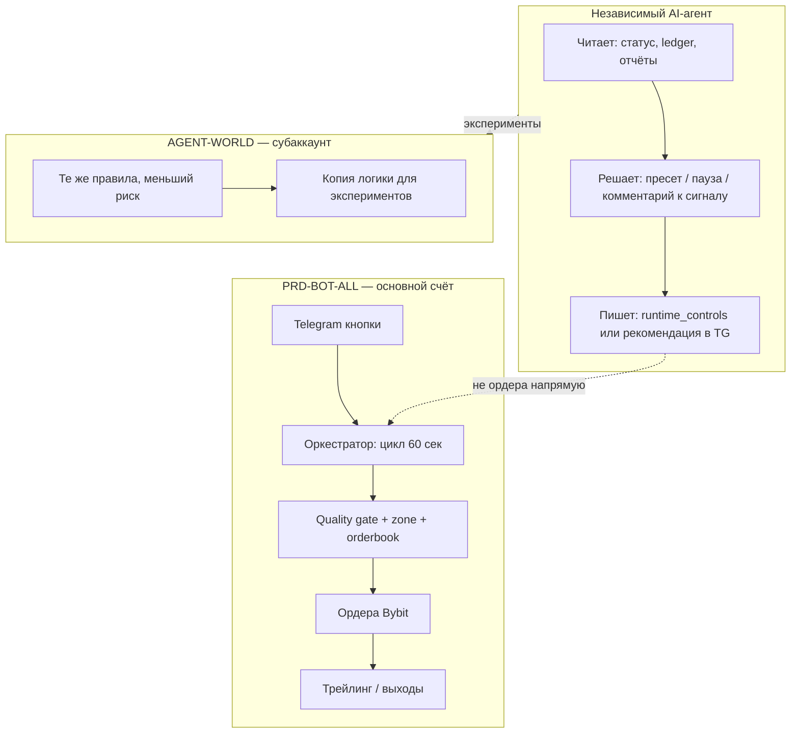

# Also_Agent — роль независимого AI-агента с PRD-BOT на Bybit

**Дата:** 17.06.2026  
**Контекст:** PRD-BOT-ALL (`run_unified.py` → `prd_agent/engine/orchestrator.py`), Telegram-кнопки, прод `/root/PRD-BOT-ALL`, песочница AGENT-WORLD на субаккаунте.

---

## 1. Что уже есть в боте (три уровня вмешательства)

| Уровень | Кто решает | Кто исполняет на Bybit |
|---------|------------|-------------------------|
| **A. Только сигналы** | Бот анализирует, пишет в Telegram / ledger «можно BUY» | **Вы** или никто — ордер не уходит |
| **B. Полный цикл** | Бот: сигнал → quality gate → ордер → SL/TP → трейлинг → закрытие | **Бот** через API Bybit |
| **C. Правка правил** | Self-improver / supervisor подкручивает `config.yaml` | Бот торгует по **новым** правилам |

**Независимый AI-агент** — четвёртый слой: он не обязан сам нажимать «Buy», он **надстраивается** над A, B или C.

---

## 2. Четыре модели роли AI-агента

### Модель 1 — «Советник» (рекомендуется для старта)

```
Рынок → Бот (цикл) → сигнал/пропуск → AI-агент: ОК / НЕТ / подождать
                              ↓
                    только если ОК → ордер на Bybit
```

**Агент делает:**
- смотрит отчёт «топ причин отказов», макро, сентимент;
- говорит: ослабить фильтр, сменить пресет (Норма → Агресс), не входить в плохой час;
- **не** шлёт ордера сам.

**Бот:** полное сопровождение цикла.  
**Агент:** только **корректировка решений** (вход да/нет, размер, пресет).

---

### Модель 2 — «Фильтр исполнения» (entry + execution)

```
Бот нашёл сигнал → AI проверяет стакан/спред/новости → execute или skip
```

**Агент делает:**
- только **вход и исполнение**: limit vs market, задержка, drift, спред;
- **не** ведёт позицию (трейлинг остаётся у `position_steward`).

**Бот:** сигналы + сопровождение после входа.  
**Агент:** **узкая полоса** — момент входа и качество исполнения.

В проекте частично уже есть: `entry_guard`, `orderbook_entry`, `quality_gate`. AI-агент = «умный слой» поверх них, не замена.

---

### Модель 3 — «Ко-пилот позиции» (сопровождение открытых сделок)

```
Позиция открыта → бот: трейлинг, time-stop
              → агент: «не закрывать рано» / «подтянуть SL» / «сократить размер»
```

**Агент делает:**
- корректировка **открытых** позиций: SL, частичный выход, пауза новых входов;
- **не** генерирует новые сигналы с нуля.

**Бот:** полный цикл.  
**Агент:** **только сопровождение** (выходы, риск портфеля).

**Риск:** два «мозга» на одной позиции → нужны жёсткие приоритеты (см. раздел 5).

---

### Модель 4 — «Автономный трейдер» (весь цикл)

```
AI-агент: скан → вход → сопровождение → выход → отчёт
Bybit API напрямую или через обёртку бота
```

**Агент делает:** всё.  
**Бот:** либо выключен, либо только **инфраструктура** (API, логи, Telegram).

Самый рискованный вариант для новичка: сложно отладить, непонятно, кто виноват при убытке.

---

## 3. Сводная таблица — что выбрать

| Вопрос | Только сигналы | Бот полный цикл + агент | Агент весь цикл | Только правка бота |
|--------|----------------|-------------------------|-----------------|-------------------|
| Ордера на Bybit | Нет / вручную | **Бот** | Агент | Никто (только config) |
| Входы | Бот советует | Бот + агент фильтрует | Агент | Параметры в yaml |
| Выходы / трейлинг | Вы сами | **Бот** | Агент | Параметры trailing |
| Обучение на ошибках | Слабое | Сильное (journal + supervisor) | Зависит от агента | Self-improver |
| Риск для новичка | Низкий | **Средний, контролируемый** | Высокий | Низкий |
| Цель (стабильность) | Медленно | **Оптимально** | Рано | Долго, без сделок |

### Рекомендация

- **Бот** = полное сопровождение цикла (модель B).
- **AI-агент** = модель 1 + постепенно модель 2 (советник + фильтр входа).
- **Не** полный автономный трейдер на основном счёте на старте.

---

## 4. Два сервера: прод и песочница



- **Прод:** бот торгует; агент **не** дублирует API-ключи для ордеров (или read-only + одобрение).
- **AGENT-WORLD:** агент может пробовать **агрессивнее** без риска для основного депозита.

---

## 5. Конкретные роли агента

| Роль агента | Что трогает | Что НЕ трогает |
|-------------|-------------|----------------|
| **Только сигналы** | Telegram: «BTC LONG 85%, RR 2.5» | Ордера, SL на бирже |
| **Корректировка входов** | Skip/approve перед execute, limit/market | Трейлинг после входа |
| **Корректировка исполнения** | Drift, спред, повтор ордера | Выбор символа |
| **Сопровождение позиций** | Рекомендация по SL/закрытию | Новые входы без бота |
| **Правка бота** | `config.yaml`, пресеты, часы блокировки | Прямые сделки |
| **Весь цикл** | Всё | — (бот почти не нужен) |

### Уже в коде PRD-BOT

| Компонент | Роль |
|-----------|------|
| `self_improvement`, `supervisor_v4` skipped backtest | правка бота / фильтров |
| `bot_manager`, bi-hourly, skip baseline | советник, отчёты |
| `correction_agent` (`enabled: true`) | лёгкая коррекция на tick |
| Кнопки **🛡 Консерв / ⚖️ Норма / 🚀 Агресс** | ручной «агент» через Telegram |

---

## 6. Приоритеты (агент + бот вместе)

1. **Emergency stop / дневной лимит** — всегда главнее агента.
2. **Quality gate + risk** — агент может ослабить через пресет, не обходить молча.
3. **Исполнение ордеров** — только **один** исполнитель (бот **или** агент, не оба).
4. **Трейлинг / SL на бирже** — лучше только бот; агент даёт **рекомендацию** в Telegram.
5. **Изменения config** — с бэкапом и кнопкой **↩️ Откат config**.

---

## 7. План на 3 месяца

| Фаза | Срок | Режим |
|------|------|--------|
| **1** | 2–4 нед | Бот **полный цикл**, агент **только отчёты** (топ отказов, статистика, макро). Пресеты — кнопками. |
| **2** | 1–2 мес | AGENT-WORLD: субаккаунт; агент предлагает пресет / паузу; подтверждение кнопкой. |
| **3** | 3+ мес | Агент **фильтр входа** (модель 2) на 1–2 символах; прод без изменений, пока WR в песочнице стабилен. |

**Не делать сразу:** агент с полным API на основном счёте без журнала и без песочницы.

---

## 8. Ответы на типовые формулировки

| Формулировка | Смысл |
|--------------|--------|
| **«Только сигналы»** | Бот учится и безопасен, но профит только если исполняете вручную. |
| **«Полное сопровождение цикла»** | **Основной режим** — так задуман unified-бот. |
| **«Агент — весь цикл»** | Возможно позже; сейчас заменяет бот, а не улучшает. |
| **«Только входы-исполнения»** | **Лучшее место для AI** поверх бота (стакан, спред, тайминг). |
| **«Только правка бота»** | Полезно долгосрочно; само по себе не торгует. |

---

## 9. Итог одной фразой

**Независимый AI-агент** = надстройка-советник и фильтр.  
**Бот** = исполнитель и сопровождение на Bybit.  
**AGENT-WORLD** = песочница, где агент может быть смелее без угрозы основному депозиту.

---

## 10. Связь с `config.yaml` (кратко)

| Кнопка Telegram | Связь с агентом / конфигом |
|-----------------|----------------------------|
| ⚖️ Норма / 🛡 Консерв / 🚀 Агресс | `risk_presets`, `entry_pipeline.mode` |
| ⏸ Пауза входов | `runtime_controls.pause_all_execution` |
| 📣 Каналы auto / 📡 Сканер auto | runtime + `telegram_signal_agent` |
| 🤖 Совет менеджера | `bot_manager.enabled` |
| ↩️ Откат config | откат правок self-improver |
| 💰 Сбросить убыток | `supervisor_v4` recovery |

Активный пресет по умолчанию: **`risk_presets_meta.active: normal`** (⚖️ Норма).

Секреты (Bybit, Telegram, OpenRouter, Adanos) — только в **`.env`**, не в yaml.

---

*Документ собран из обсуждения в чате (запрос: «опиши своё представление как независимый AI Agent сможет торговать на BYBIT…»).*
