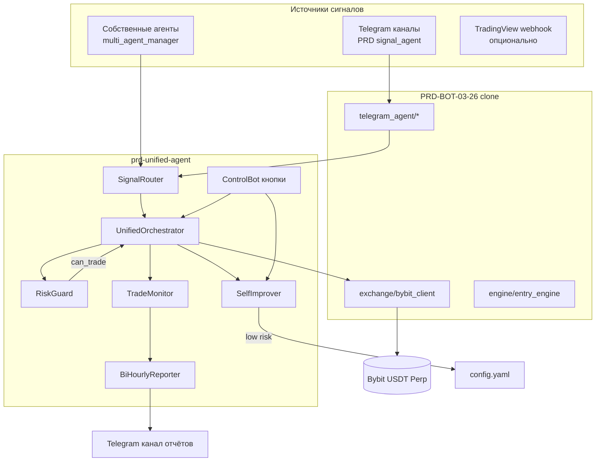

# Архитектура PRD Unified Agent

## Поток одного цикла (60 сек)

1. Читать открытые позиции с Bybit.
2. Сгенерировать собственные сигналы (если подключён PRD-repo).
3. Для каждого сигнала: `RiskGuard.can_trade()` → расчёт qty → `place_order`.
4. Каждые 2 часа: сверка PnL, формирование отчёта, предложения self-improve, отправка в канал.

## Разделение ответственности

| Слой | Отвечает за |
|------|-------------|
| PRD clone | Тяжёлая торговая логика, парсинг Telegram, бэктест |
| Unified agent | Оркестрация, единый риск-контур, отчёты, безопасный tune |
| Пользователь | Ключи API, лимиты в config, emergency stop |
