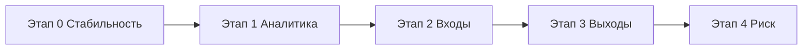

# ТЗ: модернизация PRD-BOT-ALL (Bybit + Telegram)

**Версия:** 1.0  
**Дата:** 2026-05-23  
**Заказчик:** автоторговля бессрочными контрактами Bybit, управление кнопками Telegram  

---

## 1. Цель

Единый торговый агент с минимальными просадками:
- источники: свои агенты, отфильтрованные TG-сигналы, whale/news;
- управление только кнопками в Telegram;
- прозрачная статистика по сделкам, каналам и причинам выхода.

**KPI (через 30 дней после paper/micro-live):**
| Метрика | Цель |
|---------|------|
| Winrate бота | ≥ 45% |
| Средний R:R | ≥ 1:2 |
| Max просадка дня | ≤ 5% депозита |
| Сделок в день (бот) | ≤ 8 |
| Критические падения сервисов | 0 / сутки |

---

## 2. Диагноз (по логам на 2026-05-23)

| Источник | Факт |
|----------|------|
| `latest_trade_context.json` | 229 сделок, **−106 USDT**, WR **39.7%** |
| 24 ч (бот) | 7 сделок, **−8.22 USDT**, WR **28.6%** |
| Главная причина убытков бота | `trend_exit` (−7.44, 0% WR) |
| BUY vs SELL (бот, 24 ч) | BUY WR **17%**, SELL WR **100%** (1 сделка) |
| `signal_ledger.jsonl` | 27 сигналов — все `skipped` (пауза после стопа) |
| `telegram_signal_agent.log` | 21.05: нет telethon → FATAL; шумные каналы (Quotex, Pocket Option) |
| `self_improvement_log` | Колебание `min_signal_confidence` 0.62↔0.64 в одном цикле |
| `bot.log` | Нет строк `CLOSED`/`ENTERED` — аналитика не работала |

**Вывод:** смешаны PRD-SCALP и PRD-BOT-ALL; unified-агенту нужны единый журнал, жёстче входы, мягче выходы (трейлинг), whitelist TG-каналов.

---

## 3. Этапы работ



| Этап | Срок | Содержание |
|------|------|------------|
| **0** | 1–2 нед | telethon, журнал сделок, config, логи, self-improve без колебаний |
| **1** | 2 нед | `trade_analytics.py`, кнопка «Статистика» в TG |
| **2** | 3–4 нед | Quality gate v2, whitelist каналов, channel_score |
| **3** | 2–3 нед | trend_exit, trailing 0.25%, ATR SL/TP |
| **4** | 1–2 нед | Кап плеча, blacklist альтов, approve в TG |

**Статус этапа 0 (2026-05-23):** в работе — см. раздел 8.

---

## 4. Функциональные требования

### FR-1. Единый журнал сделок
- Файл: `data/trades/trade_history.jsonl`
- Поля: `event`, `symbol`, `side`, `pnl`, `reason`, `source`, `order_id`, `qty`, `entry`, `exit`, `ts`
- Логи для `analyze_bot_log.py`: `ENTERED SYMBOL: side [source]`, `CLOSED SYMBOL: pnl=$X reason=...`

### FR-2. Аналитика
- Скрипт `scripts/trade_analytics.py` (этап 1)
- Отчёт: winrate/PnL по символу, источнику, причине выхода

### FR-3. Вход (quality gate v2, этап 2)
Обязательно одновременно:
1. `confidence ≥ min_signal_confidence` (старт **0.68**)
2. TG: канал в whitelist, `channel_score ≥ 0.6`
3. Объём 24h ≥ 10M USDT
4. Нет в blacklist / мем-паттернах
5. HTF тренд согласован со стороной
6. Orderflow в сторону сделки
7. SL + TP, min RR **1:2.5**

### FR-4. Выход (этап 3)
- SL на бирже при открытии
- Breakeven **+0.20%**, trailing activation **0.25%**, distance **0.30%**
- `trend_exit` только при убытке < −0.3% или прибыли ≥ +0.5%
- Cooldown 60 сек после `trend_exit`

### FR-5. Риск
```yaml
trading:
  leverage: 3
  max_positions: 2
  min_signal_confidence: 0.68
  min_own_agent_confidence: 0.55
  min_telegram_confidence: 0.70
  risk_pct_per_trade: 0.35
risk:
  max_daily_loss_usdt: 30
  max_trades_per_day: 8
  cooldown_after_stop_hours: 3
  cooldown_after_loss_sec: 600
```

### FR-6. Telegram signal agent
- `telethon` в venv, healthcheck
- Запись в `reports/telegram_signals/signals_inbox.jsonl`
- Игнор шума (Quotex, Pocket Option, бинарники)

### FR-7. Self-improvement
- Не применять противоречивые правки на один ключ в одном цикле
- `auto_apply_low_risk: false` до стабилизации PnL
- Критические изменения — кнопка «Применить» в TG

### FR-8. Control bot (кнопки)
Старт/стоп, статус, позиции, риск, каналы TG, последние сделки, статистика (этап 1).

---

## 5. Модули (текущая кодовая база)

| Модуль | Путь |
|--------|------|
| Orchestrator | `prd_agent/engine/orchestrator.py` |
| SignalRouter | `prd_agent/signals/router.py` |
| TradeJournal | `prd_agent/analysis/trade_journal.py` |
| RiskGuard | `prd_agent/risk/guard.py` |
| PositionSteward | `prd_agent/positions/position_steward.py` |
| TG collector | `scripts/telegram_signal_agent.py` |
| Signal quality | `telegram_agent/signal_quality.py` |

---

## 6. Нефункциональные требования

- Uptime ≥ 99% (systemd)
- Ротация `bot.log` (50 MB × 5)
- Секреты в `.env`, маскировка токенов в логах
- Backup config в `data/sandbox/` перед правками

---

## 7. Критерии приёмки этапа 0

- [ ] `data/trades/trade_history.jsonl` создаётся при сделках
- [ ] В `bot.log` есть `ENTERED` / `CLOSED`
- [ ] `config.yaml` обновлён (плечо, лимиты, trailing)
- [ ] `auto_apply_low_risk: false`
- [ ] Self-improver не колеблет confidence при убытке + много пропусков
- [ ] `scripts/healthcheck_agents.py` проходит telethon + prd_agent.config
- [ ] Каталог `reports/telegram_signals/` существует

---

## 8. Реализация этапа 0 (changelog)

| Файл | Изменение |
|------|-----------|
| `prd_agent/analysis/trade_journal.py` | Новый журнал + логи ENTERED/CLOSED |
| `prd_agent/engine/orchestrator.py` | Интеграция журнала при входе/закрытии |
| `prd_agent/evolution/self_improver.py` | Разрешение конфликтов proposals |
| `prd_agent/analysis/global_analyzer.py` | Не ослаблять порог при WR < 45% |
| `run_unified.py` | Лог в `bot.log`, маскировка токенов |
| `config.yaml` | Параметры этапа 0 |
| `scripts/healthcheck_agents.py` | Проверка окружения |
| `reports/telegram_signals/.gitkeep` | Каталог inbox |

---

## 9. Рекомендации пользователю (3 месяца)

1. **Недели 1–2:** только стабилизация, BTC/ETH, без ручных альтов параллельно боту.
2. **Недели 3–4:** paper-trading, смотреть отчёт `trade_analytics.py`.
3. **Месяц 2:** 2–3 проверенных TG-канала в whitelist.
4. **Месяц 3:** micro-live при WR ≥ 45% за 30 дней.

**Безопасность:** сменить токен Telegram-бота, если он попадал в `bot.log`.

---

*Документ согласован с анализом логов от 2026-05-19 — 2026-05-23.*
